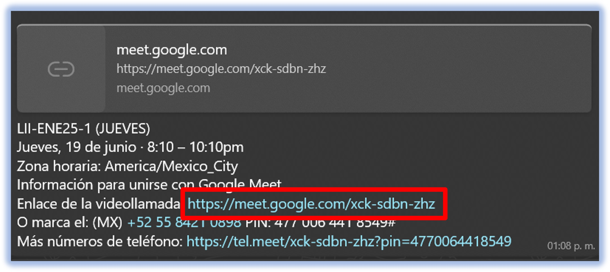
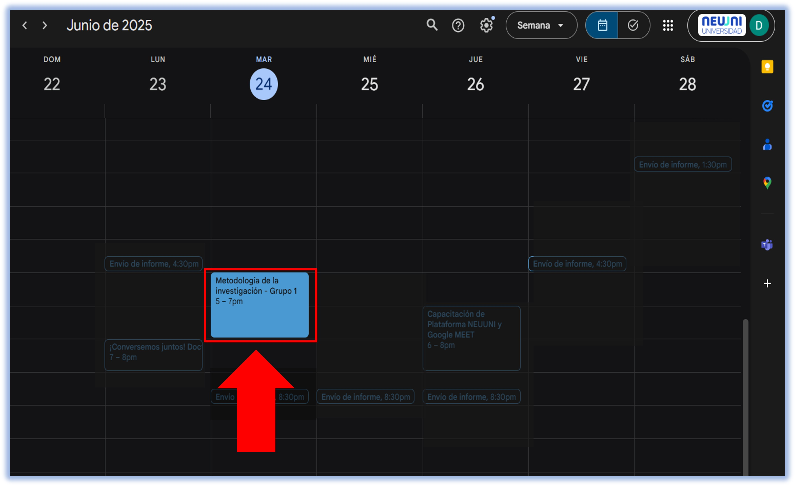
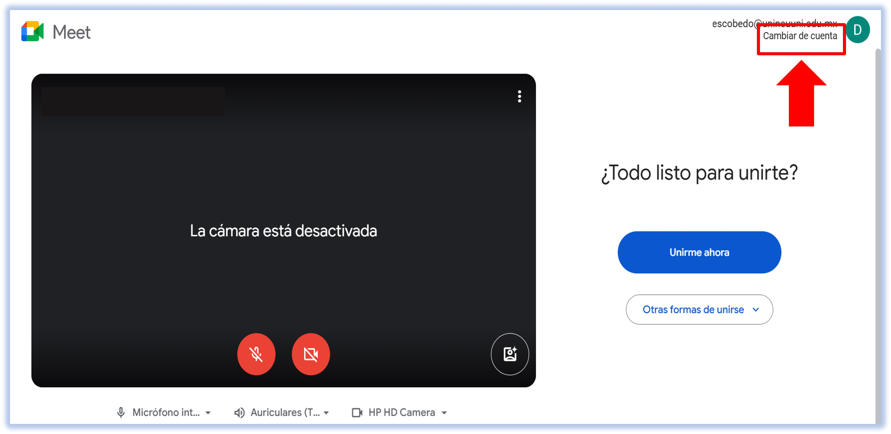
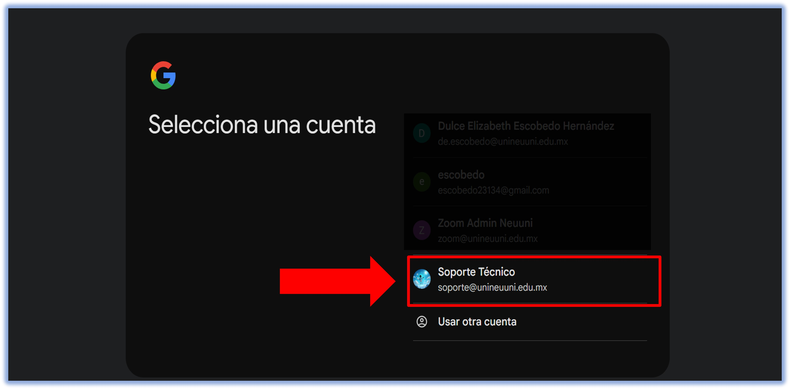

# 🔵 Cambia a tu correo institucional

### Accede correctamente con tu correo institucional

Este tutorial te ayudará a comprobar que estás accediendo de manera correcta **a tu clase sincrónica con tu correo institucional** y, en caso de que requieras
cambiar tu cuenta de acceso, te explica paso a paso cómo hacerlo.

*Para ir directamente a Cómo cambiar la cuenta en la parte de abajo, [haz clic aquí](#2-cambia-a-tu-correo-institucional).*

## 1. Accede a tu clase sincrónica

Puedes hacerlo a través de dos maneras: **por el link de la clase que se envía a tu grupo de WhatsApp y a través del Calendario de Google.**

### 1.1 Link en el grupo de WhatsApp

**Ubica el grupo de WhatsApp de tu generación**, que generalmente tiene por nombre los datos (carrera, generación, etc.). En ese grupo, el Coord.
comparte semanalmente el link de la clase, el día anterior o el mismo día de la clase. **Ubica el mensaje, como se muestra a continuación, y haz
clic en el link de Google Meet, como se muestra en la imagen**.

### 1.2 Evento de Calendario en Google

Antes del comienzo de tus materias, te llegará una invitación a un evento de Calendario a tu correo institucional, para que puedas configurarlo como
recordatorio en tu correo institucional (en Google Calendar). Puedes acceder a esta información desde el [calendario de tu correo institucional](https://calendar.google.com), 
donde aparecerá un evento como se muestra en la imagen.

Haz clic en el evento para que encuentres el botón **Unirse con Google Meet**.

## 2. Cambia a tu correo institucional

En la pantalla previa a la sala de Meet, podrás verificar si estás accediendo con tu cuenta institucional en la parte superior derecha, o sea,
**tu correo debe terminar con *...@unineuuni.edu.mx***. En caso de que no, haz clic en **Cambiar cuenta**.

Al cargar la lista de cuentas en las que has iniciado sesión, selecciona tu correo institucional, para que no tengas problemas al acceder a la clase.
#### *NOTA: Si no aparece tu correo, selecciona la opción **"Usar otra cuenta"** e ingresa tus claves de acceso.*

¡Y listo! Con estos sencillos pasos, habrás realizado el cambio de cuenta en Google Meet.
Recuerda que usar tu cuenta institucional para entrar a tus clases es también esencial para que el mentor te identifique correctamente
y quede registrada correctamente tu asistencia. ✅

## Videotutorial 🎥

    <h2 style={{ color: '#0d47a1', fontSize: '2em', fontWeight: 'bold' }}>
        Cambia de cuenta en Google Meet
    </h2>
    <iframe
        width="560"
        height="315"
        src="https://www.youtube.com/embed/lhaYu6xGVk4"
        title="YouTube video player"
        frameBorder="0"
        allow="accelerometer; autoplay; clipboard-write; encrypted-media; gyroscope; picture-in-picture"
        allowFullScreen
        style={{ marginTop: '1em' }}
    ></iframe>

