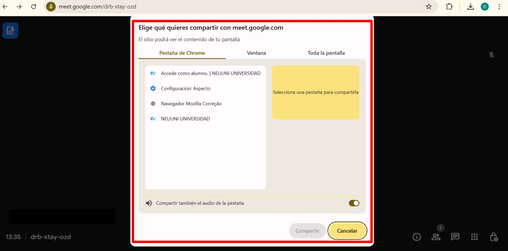
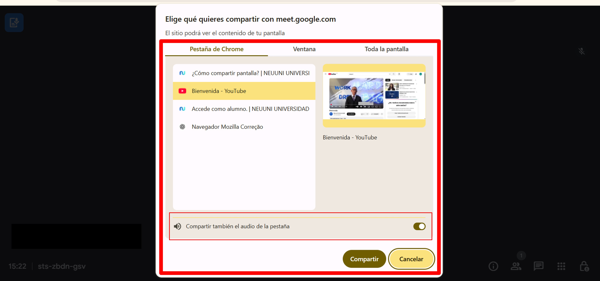
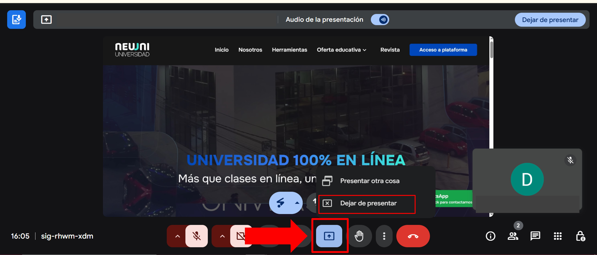

# 💻 Compartir pantalla

Dominar el compartido de pantalla es esencial para reuniones efectivas, 
clases sincrónicas y presentaciones exitosas. Ya sea que necesites mostrar un documento, 
compartir algún video de apoyo o colaborar en tiempo real, esta guía te enseñará todos 
los secretos para hacerlo con confianza y sin contratiempos técnicos. 

## 1. 🍳 Preparación inicial
1. Ingresa a tu reunión virtual.
2. Localiza el botón **Presentar ahora** en la parte inferior de la pantalla.

## 2. 🔍 Opciones para compartir pantalla

En Google Meet hay 3 modos para compartir pantalla, cada uno con diferente configuración.
Elige el que mejor se adapte a tus clases y prueba distintos modos que te ayudarán
a facilitar tus clases.

 ### 🌐 Pestaña de navegador
 - Es el **único modo en el que puedes compartir audio**.
 - Perfecto para compartir videos  y presentaciones con recursos multimedia que tengan
    audio.
 - Solo está disponible para el navegador Chrome, así que configura tu video o presentación
 con anticipación para compartirla a través de este modo.

 ### 🪟 Ventana específica
 - Comparte solo un programa que tengas abierto (Excel, PowerPoint, etc.).
 - Evita mostrar contenido privado, limitando la presentación de la pantalla
 únicamente al programa que tengas seleccionado.

 ### 🖼️ Pantalla completa
 - Ideal para mostrar múltiples aplicaciones, ya que se comparte lo que estás
 viendo en pantalla.
 - Permiso único requerido.
 - Si tienes múltiples monitores conectados,puedes seleccionar cualquiera de ellos.

## Guía para Compartir videos
Para compartir un video desde Youtube o cualquier pestaña del navegador, sigue
los siguientes pasos:

 1. Abre el video en una pestaña nueva
 2. Selecciona **Presentar ahora** → Elige la pestaña del video
 3. Verifica que **Compartir audio** esté activado para que pueda escucharse el
 audio del video en tu clase sincrónica.
 4. Confirma en la opción **Compartir**.

## ⏹️ Finaliza la acción Compartir pantalla
 - Desde la pestaña de la clase sincrónica, haz clic en el botón **Compartir pantalla**.
 - En la ventana, haz clic en **Dejar de presentar**
 - Si tu pantalla desaparece de la reunión y comienzas a ver todos los participantes
 de la reunión, habrás confirmado que se dejó de compartir correctamente.

¡Dominaste el arte de compartir pantalla! 🎉  

*Para gestionar muchísimo mejor tus clases y minimizar la cantidad de errores durante
tus clases, recuerda:
 🔸 Prueba siempre antes de presentar en una reunión de Meet donde compartas desde
 tu cuenta institucional y en una cuenta personal en la misma reunión puedas ver la pantalla.
 🔸 Elige la opción según tu necesidad. Busca el modo que más se adapte a tus necesidades y
 forma de trabajo. ¡No olvides probar distintos modos!
 🔸 Controla qué contenido compartes para evitar inconvenientes.

¿Problemas técnicos? El equipo de soporte puede ayudarte. 💡*