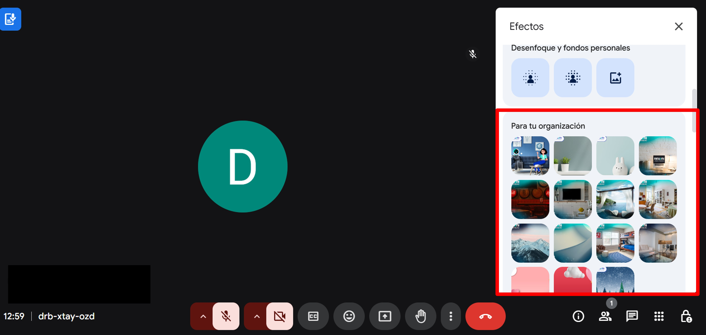

  

      
    
# 🎭 Personaliza tu fondo

Aprende a cambiar tu fondo virtual para mantener la privacidad o añadir un toque profesional a tus videollamadas. Sigue esta guía paso a paso:

## Configura tu imagen de fondo
### 📲 1. Accede a la reunión
 Abre la página de Google Meet e ingresa a alguna reunión. Recuerda realizarlo con
 tu correo institucional.

### ✨ 2. Activar efectos visuales
 1. Puedes configurar tu fondo personalizado durante la llamada
 (o antes de ingresar a la reunión).
 2. Localiza el ícono de **Efectos visuales** desde el apartado **Más opciones (⋮)** 
 (el de varita mágica en la vista previa).
 3. Haz clic para abrir el panel de opciones

### 🖼️ 3. Selección de fondo
Dentro de las opciones que puedes elegir, se encuentran:
 - Fondos preestablecidos (oficina, naturaleza, abstractos).
 - Fondos desenfocados (para privacidad).
 - Fondos de NEUUNI (exclusivos para tu cuenta institucional).
 - **Nuevo:** ¡Sube tu propia imagen personalizada!

### 💡 Consejos
 - Usa fondos con iluminación uniforme
 - Evita fondos con texto o patrones complejos
 - Prueba diferentes opciones antes de reuniones importantes

¡Buen trabajo! Participar en tus reuniones como mentor con el fondo predeterminado de mentor
reflejará seriedad y profesionalismo. No olvides que, a lo largo del año, los actualizaremos
con fondos personalizados para que puedan ser usados por todos ustedes.

*¿El fondo no se ve bien?* Verifica que tu equipo cumple con los [requisitos técnicos](#) de Google Meet.
  

<br />
