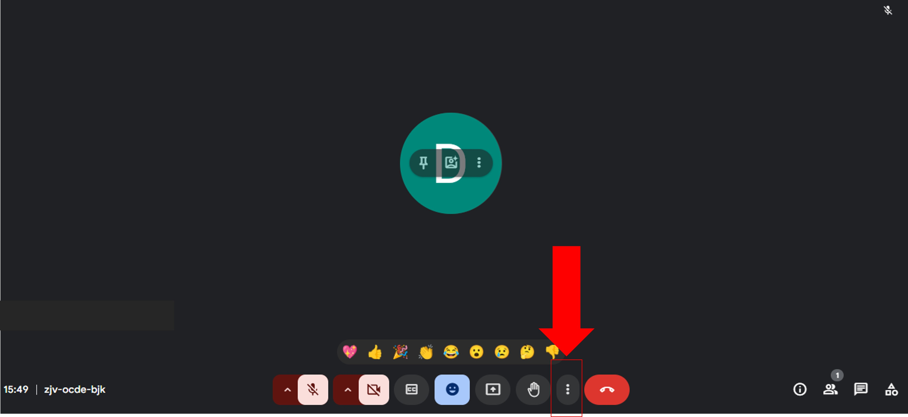
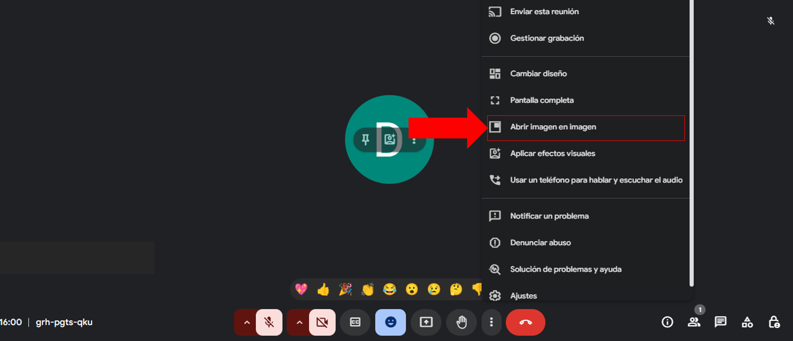
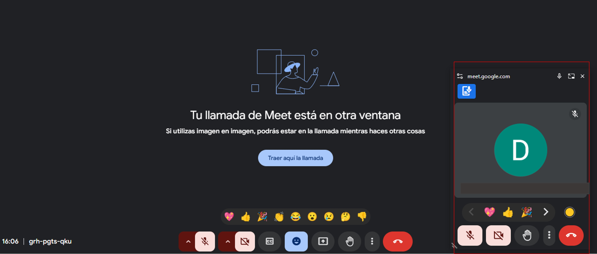
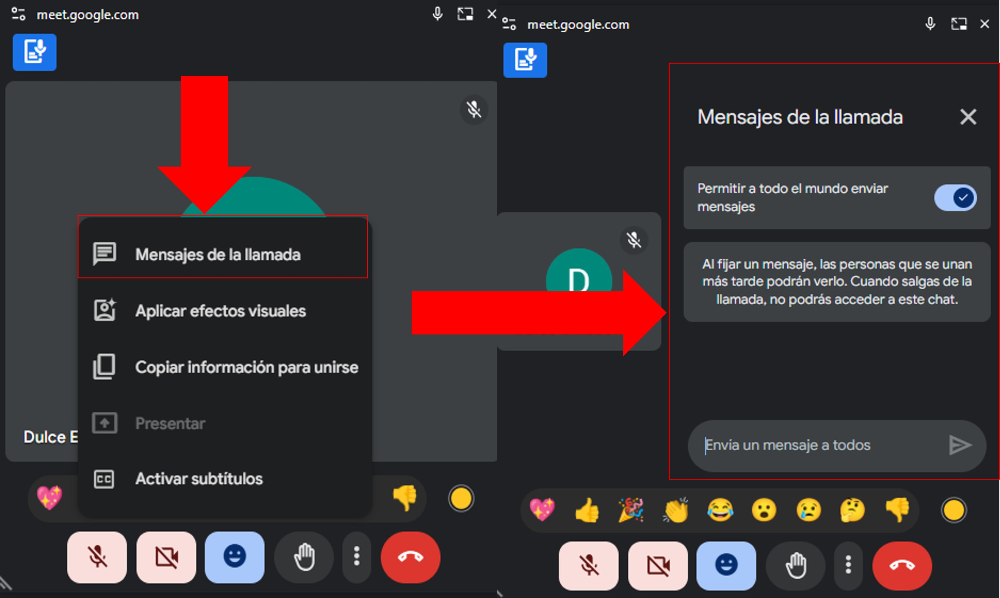
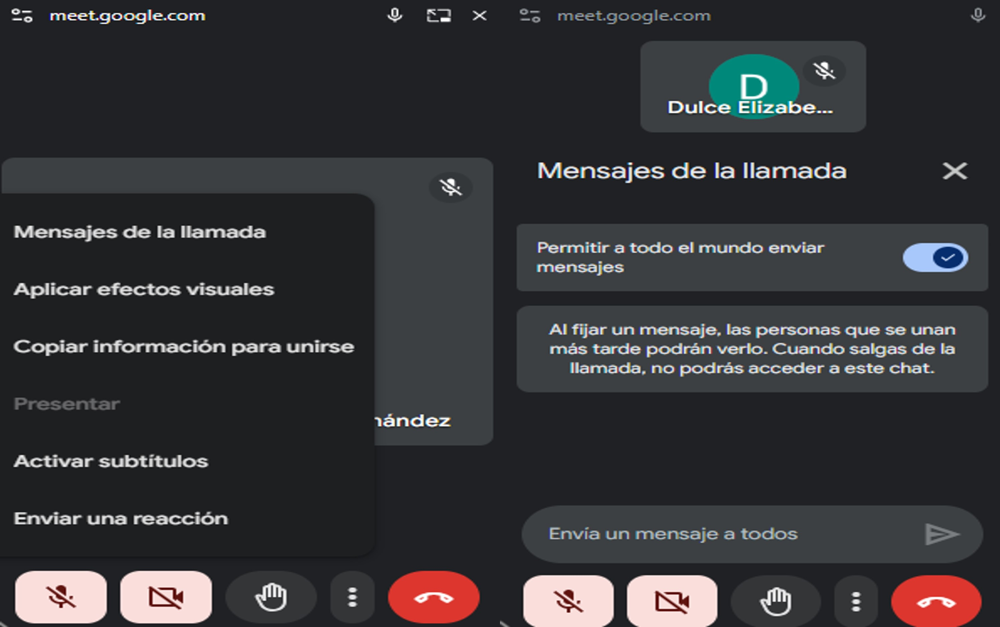

import Card from '@site/src/components/HomepageFeatures/card.jsx'

# 🖼️ Imagen en imagen

#### Lleva tu clase sincrónica a una ventana móvil

Domina la multitarea durante tus clases virtuales con esta práctica función que te permite mantener visible la reunión mientras trabajas en otras aplicaciones.

## 💡 ¿Por qué usar imagen en imagen?
- Monitorea a los estudiantes mientras consultas materiales
- Accede rápidamente a controles de la reunión
- Optimiza tu espacio de trabajo digital

## 🚀 Cómo activar imagen en imagen

### 1. Inicia tu reunión
- Abre Google Meet y únete a la videollamada
- Asegúrate de usar tu cuenta institucional

<Card>

  ___
</Card>

### 2. Accede al menú de opciones
- Haz clic en los **tres puntos** (⋮) en la barra de controles
- Selecciona **"Abrir imagen en imagen"**

<Card>
 
  ___
</Card>

### 3. Configura la ventana flotante
- La ventana se reducirá automáticamente
- Arrástrala a cualquier posición de tu pantalla
- Ajusta el tamaño según tus necesidades

<Card>

  ___
</Card>

## 🛠️ Controles disponibles
Desde la ventana flotante podrás:
- 🔊 Silenciar/activar micrófono
- 📹 Encender/apagar cámara
- 🖥️ Compartir pantalla
- 💬 Ver mensajes del chat
- 📞 Finalizar la llamada

<Card>

  ___
</Card>

## 🔍 Funciones avanzadas
Accede a opciones adicionales haciendo clic en ⋮ dentro de la ventana flotante:
- 📋 Ver lista completa de participantes
- ✉️ Acceso rápido al chat
- ⚙️ Configuración de audio/video

<Card>

  ___
</Card>

## 💡 Consejos profesionales
- Usa esta función cuando necesites consultar materiales mientras moderas la clase
- Combínala con el compartido de pantalla para presentaciones fluidas
- Ideal para verificar mensajes del chat sin perder de vista a los participantes

## ✅ ¡Listo para multitareas!
Ahora puedes impartir tus clases con mayor flexibilidad y control. Recuerda practicar esta función antes de usarla en sesiones importantes.

*"Cada pequeño aprendizaje te acerca a dominar algo nuevo; estás a punto de manejar la multitarea como un experto y aprovechar al máximo tus herramientas digitales. ¡Tú puedes lograrlo!"* 💪✨