import VideoIntro from '../insertarvideo.jsx';
import CustomLink from '../CustomLink.jsx'
import Card from '@site/src/components/HomepageFeatures/card.jsx'
import StickyNote from '@site/src/components/HomepageFeatures/stickynotes.jsx'

# 💲 Concepto de pago

Este tutorial te guiará paso a paso para gestionar y realizar los **pagos de tus trámites académicos** de forma segura a través de la plataforma institucional.

<StickyNote>
> **💡 Recomendación previa:** Antes de generar cualquier pago, te sugerimos contactar a tu **Coordinación Académica**. Ellos validarán el costo vigente y te confirmarán el área correcta para evitar errores en tu proceso.
</StickyNote>

---

## 🛠️ Trámites Disponibles

Desde tu portal, puedes generar órdenes de pago para los siguientes conceptos:

* 📜 **Certificados y Constancias:** Documentación oficial de estudios.
* 📝 **Exámenes a Título:** Derechos de examen extraordinario o especial.
* 🛑 **Retenciones:** Regularización de adeudos pendientes.
* 📂 **Traslados:** Trámites de cambio de plantel o programa.
* 💡 **Asesorías:** Pagos por apoyo académico especializado.

---

## 📑 Guía de Pasos para el Pago

### 1. Acceso al Portal
Inicia sesión con tu cuenta institucional en [Gedux](https://app.gedux.mx/login). En el **tablero principal** o en el menú lateral izquierdo, localiza y selecciona la opción **Órdenes de pago**.

<Card>
  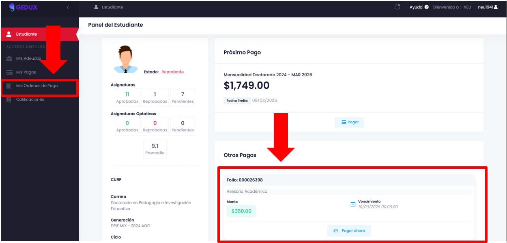
  ___
</Card>

### 2. Selección del Concepto
Una vez dentro del módulo de pagos, haz clic en el botón **"Conceptos de pago"**. Esto te permitirá ver el catálogo de trámites disponibles para tu perfil.

<Card>
  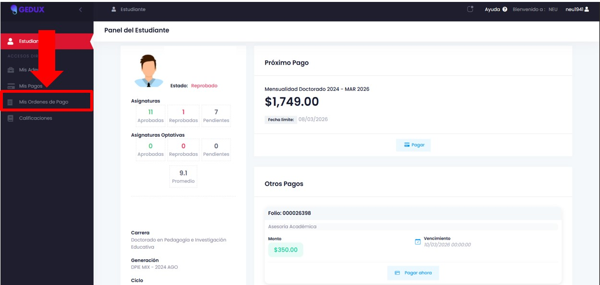
  ___
</Card>

### 3. Verificación de Montos
El sistema generará automáticamente el **monto total a pagar** basado en el trámite seleccionado. Asegúrate de que la cantidad coincida con lo indicado por tu coordinación.

<Card>
  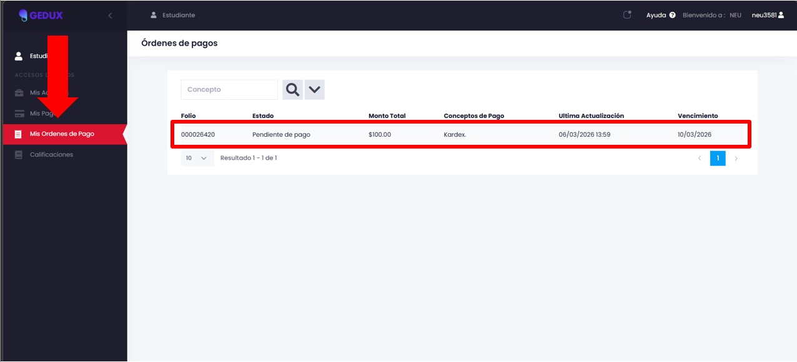
  ___
</Card>

### 4. Elección del Método de Pago
La plataforma ofrece dos modalidades. Selecciona la que más te convenga y presiona **Continuar**:
1. **Pago en Efectivo:** Genera una ficha para pagar en establecimientos físicos.
2. **Pago con Tarjeta:** Realiza la transacción en línea de forma inmediata.

<Card>
  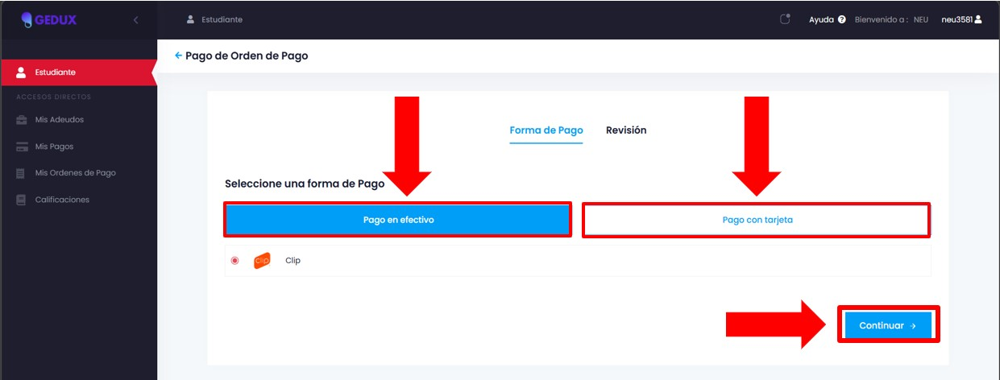
  ___
</Card>

---

### 💳 Instrucciones según tu forma de pago

Haz clic en una de las pestañas de abajo para ver el procedimiento específico:

  
<b>🟢 Proceso: Pago en Efectivo (Ventanilla/Tiendas)</b>

### Pasos para Pago Presencial

Al elegir efectivo, el sistema te preparará para generar una referencia bancaria.

<Card>
  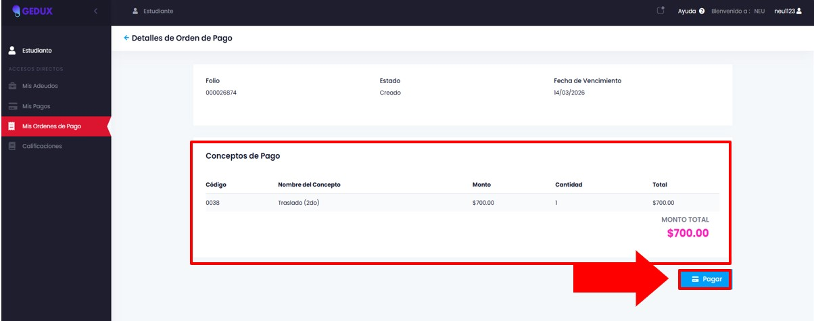
  ___
</Card>

#### A. Generar Orden
Haz clic en el botón **Pagar**. Esto confirmará que deseas crear una orden para depósito externo.

<Card>
  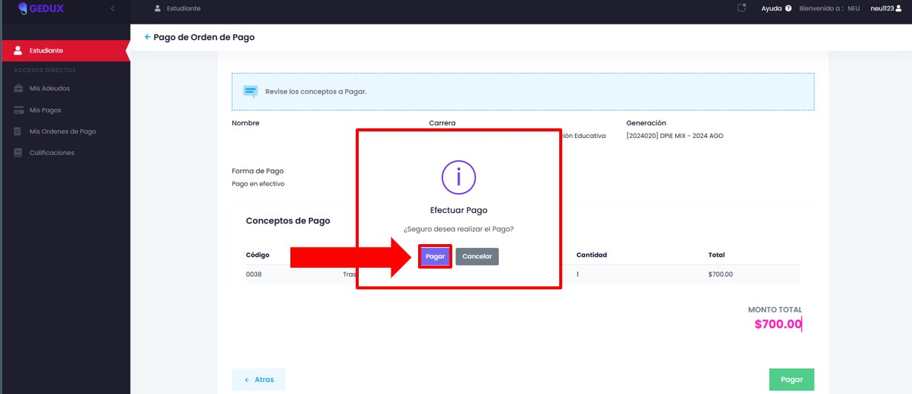
  ___
</Card>

#### B. Establecimientos Autorizados
Se mostrará una lista con los logotipos de los bancos y tiendas de conveniencia (OXXO, 7-Eleven, etc.) donde puedes presentar tu ficha.

<Card>
  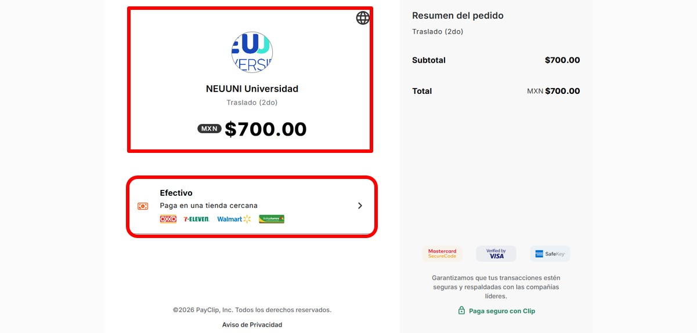
  ___
</Card>

#### C. Obtención de Ficha
Finalmente, ingresa tu número telefónico. El sistema enviará o descargará el documento con la **referencia numérica** necesaria para que el cajero procese tu pago.

<Card>
  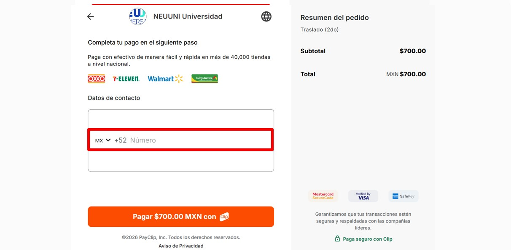
  ___
</Card>

  
<b>🔵 Proceso: Pago con Tarjeta (En Línea)</b>

### Pasos para Pago Digital

Si prefieres liquidar el monto al instante, utiliza la pasarela de pagos segura.

<Card>
  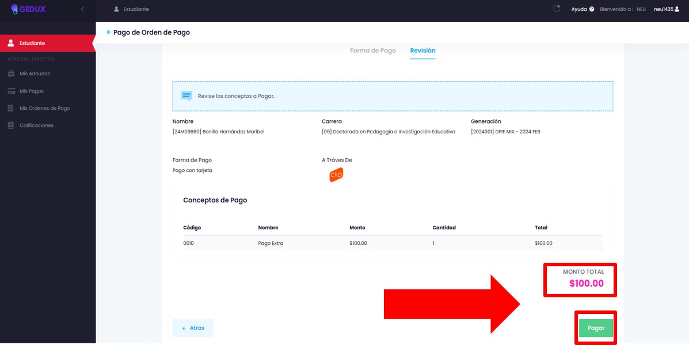
  ___
</Card>

#### A. Iniciar Transacción
Revisa el resumen de tu solicitud y presiona el botón **Pagar**. Serás redirigido al entorno seguro de cobro.

<Card>
  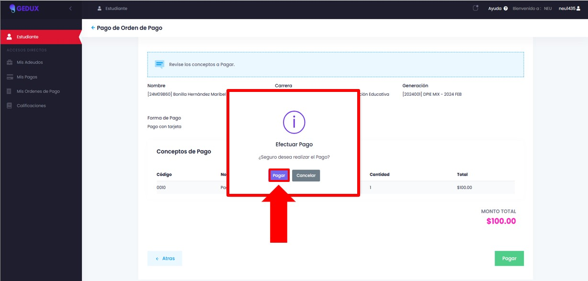
  ___
</Card>

#### B. Resumen y Tarjetas Aceptadas
El sistema te indicará las tarjetas (Visa, Mastercard, American Express) admitidas para el trámite.

<Card>
  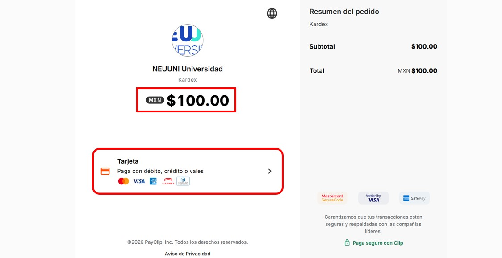
  ___
</Card>
       
#### C. Verificación de Seguridad
Por tu protección, recibirás un **código de verificación (OTP)** vía SMS en tu celular. Ingrésalo para validar que eres el titular y, finalmente, captura los datos de tu tarjeta para completar el pago.

<Card>
  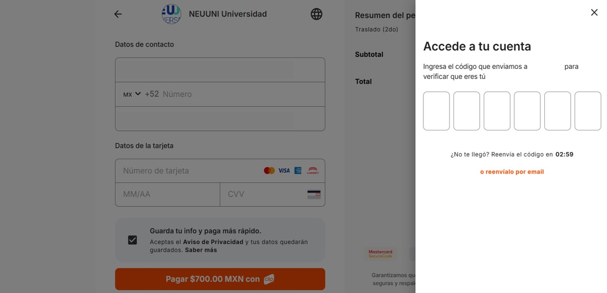
  ___
</Card>

