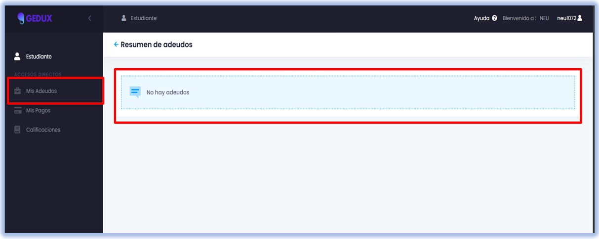
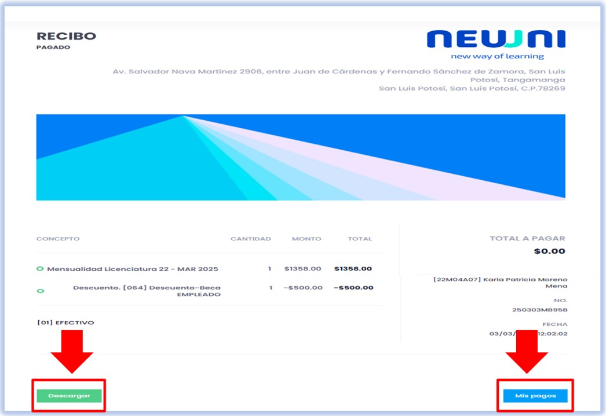
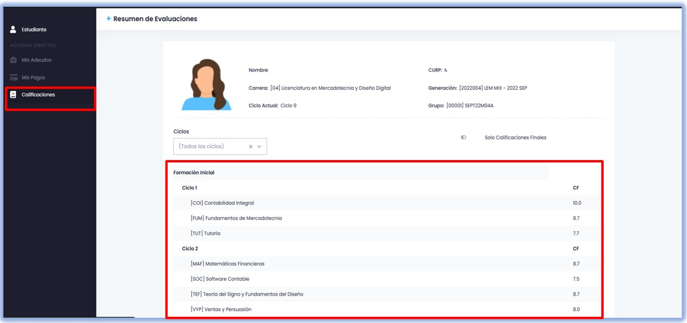

import VideoIntro from '../insertarvideo.jsx';
import CustomLink from '../CustomLink.jsx'

# 🔍 Descripción de la interfaz

### Conoce el entorno de Gedux para acceder rápidamente a las funciones

## 1. Inicia sesión en Gedux

Si tienes duda sobre este proceso, consulta nuestro [tutorial de acceso](./plataforma-pago).

## 2. Conoce las secciones

1. **Información del usuario:** Muestra tus datos como el nombre, matrícula, asignaturas, estado académico, así como información personal. **Puedes consultar tus Calificaciones desde esta opción**.
2. **Próximo a pagar:** Este módulo ofrece la opción de pagar tu mensualidad pendiente a través del botón **Pagar**. Si tienes dudas sobre cómo realizar el pago, puedes checar nuestro   
   Si no sabes cómo realizar este proceso, puedes consultar nuestro <CustomLink href="../Plataforma Gedux/plataforma-pago.html">tutorial de pagos.</CustomLink>.
3. **Adeudos:** Aquí se muestran los pagos pendientes.
4. **Pagos parciales:** Aquí se muestra el historial de pagos.
5. **Otros pagos:** Contiene los pagos adicionales realizados por otros medios.

## 3. Menú de navegación

En la parte izquierda de la pantalla, se ubica un menú de navegación con accesos rápidos a **Mis adeudos**, **Mis pagos** y **Calificaciones**.

#### Mis adeudos

Describe qué pagos necesitas para ponerte al corriente con tus mensualidades.

#### Mis pagos

Desde aquí podrás ver los pagos realizados anteriormente y podrás descargar el comprobante de pago.

#### Calificaciones

En el módulo de **Calificaciones** puedes consultar tus resultados académicos por ciclos o materias culminadas, como se muestra en la imagen.

