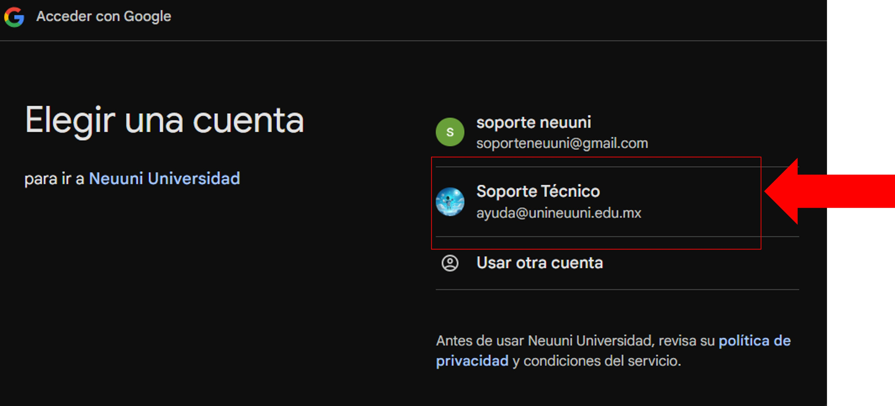
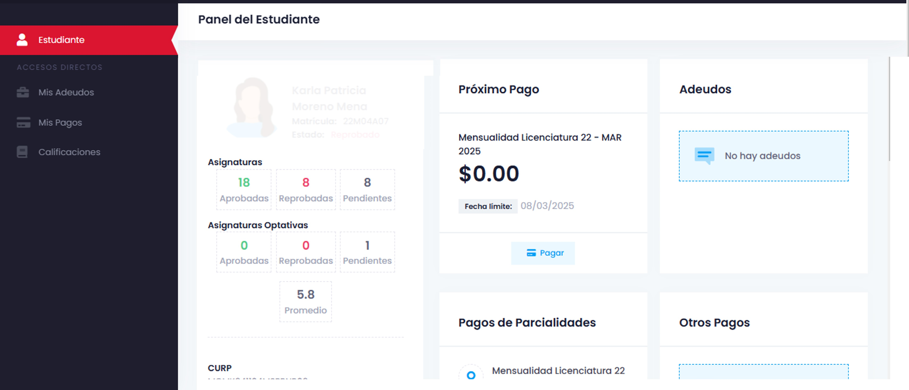

import VideoIntro from '../insertarvideo.jsx';

  

      

    # 🔑 Acceso a Gedux
    

### Aprende a ingresar a Gedux

Tranquilidad y facilidad financiera. Realiza tus pagos de colegiatura de manera segura y sencilla a través 
de Gedux. Mantén al día tu trayectoria académica con pagos mensuales fáciles de gestionar.

## 1. Acceso a Gedux desde la plataforma NEUUNI

Dentro de la plataforma NEUUNI, dirígete a la sección superior central.

Ubica el botón con el ícono de **moneda ($)** y haz clic en él para acceder a la plataforma de pagos.

## 2. Ingresa con tu cuenta de Google

Una vez dentro de la plataforma de pagos, selecciona la opción **Continuar con Google**.

Al hacer clic en "Continuar con Google", se abrirá una ventana emergente.
Selecciona tu cuenta institucional de la lista. 

Si no aparece, haz clic en **Usar otra cuenta** e ingresa
tus claves de acceso institucionales.

Desde esta sección, podrás gestionar tu historial académico, realizar pagos, consultar tus 
estados de cuenta, revisar el historial de pagos y más.

## 🎥 Videotutorial

<VideoIntro title="Acceso a Gedux" videoUrl="https://www.youtube.com/embed/laDPECNsgQ8" />
  

 
