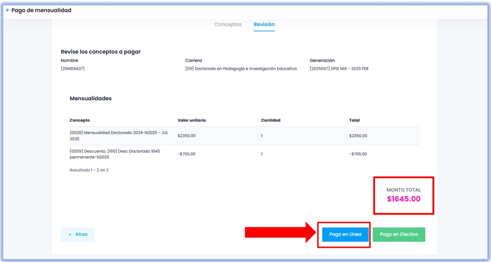

import VideoIntro from '../insertarvideo.jsx';

  # 💲 Realiza tus pagos
   
### Aprende a pagar tu mensualidad en línea o en efectivo

## 1. Ingresa a Gedux

Inicia sesión en tu plataforma Gedux. Si tienes duda de cómo ingresar, revisa nuestro [tutorial de acceso](./plataforma-pago.mdx).  

## 2. Inicia tu pago

Una vez que ingreses a la sesión, verás la siguiente pantalla. En la sección de **Próximo Pago**, haz clic en **Pagar**, como
se muestra en la imagen.

## 3. Elige una o varias mensualidades

En la pantalla de **Conceptos**, selecciona la(s) mensualidad(es) que deseas pagar. Si tienes descuentos y/o recargos
por aplicar, se calcularán en la siguiente ventana.

Una vez que hayas elegido, haz clic en **Continuar**.

## 3. Elige tu método de pago

Los pagos en Gedux pueden realizarse de dos maneras: pago en línea y en efectivo.
 
  - **Pago en línea**. 
  - **Pago en efectivo**.

### 3.1 Pago en línea

Si al seleccionar tu manera de pago lo realizas mediante en **pagos en línea** nos mostrará un estado de las mensualidades siguientes a pagar, aquí nos da la opción de cubrir las mensualidades que se quiera realizar el pago, una vez seleccionadas las opciones damos clic en continuar

Al dar selección en continuar aparecerá la siguiente visualización en la cual nos mostrará el **monto total a pagar** y damos selección en **pago en línea** nuevamente 

Nos abrirá una ventana emergente en la cual seleccionaremos nuevamente **pagar**.

Una vez seleccionado este proceso nos enviará a la opción de colocar nuestros datos de nuestra tarjeta como nombre completo, correo e ingresar datos de nuestra tarjeta. Una vez realizado el llenado de los datos seleccionamos la opción de **pagar**.

**Una vez seleccionada la opción de pagar nos enviará a otra visualización en donde nos confirmará nuestro pago.**

### 3.2 Pago en efectivo.

Haz clic en el botón verde y confirma en la ventana emergente para iniciar con la generación
de la referencia para hacer el pago por este medio.

Ingresa tu correo electrónico para enviarte cualquier información referente al pago y, después, haz clic
en el botón naranja de **Pagar con *Clip***.

#### 1. Elige el establecimiento

Elige la tienda en la que deseas pagar, para que se genere un número de referencia que deberás
presentar en el cajero del establecimiento elegido.

#### 2. ¡Recuerda!

Para completar el pago en el establecimiento, sigue los pasos que a continuación se muestran:

  1. Ve a la tienda más cercana y di que harás el pago a **ArcusPay**.
  2. Menciona la cantidad **exacta** a pagar en efectivo.
  3. Guarda tu recibo como comprobante de pago.

**Guarda el número de referencia** que se generará, para que puedas presentarlo en el cajero del
establecimiento.

Al seleccionar la opción **Guardar** en la pantalla, podrás descargar el ticket.

#### 3. Recupera tu número de referencia

Una manera de consultar o verificar nuevamente tu código de barras y la referencia, es descargar el archivo
para tenerlo a la mano y así poder consultar los datos cuando lo necesites.

  

    📌 **NOTA:**   
    
   En **NEUUNI**, nos preocupamos por que tus pagos sean **fáciles, seguros y flexibles ✅.**
Gracias a nuestra amplia red de establecimientos asociados a través de *Clip* y el pago en
plataforma, puedes elegir la opción que mejor se adapte a ti. 🐙

  

<br />

## 🎥 Videotutoriales

 

<h2 style={{ color: '#0056b3', fontFamily: 'Arial Black, Arial, sans-serif', textAlign: 'center', marginTop: '2rem', fontSize: '2.5rem' }}>
    Pagos en Efectivo
</h2>

 

<iframe
  src="https://drive.google.com/file/d/1D6_XL_Y8Dpttnv7vFBfaT0dgageg4yzq/preview"
  width="640"
  height="360"
  allow="autoplay"
  style={{ display: "block", margin: "2rem auto" }}
/>

 

<h2 style={{ color: '#0056b3', fontFamily: 'Arial Black, Arial, sans-serif', textAlign: 'center', marginTop: '2rem', fontSize: '2.5rem' }}>
  Pagos en Línea
</h2>

 

<iframe
  src="https://drive.google.com/file/d/1Kfj5FbKbMjAxJSy5NZdF9yQYMJFk2BKY/preview"
  width="640"
  height="360"
  allow="autoplay"
  style={{ display: "block", margin: "2rem auto" }}
/>

