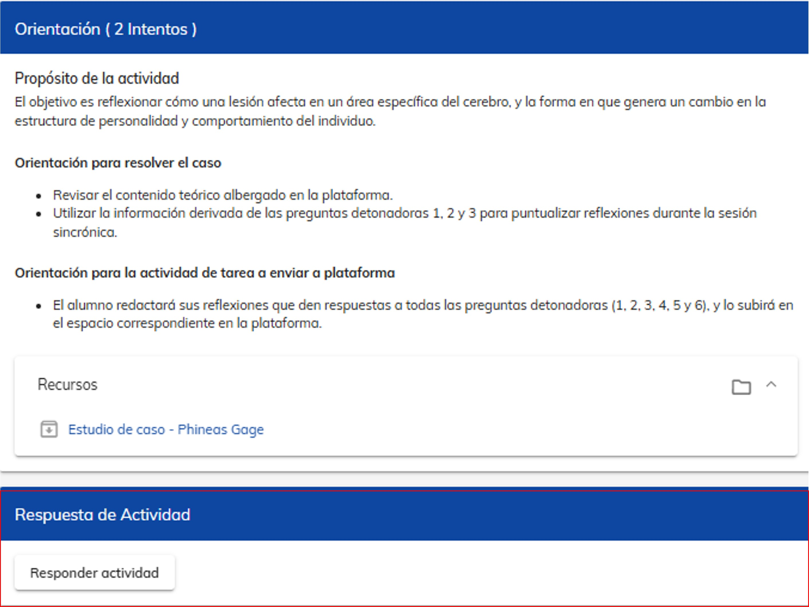
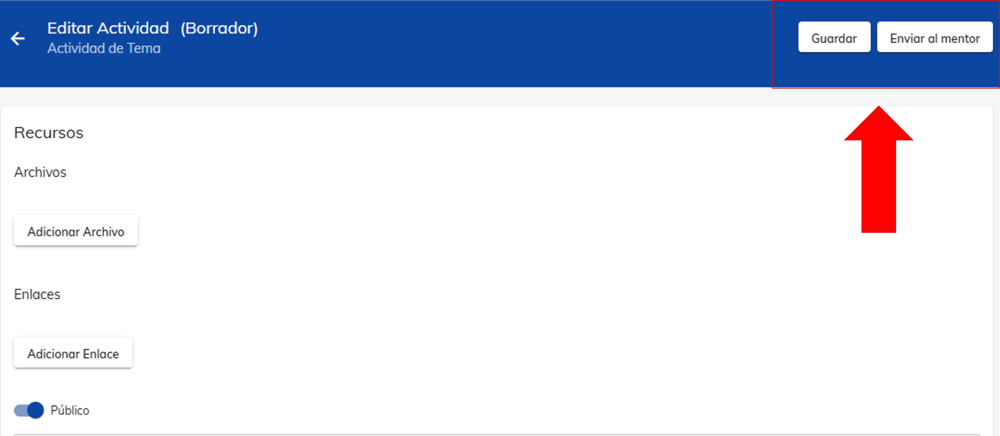

import VideoIntro from '../insertarvideo.jsx';
import CustomLink from '../CustomLink.jsx'

# Envío de actividad

##  Sube tu actividad a la plataforma

¿Listo para brillar? Aquí aprenderás a subir tus tareas a la plataforma para que tu mentor pueda evaluarlas. 
Recuerda que tus calificaciones dependen en gran medida de la entrega exitosa de tus actividades.

### 1. Ingreso al módulo de Tarea

Accede al módulo de **Tarea** desde la materia y el número de tema que desees.

#### Nota: Si no recuerdas cómo hacerlo, consulta el tutorial sobre los
<CustomLink href="../Primeros pasos/firstelements.html">elementos de un curso</CustomLink>.

### 2. Contenido del módulo

A continuación se describen las distintas secciones que tiene el módulo. **Es importante leer cada una de
ellas**, para que puedas realizar correctamente tu actividad.

- **Proposito de la actividad**. 
Explica el objetivo de la tarea y su relevancia en el desarrollo de habilidades prácticas.
- **Orientacion para responder el caso**.
Proporciona instrucciones claras y detalladas sobre cómo abordar la tarea.
- **Orientacion para la actividad a enviar a plataforma**.
Indica cómo debes complementar tu actividad para que puedas completarla y subirla a la plataforma.
- **Recursos a consultar**.
Proporciona enlaces o referencias a materiales útiles para realizar la actividad.
- **Respuesta de actividad**.
Es el espacio designado para subir tu actividad.

#### Nota: Recuerda que parte de la actividad es realizada en la clase sincrónica y la otra parte de manera 
individual.

### 3. Cómo enviar tu actividad (archivo o enlace)

Para subir tu archivo a la plataforma, haz clic en el botón **Responder actividad**.
Al ingresar, aparecerán dos opciones de envío: *Adicionar enlace* y *Adicionar archivo*. 

- **Adicionar archivo**. Desde esta opción, podremos agregar nuestro archivo para subirlo a la plataforma.
Al hacer clic sobre el botón, se abrirá nuestro examinador de archivos, donde debemos buscar y seleccionar
el archivo de nuestra tarea, configuramos el nombre y hacemos clic en *Guardar*.

- **Adicionar enlace**. Se despliega una ventana emergente en la cual insertaremos el link de la
actividad a enviar y configuraremos el nombre del envío (hay que verificar que el URL esté correcto para evitar
cualquier error).

### 4. Enviar... ¿o guardar para corregir?

Una vez que hayas seleccionado el archivo o ingresado el enlace, verás dos opciones: **Guardar** y 
**Enviar al mentor**. La primera te permite guardar tu documento en la plataforma **sin enviarlo al mentor**, lo 
cual es útil si deseas almacenar tu archivo y acceder a él desde otro dispositivo. La segunda opción envía el 
archivo directamente al mentor para su evaluación.

### 5. Evaluación de actividad

Una vez que envíes tu actividad, tu mentor la evaluará y te brindará retroalimentación. La sección de Evaluación
se encuentra en la parte superior derecha, tal como se muestra en la imagen. Es importante revisar el apartado 
de retroalimentación para conocer si tu actividad fue calificada como Satisfactoria (¡wuu!) o Insatisfactoria.
En este último caso, podrás apoyarte en los comentarios proporcionados para identificar tus áreas de 
oportunidad y realizar un nuevo envío.

#### ¡Importante!

Es importante tener en cuenta que plataforma Neuuni, solo nos permite realizar dos intentos de envío,
por lo que es importante revisar y asegurarnos de que nuestra actividad cumple con los requerimientos 
solicitados. 

<VideoIntro title="Envío de actividad" videoUrl="https://www.youtube.com/embed/gWwNqmWR4OQ?si=uJgLGMuJZ-4W7FyZ" />