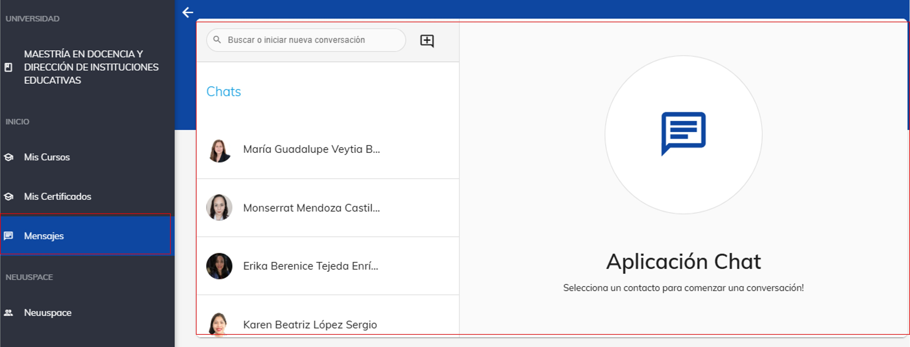
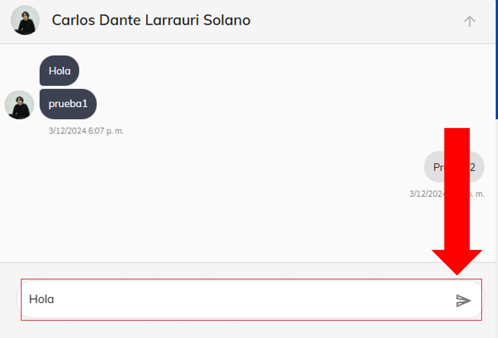

# Chatea con tu mentor

## Contacta a tu mentor en la plataforma

Entendemos que en un entorno virtual puede ser difícil la comunicación entre estudiantes y docentes. Es por eso 
que, dentro de la plataforma, encontrarás un espacio diseñado para conversar con tus mentores y compañeros con 
los que compartes cursos.

### 1. Ubica la sección

Existen dos formas de acceder a la sección de mensajes:

1. **Desde el menú lateral izquierdo**. Dirígete a la sección **Inicio** y selecciona la opción **Mensajes**.

2. **Desde la barra superior de notificaciones**. Ubica el primer ícono con forma de mensaje y haz clic en él.

### 2. Inicia una conversación

Al ingresar, verás una pantalla similar a la que se muestra en la imagen. En ella, se desplegará el historial 
de conversaciones que hayas tenido al utilizar esta funcionalidad.

### 3. Búsqueda de usuario

**Para iniciar una nueva conversación**, haz clic en el botón '+' que aparece al lado del buscador, como se
indica en la imagen.

Para buscar a tu mentor, dirígete a la barra de búsqueda que aparece en la imagen y escribe el nombre del mentor
que estás buscando, y haz clic sobre su nombre para iniciar una conversación.

### 4. Inicia una conversación

Al seleccionar el contacto, se abrirá la siguiente vista. Si ya tienes una conversación previa, esta se mostrará 
como en la imagen. De lo contrario, redacta tu mensaje y haz clic en el botón de enviar.

¡Listo! Con estos sencillos pasos habrás establecido comunicación con tu mentor. Recuerda que esta funcionalidad 
es una herramienta muy útil para mantenerte en contacto con él.