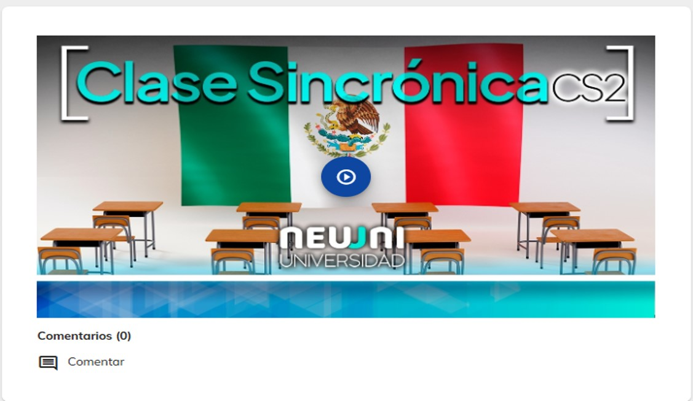
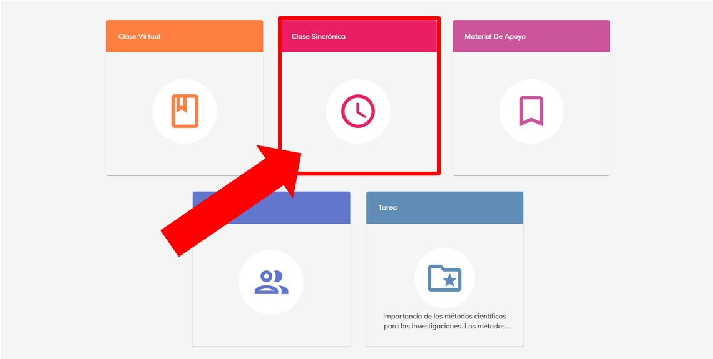
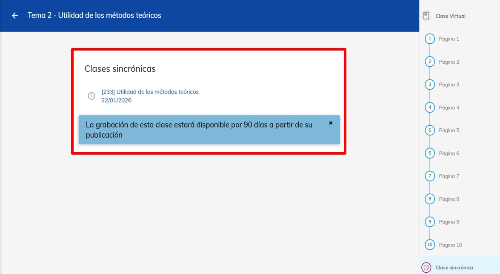
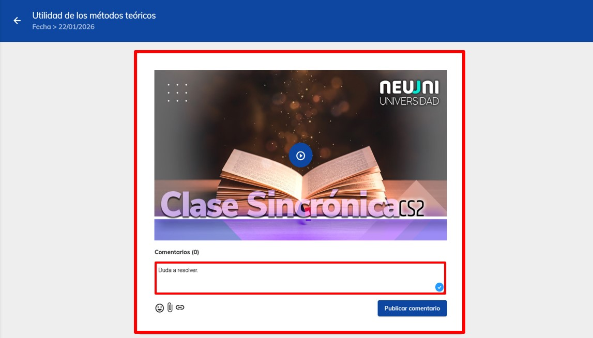

import VideoIntro from '@site/src/components/HomepageFeatures/insertarvideo.jsx';
import IntroBox from '@site/src/components/HomepageFeatures/introbox.jsx'
import Card from '@site/src/components/HomepageFeatures/card.jsx'
import StickyNote from '@site/src/components/HomepageFeatures/stickynotes.jsx'
import CustomLink from '@site/src/components/HomepageFeatures/CustomLink.jsx'

# 📹 Clase sincrónica

### Visualiza la grabación de tu clase

<IntroBox>
  Aprovecha la disponibilidad 24/7 del contenido multimedia de la plataforma. 😁 Descubre
  en este módulo la grabación de tu clase para revisar el video si llegaste a faltar, para revisar
  algún contenido o como complemento de alguna actividad.

  La clase sincrónica tiene la finalidad de asegurar la interacción entre los mentores y estudiantes en
  tiempo real y es el complemento de tu clase virtual. Además de tener  parte de la explicación del contenido
  de la materia, podrás aclarar dudas y trabajar en la actividad con tus compañeros en los **grupos de trabajo**.

  Aquí encontrarás las grabaciones de las clases en vivo. Perfectas para repasar, ponerte al día si faltaste o para ayudarte a realizar tu tarea.

  Las clases sincrónicas tienen la finalidad de asegurar la interacción entre los mentores y estudiantes 
  en tiempo real. Aquí se abordan explicaciones, demostraciones de contenidos y procedimientos prácticos
  del tema, incluyendo el trabajo en equipo de la actividad para clase sincrónica.

</IntroBox>

<StickyNote>

  Al término de la clase sincrónica se da una atención diferenciada a los estudiantes que lo requieran, 
  los cuales permanecen con el mentor por un espacio de hasta 30 minutos.

</StickyNote>

<Card>
  

  *Cada Clase Sincrónica es editada y subida a la plataforma*
</Card>

___

## I. Ingreso al módulo de clase sincrónica

Accede al módulo de **Clase sincrónica** desde la materia y el número de tema que desees.

<StickyNote>
  Si no recuerdas cómo hacerlo, consulta el tutorial
<CustomLink href="../Primeros pasos/firstelements.html">elementos de un curso</CustomLink>
</StickyNote>

<Card>
  

  *Módulo de **Clase Sincrónica***
</Card>

___

## II. Contenido de la clase sincrónica

Dentro de este módulo, se encuentra la grabación de tu clase sincrónica. El acceso al video de tu clase te
permite repasar el contenido, recuperar algo que te perdiste o ver la clase si no pudiste estar ahí. Recuerda 
que la grabación está disponible un día hábil después del día de tu clase y podrás verla 24/7. 

<Card>
  

  *La fecha en el título corresponde al día de tu clase*
</Card>

<StickyNote>
  La grabación de la clase está disponible a partir del primer día hábil y está en plataforma
  un lapso de 90 días
</StickyNote>

___

## III. Neuuni Connect

Dentro de la plataforma, nuestro reproductor de video incluye la herramienta Neuuni Connect, que te permite
realizar comentarios en intervalos específicos del contenido. Esto facilita que tu mentor identifique el momento
 exacto en el que surgió tu duda y pueda responderte de manera más clara y precisa.

<Card>
  

  *Utiliza NeuuniConnect para hacer tus preguntas*
</Card>

___

## 🎥 Videotutorial

<VideoIntro title="Clase sincrónica" videoUrl="https://www.youtube.com/embed/lC2juGz5sk0" />