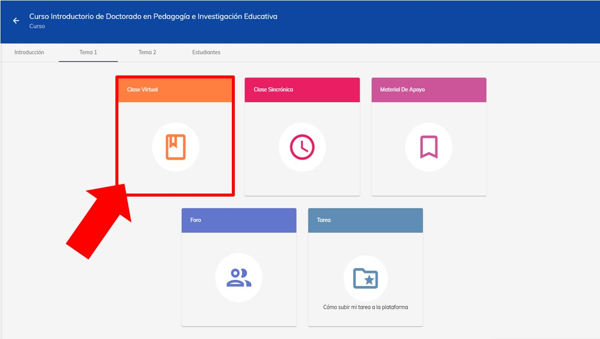
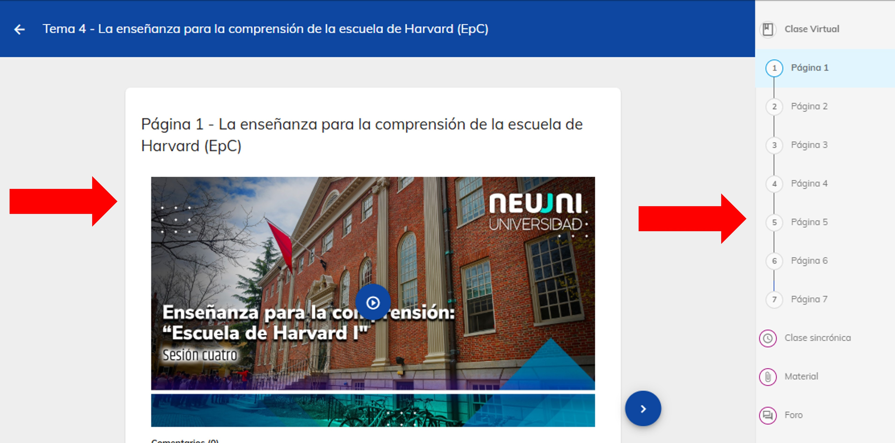
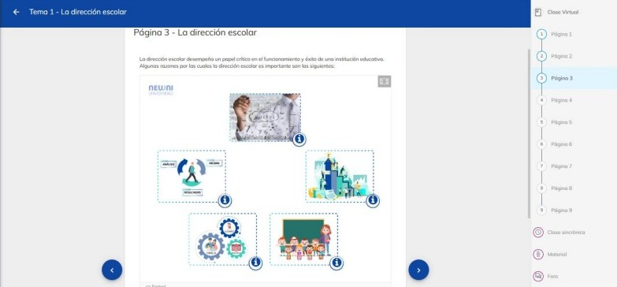
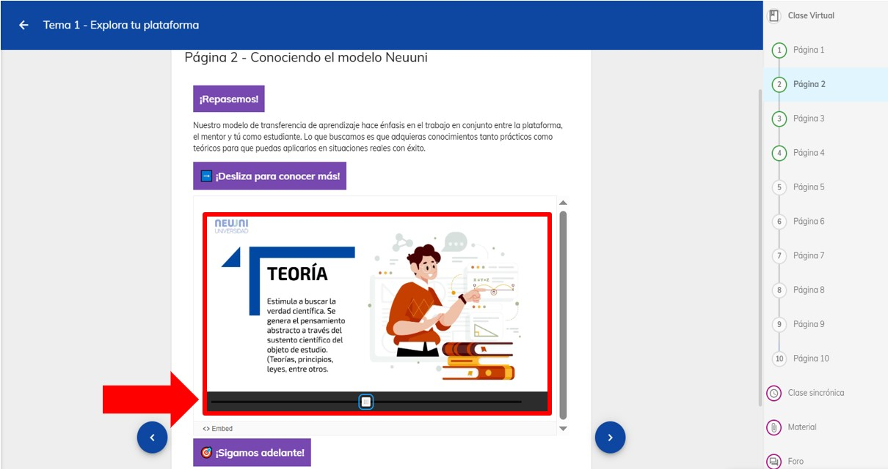
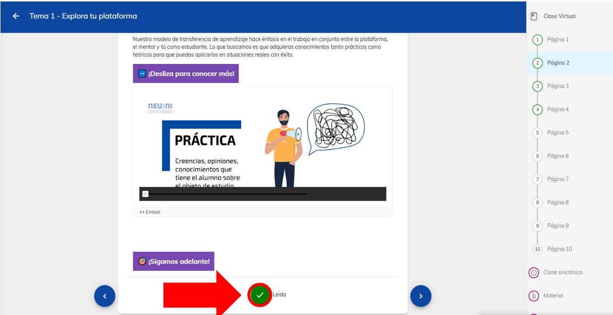

import VideoIntro from '@site/src/components/HomepageFeatures/insertarvideo.jsx';
import IntroBox from '@site/src/components/HomepageFeatures/introbox.jsx'
import Card from '@site/src/components/HomepageFeatures/card.jsx'
import StickyNote from '@site/src/components/HomepageFeatures/stickynotes.jsx'
import CustomLink from '@site/src/components/HomepageFeatures/CustomLink.jsx'

# 💻 Clase virtual

### Tu primer acercamiento al conocimiento

<IntroBox>
  La clase virtual es el pilar fundamental de tu curso. Aquí encontrarás todo 
  lo que necesitas para dominar tus materias, ya que es el módulo principal de 
  conocimiento. 🧠 **El reto de este espacio es presentar la esencia de la 
  teoría y el diseño de los procedimientos (habilidades) para su puesta en práctica**. 
  💡 Los elementos que la conforman (texto, imágenes, videos y actividades de 
  gamificación) facilitarán la comprensión del tema.

  **Organízate para darle el tiempo apropiado al estudio de este espacio y compleméntalo 
  con tus distintas técnicas de estudio**. ✍️ Recuerda que puedes consultar el 
  contenido las veces que se necesite, ya que siempre estará disponible cuando lo 
  necesites. ¡El conocimiento te espera! ✨
</IntroBox>

<StickyNote>
  Es importante **revisar a fondo la clase virtual antes de ingresar a tu clase sincrónica**
</StickyNote>

___

## I. Ingresar a plataforma Neuuni.

Accede al módulo de **Clase virtual** desde la materia y el número de tema que desees.

<StickyNote>
  Si no recuerdas cómo hacerlo, consulta el tutorial sobre 
  <CustomLink href="../Primeros pasos/firstelements.html">elementos de un curso</CustomLink>
</StickyNote>

<Card>
  

  *La Clase Virtual es el primer módulo de cada tema*
</Card>

<Card>

  ℹ️ *Recuerda: Debes consultar el contenido de tu Clase Virtual antes de acceder a
  tu Clase Sincrónica. Te recomendamos que te tomes tu tiempo para revisar el contenido
  y aplicar tus técnicas de aprendizaje 🧠*
  
</Card>

___

## II. Contenido de la clase virtual

Dentro de la sección, podrás observar el contenido principal del tema, el cual estará compuesto 
por videos, textos y, en algunos casos, herramientas de gammificación que te ayudarán a reforzar
tu aprendizaje.

<Card>
  

  *Utiliza las herramientas de navegación para desplazarte entre el contenido de la Clase Virtual*
</Card>

Durante el recorrido del tema, en las distintas páginas, podrás encontrar **herramientas de gamificación** que 
te permitirán evaluar y reforzar tu progreso. La clase virtual no se limita a texto, ya que incluye diversos 
formatos interactivos y métodos de aprendizaje diseñados para enriquecer tu experiencia.

<Card>
  

  

  *Las herramientas de gamificación ayudan a comprender y reforzar el aprendizaje*
</Card>

Cada una de las páginas incluye una guía visual que guarda la última página que leíste, 
permitiéndote saber exactamente dónde continuar la próxima vez que ingreses al módulo.

<Card>
  

  *Usa el indicador de página leída para guardar el progreso de tu lectura*
</Card>

___

## 🎥 Videotutorial

<VideoIntro title="Clase virtual" videoUrl="https://www.youtube.com/embed/prF15wbTiPs" />