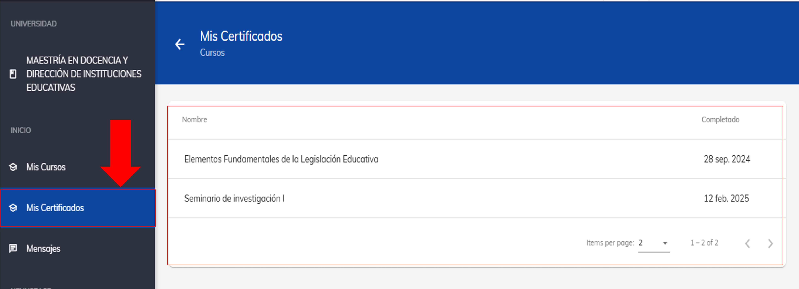

import VideoIntro from '@site/src/components/HomepageFeatures/insertarvideo.jsx';
import IntroBox from '@site/src/components/HomepageFeatures/introbox.jsx'
import Card from '@site/src/components/HomepageFeatures/card.jsx'
import StickyNote from '@site/src/components/HomepageFeatures/stickynotes.jsx'
import CustomLink from '@site/src/components/HomepageFeatures/CustomLink.jsx'

# 🏆 Constancia de materia

### Descarga tu constancia

<IntroBox>
    **¡Felicitaciones por aprobar tu materia! Ya puedes descargar tu constancia, la cual acredita tus nuevos 
    conocimientos adquiridos**. Estas evaluaciones nos ayudan a mejorar continuamente nuestros cursos y a brindarte 
    una mejor experiencia de aprendizaje.
</IntroBox>

## 1. Verifica tu Porcentaje de avance

Para obtener tu constncia, es necesario haber completado la calificación mínima aprobatoria: para
**licenciaturas es de 70%** y para **posgrados es de 80%**.

<Card>
    
    ___
    *El recuadro rojo indica también la calificación del curso*
</Card>

Una vez que hayas alcanzado la calificación mínima aprobatoria, aparecerá el botón **Obtener constancia**.
Haz clic para iniciar el proceso de generación de tu constancia al responder la evaluación docente y del curso.

<Card>
    
    ___
    *El botón para obtener la constancia aparece una vez que se ha alcanzado
    la calificación mínima aprobatoria*
</Card>

También puede aparecer de esta manera: 

<Card>
    
</Card>

<StickyNote>
    Si no te aparece el botón **Obtener constancia**,
    comunícate con nuestros agentes de Soporte Técnico
</StickyNote>

## 2. Responder evaluación 

Al hacer clic en **Obtener constancia**, se mostrará una encuesta que debes completar.

Responde los reactivos de la evaluación según indique cada pregunta. Estas evaluaciones son
importantes para mantener los cursos constantemente actualizados y a nuestros mentores capacitados.

<Card>
    
    ___
    *Responde cada uno de los reactivos de la evaluación para obtener tu constancia*
</Card>

## 3. Descarga tu Constancia de Acreditación

Una vez que hayas completado la encuesta, haz clic en **Guardar** en la parte superior derecha para guardar la evaluación
y pueda obtenerse tu Constancia de Acreditación.

Desde la constancia generada, podrás descargar tu archivo en PDF
desde el botón **Obtener PDF** ubicado en la parte superior derecha.

<Card>
    
    ___
    *Archivo de la constancia de acreditación*
</Card>

## 4. Cómo ver el historial de constancias

En el menú lateral izquierdo, ubica la sección **Mis Constancias**.

Dentro de este apartado, encontrarás todos los certificados de los cursos que has 
completado exitosamente.

Puedes descargar tus certificados las veces que desees y en cualquier momento.

<Card>
    
    ___
    *Las constancias generadas aparecerán en la sección* Mis Constancias
</Card>

___

**¡Enhorabuena por este nuevo logro!** 🏆

Completar tu evaluación y obtener este documento
es el paso final para formalizar tu esfuerzo.

Recuerda que es **indispensable descargar tu certificado** para que el sistema
registre la materia como concluida correctamente; esto permitirá que el **porcentaje
de avance general de tu carrera** se actualice y puedas seguir progresando hacia tu
meta de graduación.