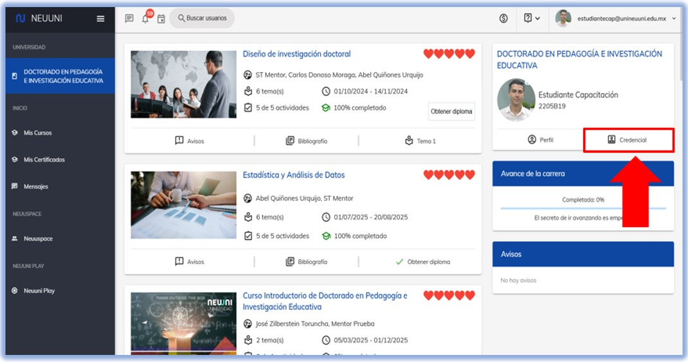
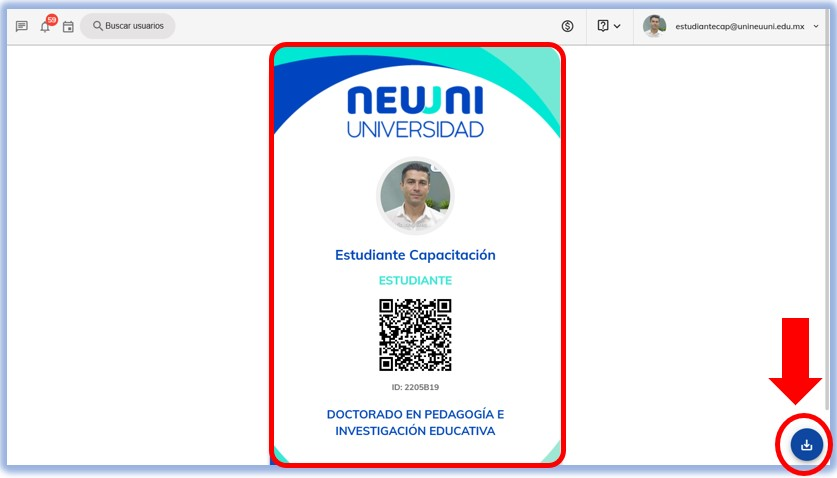

#  Obtén tu credencial de estudiante. 

### Ingresa a plataforma. 

Ingresa a la plataforma Neuuni. Desde el siguiente enlace [Plataforma Neuuni](https://unineuuni.edu.mx/).

Una vez dentro de la plataforma, se mostrará la siguiente visualización, donde encontrarás la opción señalada como **"Credencial"**. Selecciona esa opción para continuar.

Al ingresar, se visualizará tu credencial de estudiante de la Universidad Neuuni. También tendrás la opción de descargarla desde el botón ubicado en la parte inferior derecha.

