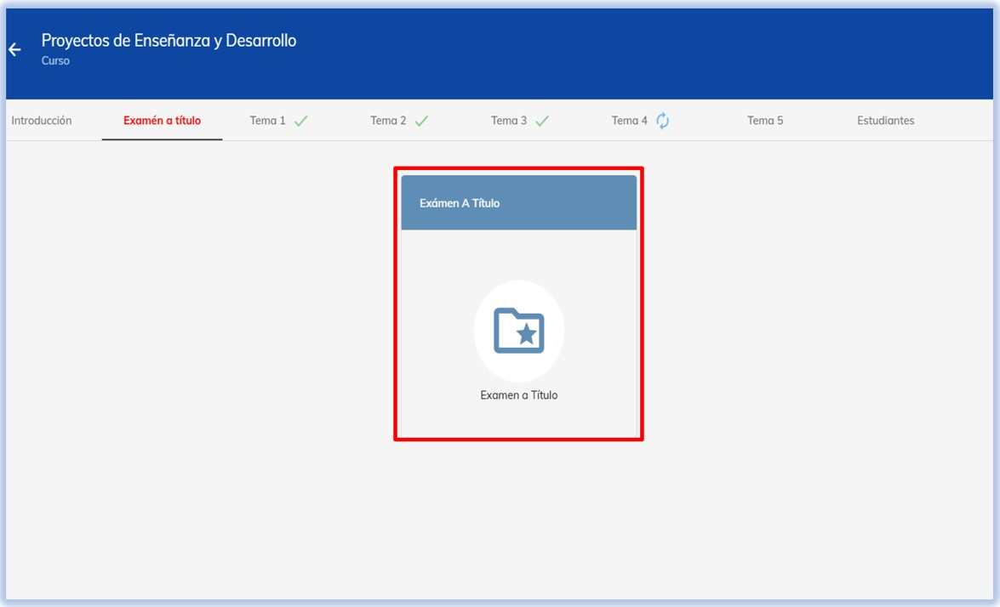

# 📄 Examen a título

### Conoce el proceso de examen a título

  

   *¿Qué debo hacer si me faltaron actividades para aprobar mi materia?* 😥
   ¡No te preocupes! En este tutorial, conocerás **los pasos del examen a título**, la cual es una opción para aprobar la materia en caso
   de que durante el envío regular de actividades no se haya logrado alcanzar el porcentaje mínimo aprobatorio de tu materia.

   **¡¡¡No te desanimes!!! Continúa trabajando y esforzándote al máximo 💪🧠**
  

 

 {
  e.currentTarget.style.transform = 'rotate(-2deg) scale(1.05)';
}}
onMouseOut={(e) => {
  e.currentTarget.style.transform = 'rotate(2deg) scale(1)';
}}>
  📌 ***NOTA:*** 

   *La calificación mínima aprobatoria para licenciaturas es 70% y para posgrado es 80%*

## 1. Validación de pago

El primer paso para iniciar el proceso, es realizar el pago según las indicaciones que te haya proporcionado tu Coordinador.
Recuerda que, una vez realizado el pago, **debes enviar el comprobante de pago a tu Coordinador**, quien te notificará cuando
puedas hacer el envío del examen a título.

 {
  e.currentTarget.style.transform = 'rotate(-2deg) scale(1.05)';
}}
onMouseOut={(e) => {
  e.currentTarget.style.transform = 'rotate(2deg) scale(1)';
}}>
  📌 ***NOTA:*** 

   *Recuerda que este proceso debe realizarse directamente con tu coordinador*

## 2. Ingresa al módulo

En la página principal de tu materia, haz clic en **Examen a título**, para que puedas conocer la actividad que realizarás.

## 3. Responde la actividad

**Lee detenidamente las instrucciones de la actividad**. Recuerda que **ahí mismo se especifica también la forma en la que 
se realizará el envío de los archivos de tu examen**.

Antes de enviar tu examen, **verifica que los archivos que subas al módulo sean los correctos**, para evitar demoras en la evaluación. 👁️

## 4. Revisión 

Para que tu examen pueda ser revisado, una vez que has enviado la actividad **notifica a tu Coordinador** para continuar con el proceso.
La calificación estará apareciendo en la tarjeta de la materia, en la sección *"Mis Cursos"*.

 

  

   ***✅ Recuerda: Este proceso es una gran oportunidad para demostrar todo lo que has aprendido. Sigue cada paso con atención y compromiso para cerrar con éxito esta etapa de tu formación. ¡Ánimo! Tu esfuerzo te acerca cada vez más a tus metas.***
  

 

## ℹ️ Infografía

   

 