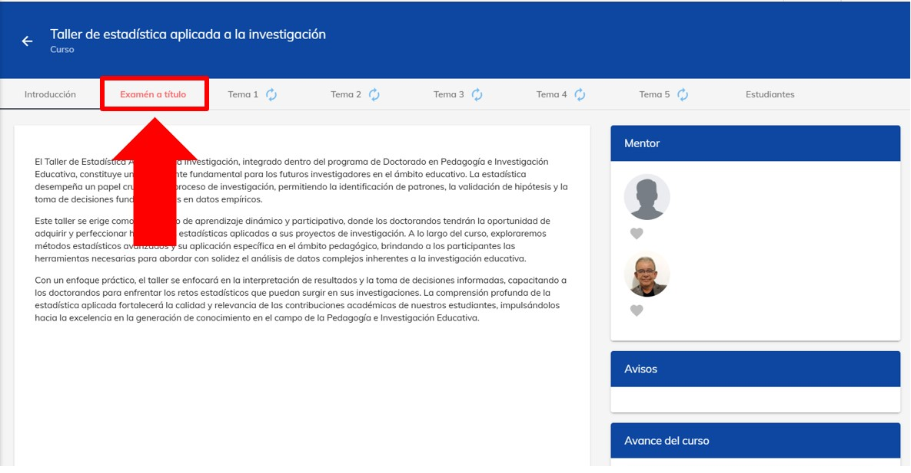
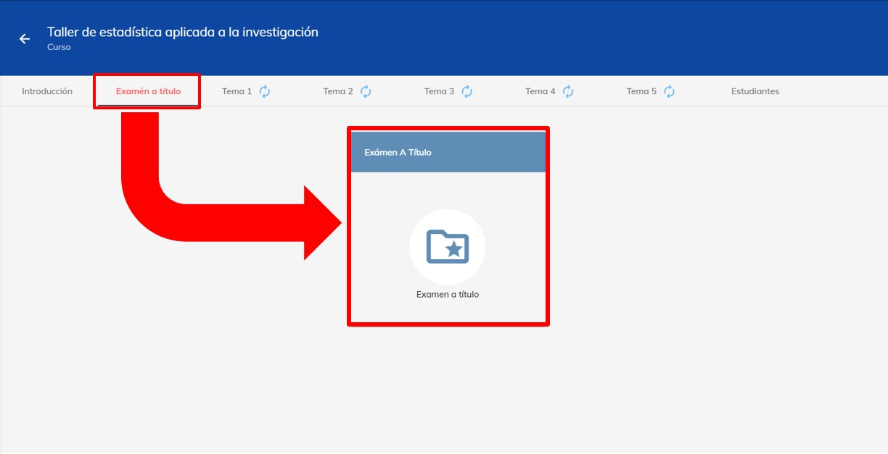
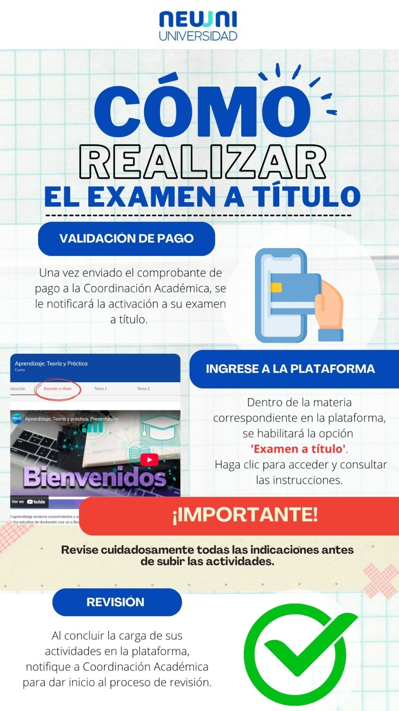

import VideoIntro from '@site/src/components/HomepageFeatures/insertarvideo.jsx';
import IntroBox from '@site/src/components/HomepageFeatures/introbox.jsx'
import Card from '@site/src/components/HomepageFeatures/card.jsx'
import StickyNote from '@site/src/components/HomepageFeatures/stickynotes.jsx'
import CustomLink from '@site/src/components/HomepageFeatures/CustomLink.jsx'

# 📄 Examen a título

### Conoce el proceso de examen a título

<IntroBox>
  *¿Qué debo hacer si me faltaron actividades para aprobar mi materia?* 😥

  ¡No te preocupes! En este tutorial, conocerás una opción para aprobar la materia en caso de que durante el envío
  regular de tareas no hayas logrado alcanzar el porcentaje mínimo aprobatorio de tu materia: el **Examen a título**.

  A continuación veremos los pasos a seguir para realizar nuestro examen a título.

  **¡¡¡No te desanimes!!! Continúa trabajando y esforzándote al máximo 💪🧠**
</IntroBox>

<StickyNote>
  La calificación mínima aprobatoria para licenciaturas es 70% y para posgrados es 80%
</StickyNote>

___

## I. Validación de pago

El primer paso para iniciar el proceso, es realizar el pago según las indicaciones que te haya proporcionado tu Coordinador.
Recuerda que, una vez realizado el pago, **debes enviar el comprobante de pago a tu Coordinador**, quien te notificará cuando
puedas hacer el envío del examen a título.

<StickyNote>
  Recuerda que este proceso debe realizarse directamente con tu coordinador
</StickyNote>

___

## II. Ingresa al módulo

En la página principal de tu materia, haz clic en **Examen a título**, para que puedas conocer la actividad que realizarás.

<Card>
  
  
  
  
  *Ubicación del examen a título dentro del curso*
</Card>

___

## III. Responde la actividad

**Lee detenidamente las instrucciones de la actividad**. Recuerda que **ahí mismo se especifica también la forma en la que 
se realizará el envío de los archivos de tu examen**.

<StickyNote>
  Antes de enviar tu examen, **verifica que los archivos que subas al módulo sean los correctos**, para evitar demoras en la evaluación. 👁️
</StickyNote>

___

## IV. Revisión 

Para que tu examen pueda ser revisado, una vez que has enviado la actividad **notifica a tu Coordinador** para continuar con el proceso.
La calificación estará apareciendo en la tarjeta de la materia, en la sección *"Mis Cursos"*.

___

<Card>
  **✅ Recuerda: Este proceso es una gran oportunidad para demostrar todo lo que has aprendido.
  Sigue cada paso con atención y compromiso para cerrar con éxito esta etapa de tu formación.
  ¡Ánimo! Tu esfuerzo te acerca cada vez más a tus metas.**
</Card>

## ℹ️ Infografía

<Card>
  
  ___
  *Proceso de examen a título*
</Card>