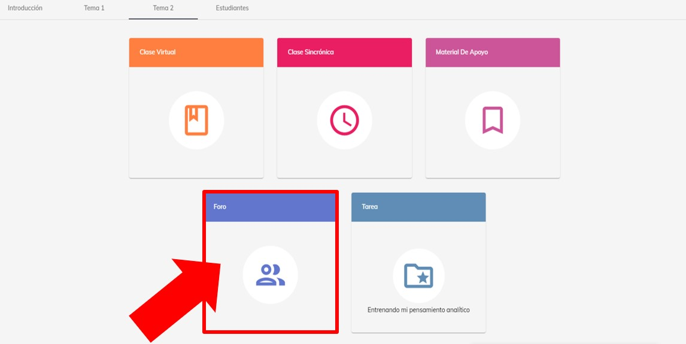
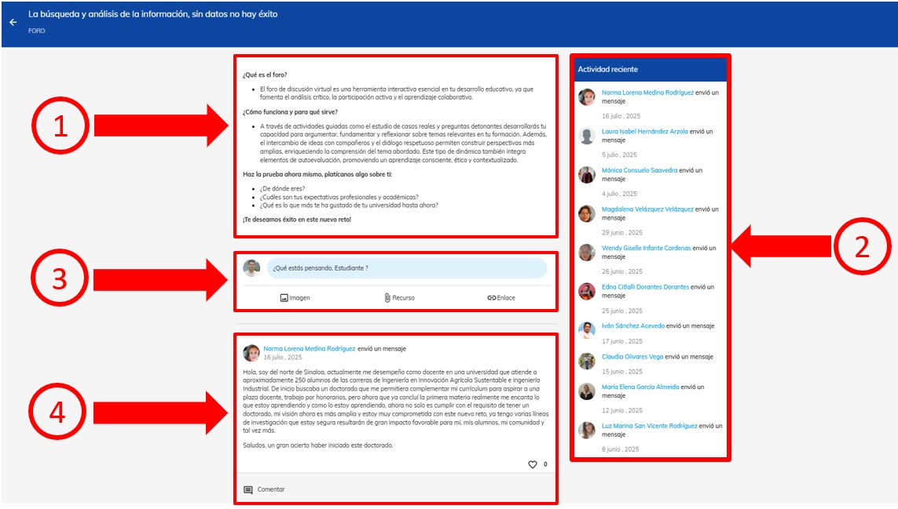

import VideoIntro from '@site/src/components/HomepageFeatures/insertarvideo.jsx';
import IntroBox from '@site/src/components/HomepageFeatures/introbox.jsx'
import Card from '@site/src/components/HomepageFeatures/card.jsx'
import StickyNote from '@site/src/components/HomepageFeatures/stickynotes.jsx'
import CustomLink from '@site/src/components/HomepageFeatures/CustomLink.jsx'

# 👥 Foro

### Comparte tus opiniones y participa en NEUUNI

<IntroBox>
  El módulo de foro es una parte importante en la ruta de aprendizaje cada semana. Propicia la interacción reflexiva entre los estudiantes y el mentor. Aquí, **se expresan los
  puntos de vista sobre un caso relacionado con el tema**, convirtiéndose en una rica actividad de aprendizaje. 🔝

  El análisis del caso de estudio se complementa con las preguntas detonadoras para llegar a una solución y compartirla en el espacio. Es importante **el intercambio de ideas
  entre todos, permitiendo que tanto alumnos como mentor compartan sus opiniones sobre el caso**, un concepto muy importante en el proceso de aprendizaje. 👥
</IntroBox>

<StickyNote>
  El foro debe realizarse semanalmente después de haber tenido la respectiva clase sincrónica
</StickyNote>

⚠️ **¡¡No olvides participar en esta parte tan importante de NEUUNI!! 💯🔝**

___

## I. Ingreso al foro

Accede al módulo de foro desde la materia y el número de tema que corresponde.
Si no recuerdas cómo hacerlo, puedes consultar el tutorial
**<CustomLink href="../Primeros pasos/firstelements.html">elementos de un curso</CustomLink>**.

<Card>
  
  
  *Módulos de un curso*
</Card>

___

## II. Elementos del foro

Al entrar al foro, podrás observar los siguientes elementos:
    
    1. **Orientación del foro**. Es el apartado informativo sobre el tema seleccionado que se trabajará, compuesto por:
      
        - *Propósito de la actividad:* Define el **objetivo fundamental del ejercicio**, explicando la meta principal que se
        busca lograr. Establece el "por qué" de la actividad, guiando al participante hacia la comprensión del resultado
        deseado.
        - *Orientación para ejecutarla:* Describe el **proceso a seguir para completar la actividad**. Proporciona instrucciones
        claras y detalladas, incluyendo los recursos necesarios (como lecturas, videos, etc.) y las tareas específicas
        a realizar. Es el "cómo" se llevará a cabo la actividad.
        - *Orientación para autoevaluación:* Fomenta la **reflexión personal sobre el proceso de aprendizaje**. Te invita a
        analizar tu propio desempeño y la adquisición de conocimientos. Las preguntas formuladas te ayudarán a evaluar si
        los objetivos de aprendizaje se han cumplido y a identificar cualquier dificultad o experiencia en la realización
        del foro. Es una herramienta para el "autocuestionamiento" y la mejora continua.
      
    2. **Actividad reciente.** Un espacio que muestra la actividad reciente de los participantes que han comentado en el foro.
    3. **Campo de comentario.** Es el área donde podrás compartir tu opinión mediante texto, imágenes, enlaces o documentos. 
    Desde aquí podrás publicar tu comentario del foro.
    4. **Participaciones del foro.** El espacio donde aparecerá tu comentario de foro una vez realizado y los comentarios de
    tus compañeros, con la posibilidad de interactuar o dando *Me gusta* a las aportaciones de tus compañeros.

<Card>
  
  
  *Elementos del foro*
</Card>

___

**¡Enhorabuena por sumar tu voz a la comunidad!**

Al compartir tus ideas, no solo demuestras tu dominio del tema, sino que también contribuyes
al crecimiento profesional de todos tus compañeros. Tu compromiso con el diálogo es lo que
convierte un curso en una verdadera experiencia de aprendizaje.

Recuerda ingresar semanalmente para revisar las retroalimentaciones de tu mentor y las
respuestas de tus colegas, ya que la riqueza del foro reside en la constancia de la
interacción.

___

## 🎥 Videotutorial

<VideoIntro title="Foro" videoUrl="https://www.youtube.com/embed/nk7opnZTp2o" />