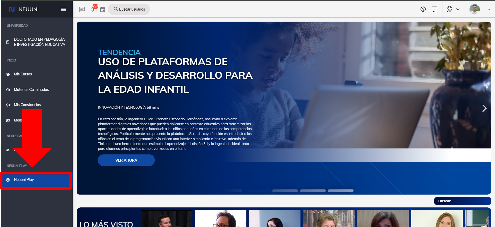
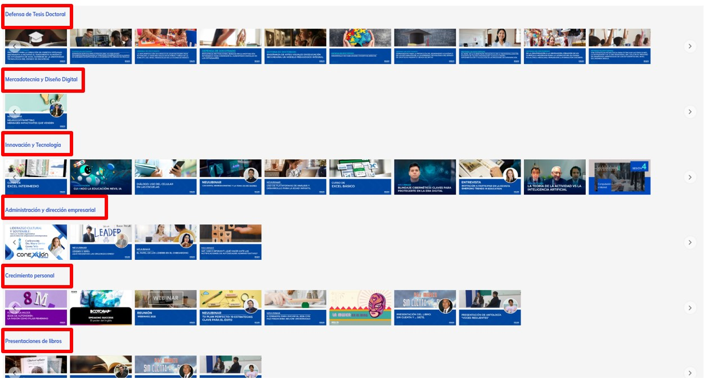
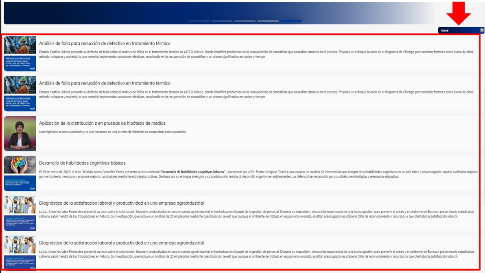

import VideoIntro from '@site/src/components/HomepageFeatures/insertarvideo.jsx';
import IntroBox from '@site/src/components/HomepageFeatures/introbox.jsx'
import Card from '@site/src/components/HomepageFeatures/card.jsx'
import StickyNote from '@site/src/components/HomepageFeatures/stickynotes.jsx'
import CustomLink from '@site/src/components/HomepageFeatures/CustomLink.jsx'

# 🎬 NeuuniPlay

### El 'Netflix' de NEUUNI

<IntroBox>
    **¡Bienvenido a la experiencia NeuuniPlay!**

    El espacio donde el aprendizaje se encuentra con el entretenimiento. Sumérgete en nuestro
    catálogo exclusivo de eventos, charlas magistrales y conferencias diseñadas para inspirarte.
</IntroBox>

___

## I. ¿Qué es Neuuni Play?

Neuuni play es un espacio donde encontraras distintas series de videos de diferentes categorías en 
tendencia. Encontraras temas como ciencia, tecnología, educación, negocios, investigación, 
psicología, etc.

Su principal objetivo es proporcionar a los estudiantes un acceso fácil y dinámico a recursos educativos 
multimedia. A través de Neuuni Play, los alumnos pueden acceder a videos, tutoriales, conferencias en línea y 
otros contenidos que complementan su aprendizaje. 

___

## II. Accede al sitio

Dirígete al menú lateral izquierdo, en la parte de abajo, y selecciona **Neuuni Play**, como se indica en la
imagen.

<Card>
    
    
    *Ubicación de NeuuniPlay dentro de la plataforma*
</Card>

Al ingresar a Neuuni Play, podrás explorar el contenido multimedia que tenemos disponible para ti. A través de 
las distintas secciones, encontrarás una variedad de videos, desde Neuuniclases y webinars hasta series sobre 
las principales carreras en NEUUNI, entre otros. ¡La oferta de interacción es amplia y diversa!

<Card>
    
    
    *NeuuniPlay es el espacio que alberga el contenido multimedia de NEUUNI*
</Card>

___

## III. Características

1. **Acceso a Contenido Variado**: Los estudiantes pueden explorar una amplia variedad de temas a través de 
materiales interactivos que hacen el aprendizaje más atractivo. Desde clases grabadas hasta recursos de lectura,
 todo está diseñado para facilitar el entendimiento.

2. **Aprendizaje Autodirigido**: Neuuni Play permite a los estudiantes aprender a su propio ritmo. Pueden pausar,
 retroceder y revisar los materiales tantas veces como necesiten, lo cual es ideal para comprender conceptos 
 difíciles.

<Card>
    
    
    *NeuuniPlay está dividido en categorías que facilitan la organización del contenido*
</Card>

3. **Interactividad**: Algunos contenidos pueden incluir elementos interactivos, como cuestionarios o ejercicios
 prácticos, lo que fomenta una experiencia de aprendizaje más activa.

4. **Soporte a Estudiantes**: Neuuni Play brinda recursos adicionales que ayudan a los estudiantes con diferentes
 estilos de aprendizaje. Esto refleja el compromiso de la universidad de adaptarse a las necesidades de todos 
 sus alumnos.

<Card>
    
    
    *El contenido de NeuuniPlay es totalmente propiedad de NEUUNI*
</Card>

5. **Accesibilidad**: Está diseñado para ser accesible desde diferentes dispositivos, ya sea computadora, tablet o
 móvil, lo que permite que los estudiantes se conecten desde cualquier lugar y en cualquier momento. 

La idea es que **Neuuni Play** se convierta en una **herramienta clave para optimizar el aprendizaje y facilitar
la adquisición de conocimientos** en todos los niveles académicos. Neuuni Play es tu llave a un mundo de 
conocimiento que te espera, donde cada video y cada curso puede ser el paso que te lleve más cerca de tus sueños. 

**¡Explora, aprende y crece! 📘✨**