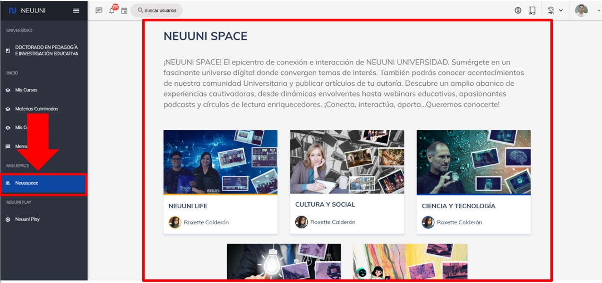
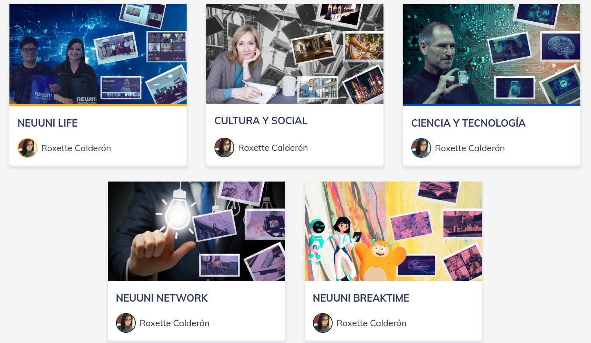

import VideoIntro from '@site/src/components/HomepageFeatures/insertarvideo.jsx';
import IntroBox from '@site/src/components/HomepageFeatures/introbox.jsx'
import Card from '@site/src/components/HomepageFeatures/card.jsx'
import StickyNote from '@site/src/components/HomepageFeatures/stickynotes.jsx'
import CustomLink from '@site/src/components/HomepageFeatures/CustomLink.jsx'

# 🪐 NeuuniSpace

### Nuestro espacio de conexión e interacción

<IntroBox>
    **¡Bienvenido(a) a tu zona de interacción!**

    Este es un espacio diseñado para ti, donde encontrarás un lugar lleno de temas interesantes y relevantes para 
    tu vida universitaria. Sumérgete en esta sección y descubre todo lo que tenemos preparado para ti. ¡No te 
    arrepentirás!
</IntroBox>

___

## I. ¿Qué es Neuuni Space?
¡Neuuni Space es un espacio emocionante y creativo de NEUUNI! 🌌✨ Es un lugar donde se fomenta la innovación, 
la colaboración y el aprendizaje práctico. En Neuuni Space, los estudiantes pueden obtener información para
participar en talleres, charlas, y eventos que les permiten desarrollar sus habilidades de manera activa y 
dinámica; además, es el punto de conexión e interacción entre todo el Universo NEUUNI: alumnos, mentores y
administrativos.

___

## II. ¿Cómo accedo a NeuuniSpace?

Dirígete al menú lateral izquierdo, en la parte de abajo, y selecciona **Neuuni Space**, como se indica en la
imagen.

<Card>
    
    
    *Ubicación de NeuuniSpace*
</Card>

Al ingresar en este apartado, aparecerán las siguientes secciones, las cuales podrás interactuar de distintas 
formas:

<Card>
    
    
    *Hay 5 categorías dentro de NeuuniSpace*
</Card>

    1. **Neuuni Life**. ¡Neuuni Life es la esencia vibrante de la experiencia estudiantil en la Universidad de 
    Neuuni! 🌟 Es más que solo una plataforma; es un enfoque integral que abarca todas las actividades y aspectos 
    de la vida estudiantil.

    2. **Cultura y social**. Esta parte de la plataforma se enfoca en enriquecer la vida estudiantil a través de 
    actividades culturales y sociales, promoviendo la diversidad y la conexión entre los estudiantes. 🤝👩‍🎓👨‍🎓

    3. **Ciencia y tecnología**. Es un espacio diseñado para fomentar la innovación, el aprendizaje interactivo y el
    desarrollo de habilidades tecnológicas entre los estudiantes. 🧪🛠💻

    4. **Neuuni Network**. Es el punto de conexión entre estudiantes, mentores y administrativos, promoviendo una 
    red de colaboración y apoyo en el proceso de aprendizaje y desarrollo profesional.
    Si eres autor, artista, o tienes una obra que te gustaría compartir, ¡esta es tu oportunidad! 🎨✨ 
    Te invitamos a mostrar tus creaciones en Neuuni Space, una plataforma donde podrás exponer tu talento y ser 
    parte de una comunidad que valora la creatividad. Esta es una excelente manera de dar a conocer tu trabajo y 
    conectar con otros apasionados. ¡No dudes en enviarnos tus obras y ser parte de esta emocionante exposición! 
    🚀📚 *(Contáctate con Soporte Técnico para mayor información)*.

    5. **Neuuni Breaktime**. ¡Hola! Neuuni Breaktime es una maravillosa iniciativa que ofrece a los estudiantes un 
    espacio para relajarse y desconectar un poco de las cargas académicas. Es el momento perfecto para 
    disfrutar de actividades recreativas 🥳✨ 

___

## III. Características

    1. **Talleres y Conferencias**: Aquí se realizan actividades que abarcan diversos temas, desde emprendimiento 
    hasta desarrollo personal, impartidos por expertos y profesionales en diversas áreas.
    2. **Colaboración entre Estudiantes**: Neuuni Space promueve el trabajo en equipo, permitiendo que los alumnos 
    colaboren en proyectos y compartan ideas, lo que enriquece el aprendizaje colectivo.
    3. **Recursos Multimedia**: Puedes acceder a contenido audiovisual, tutoriales y materiales interactivos que 
    complementan tu formación.
    4. **Fomento de la Creatividad**: Este espacio está diseñado para inspirar la creatividad y la innovación, 
    alentando a los estudiantes a pensar de manera diferente y a desarrollar nuevas ideas. 
    5. **Comunidad**: Neuuni Space crea un ambiente amigable y de apoyo, donde los estudiantes pueden conectarse
    entre sí y con profesorado, fortaleciendo la red de contactos para su futuro profesional. 

Es el lugar ideal para todos aquellos que buscan aprovechar al máximo su experiencia educativa y encontrar 
nuevas oportunidades. ¡Si te gustaría saber más o tienes alguna pregunta específica sobre Neuuni Space, no 
dudes en preguntar! 🚀