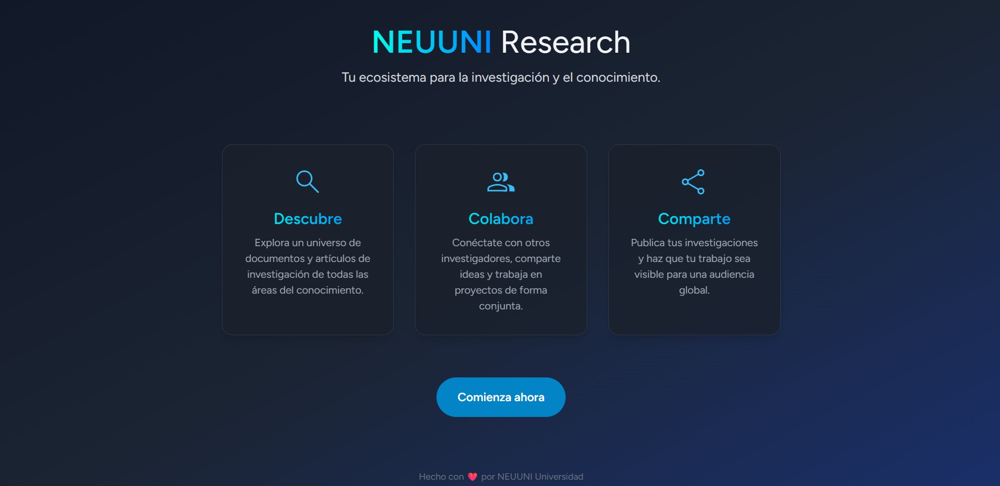
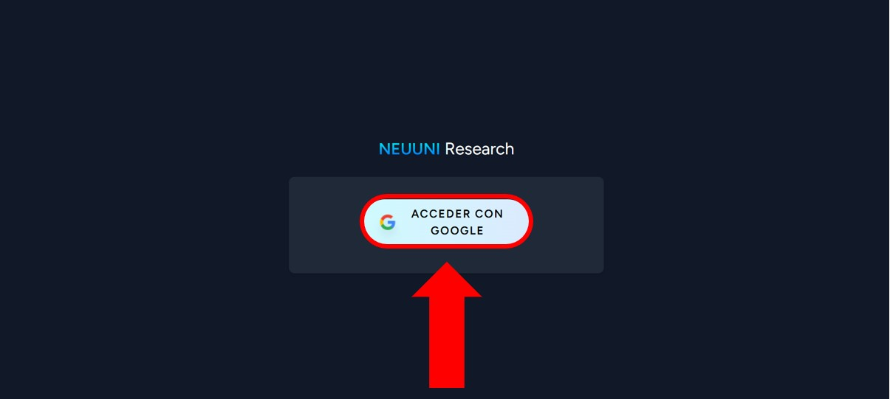
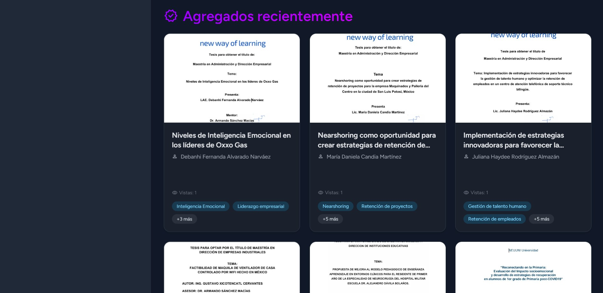
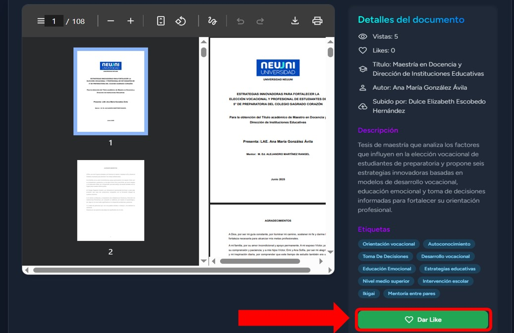
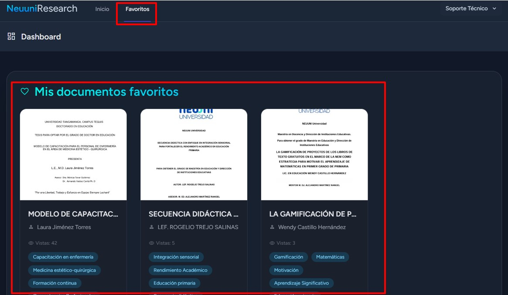

import CustomLink from '@site/src/components/HomepageFeatures/CustomLink.jsx';
import IntroBox from '@site/src/components/HomepageFeatures/introbox.jsx';
import StickyNote from '@site/src/components/HomepageFeatures/stickynotes.jsx';
import Card from '@site/src/components/HomepageFeatures/card.jsx';

# 📖 NeuuniResearch

### Repositorio de documentos

<IntroBox>
    **NeuuniResearch** es el repositorio digital especializado de NEUUNI, diseñado para acompañarte en tu formación académica
    y facilitar el aceso a fuentes de información confiables y de alta calidad.

    Es un espacio centralizado donde **se almacena, organiza y conserva la producción intelectual y científica de los integrantes del ecositema NEUUNI**.
    En NeuuniResearch, **este contenido está concentrado específicamente para servir como base en tus investigaciones y tareas**.
</IntroBox>

___

## 💡 ¿Cómo ayuda NeuuniResearch a tu formación?
Contar con un repositorio institucional te ofrece ventajas clave:

    - **Información Verificada**: Acceso a fuentes oficiales y académicas, evitando la desinformación de buscadores genéricos.
    - **Centralización**: Todo lo que necesitas para tu carrera en un solo lugar.
    - **Inspiración**: Consulta tesis y protocolos reales para guiar tus propios proyectos finales.

___

## 📂 Contenido disponible
Para apoyar tu aprendizaje, el sitio alberga diversos tipos de recursos:

    - **Artículos científicos:** Lo último en investigación y hallazgos académicos.
    - **Tesis:** Trabajos de grado de otros alumnos para consulta y referencia.
    - **Libros y Herramientas estadísticas:** Material de apoyo para tus análisis de datos.
    - **Plantillas de protocolos:** Estructura base  para facilitar la creación de tus proyectos.

___

## 🚀 Cómo acceder y navegar
El repositorio está disponible al hacer clic en la siguiente dirección: 🔗 <CustomLink href="https://research.unineuuni.com" target="blank" rel="noopener noreferrer">**research.unineuuni.com**</CustomLink>.

<Card>
    
    ___
    *Página principal de **NeuuniResearch***
</Card>

<StickyNote>
    Puedes acceder al repositorio desde el botón **📚 NeuuniResearch** ubicado en la parte superior derecha de esta página,
    al lado del buscador
</StickyNote>
___

## 👣 Pasos para ingresar

    1. **Inicio de sesión:** Utiliza exclusivamente tu **correo institucional** para validar tu
    acceso, como lo has utilizado en NEUUNI.

    <Card>
        
        ___
        *Utiliza* **Acceder con Google** *para ingresar a NeuuniResearch*
    </Card>
    2. **Inicio:** En la pantalla principal verás el catálogo general. La página destacará los archivos *Más populares* y los *Más recientes*.
<Card>
    
    
    ___
    **Inicio** *de NeuuniResearch, donde aparecen los documentos con más vistas y los que se añaden
    recientemente*
</Card>

    3. **Uso de filtros:** En el menú lateral izquierdo, puedes segmentar tu búsqueda por:
        - Grado académico.
        - Tipo de documento.
        <StickyNote>
            Usa el botón ***Limpiar filtro*** para reiniciar tu búsqueda en cualquier momento
        </StickyNote>

    <Card>
        
        ___
        *Los filtros te ayudarán a segmentar los documentos por grado académico y tipo de documento*
    </Card>

    4. **Detalles del documento:** Al seleccionar un archivo, podrás leer una descripción detallada y metadatos
    relavantes para saber si es lo que necesitas antes de profundizar en él.

### 🌟 Sección de Favoritos

Si encuentras un documento útil y quieres consultarlo después sin tener que buscarlo de nuevo:

    - Haz clic en el ícono de ***Dar like*** dentro del documento.

<Card>
    
    ___
    ***Dar Like** guardará el documento en **Favoritos***
</Card>

    - El archivo se guardará automáticamente en tu sección de **Favoritos**, ubicada en el menú principal, para un acceso inmediato.

<Card>
    
    ___
    *La sección* **Favoritos** *te permite guardar archivos para acceder a ellos de manera más rápida*
</Card>

___

## 🤝 Contribuye a la comunidad
¿Tienes una tesis o un archivo académico de valor que gustaría compartir con otros alumnos?
**¡Tu aporte es valioso!** Ponte en contacto con tu **Coordinador Académico** para iniciar el proceso de gestión y
revisión del documentos. ¡Junto fortalecemos el aservo de NeuuniResearch!