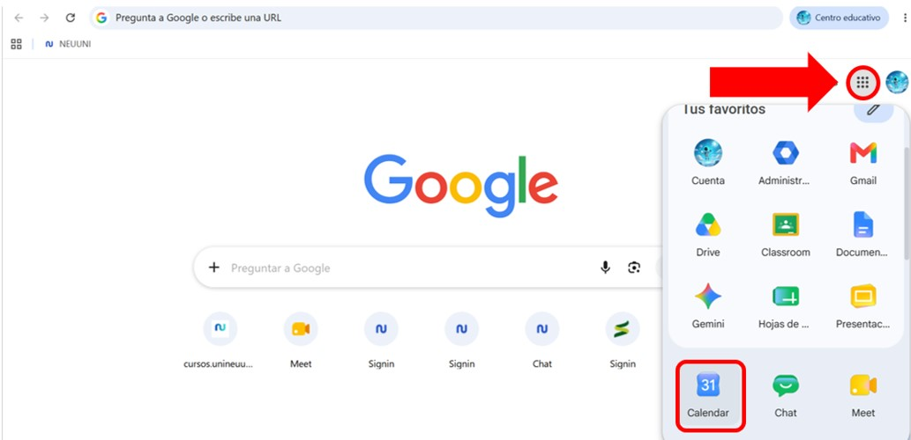
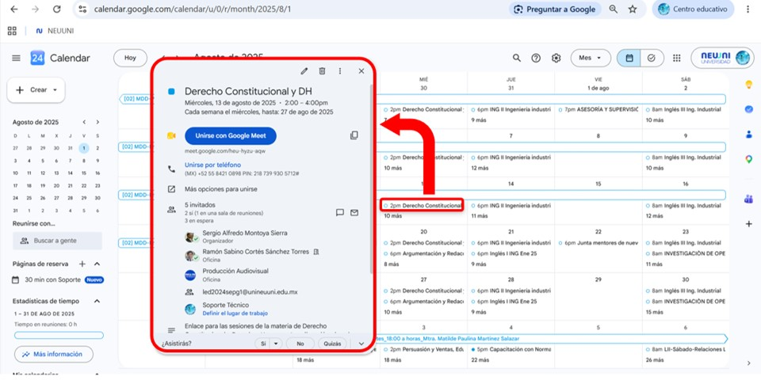
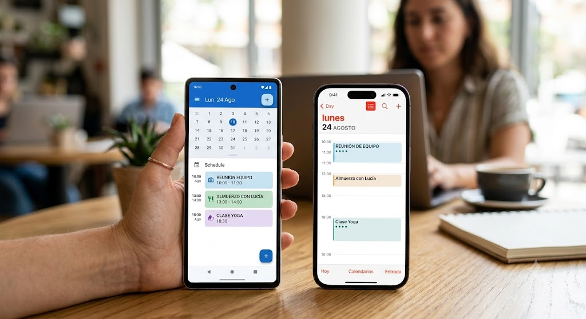

import VideoIntro from '@site/docs/alumnos/tutorial-basics/insertarvideo.jsx';
import CustomLink from '@site/src/components/HomepageFeatures/CustomLink.jsx';
import IntroBox from '@site/src/components/HomepageFeatures/introbox.jsx';
import StickyNote from '@site/src/components/HomepageFeatures/stickynotes.jsx';
import Card from '@site/src/components/HomepageFeatures/card.jsx';

# 📅 Calendar: Tu aliado para dominar tu tiempo

### Toma el control de tus horarios, planifica tus actividades y construye una rutina de estudio a tu medida ✨

<IntroBox>
    El uso de **Google Calendar con tu correo institucional de NEUUNI Universidad** es una herramienta fundamental para organizar y fortalecer tu aprendizaje 💡. Te permite planificar con precisión tus actividades académicas, establecer recordatorios oportunos y administrar tu tiempo de manera eficiente para alcanzar todas tus metas 🚀.
</IntroBox>

## ¿Qué es Google Calendar y por qué es clave en tu educación virtual? 🎯

En la modalidad en línea y de entornos virtuales, el mayor desafío no es la dificultad de las materias, sino la gestión autónoma de tus horarios ⌛. **Google Calendar** es tu agenda digital inteligente 🤖 que te ayuda a transformar las buenas intenciones de estudio en compromisos concretos y visuales. 

Al utilizarlo con tu correo institucional, asumes un papel activo y responsable de tu propio proceso de aprendizaje 🧠. Planificar el tiempo, anticipar las fechas de entrega importantes y mantener una rutina de estudio constante son acciones esenciales en NEUUNI Universidad para avanzar satisfactoriamente y alcanzar el éxito profesional 🎓✨.

---

## ¿Cómo acceder a tu Google Calendar institucional? 🔑

El acceso a tu calendario está completamente integrado en tu espacio de trabajo universitario 💻. Puedes entrar de dos formas muy sencillas:

1. **Desde tu Computadora (Web):** 🖥️
   - Inicia sesión en tu correo institucional de Gmail de la universidad.
   - En la esquina superior derecha, haz clic en el icono de la cuadrícula de aplicaciones (el menú de 9 puntos o "waffle").
   - Selecciona el icono azul de **Calendar** 📅.
   - O bien, ingresa directamente a **[calendar.google.com](https://calendar.google.com)** con tu sesión institucional iniciada.

<Card>
    

    Ícono de Google Calendar en aplicaciones de Google
</Card>

2. **Desde tu Dispositivo Móvil (App):** 📱
   - Descarga la aplicación de **Google Calendar** en tu teléfono o tableta (disponible gratis para iOS y Android).
   - Agrega tu cuenta de correo institucional de NEUUNI Universidad en la app para sincronizar tus horarios al instante en todas tus pantallas 🔄.

---

## Sincronización Automática: ¿Dónde ubicar tus eventos de clase? ⚡

Una de las grandes ventajas de pertenecer a la comunidad de NEUUNI Universidad es la automatización. Conforme vayas cursando tus materias, **encontrarás los eventos de tus clases agregados automáticamente en tu calendario institucional** 📆✨.

* **Enlaces y Horarios en un clic:** 🔗 Al ingresar a tu calendario, verás bloques de tiempo reservados para tus sesiones académicas. Al hacer clic sobre cualquiera de estos eventos, podrás visualizar directamente los **enlaces y horarios de tus clases sincrónicas**, permitiéndote acceder de forma oportuna a cada sesión sin perder tiempo buscando ligas en chats o correos.

<Card>
    

    Desde los eventos de tu calendario podrás ingresar a tus clases sincrónicas.
</Card>

* **Actualizaciones en Tiempo Real:** 🔔 Si hay alguna modificación en el horario de una sesión virtual por parte de tu mentor, el evento en tu Google Calendar se actualizará de forma automática, manteniéndote al tanto de cualquier cambio al instante.

---

## Guarda la Organización de tu Tiempo: Desarrolla tu Disciplina 🌿

Google Calendar no es solo una herramienta para ver cuándo tienes clase; es una plataforma de planificación personal donde puedes registrar y guardar toda la estructura de tu semana 🗓️. Al organizar tus tiempos, estableces hábitos de estudio constantes que favorecen la disciplina, la autonomía y tu continuidad académica 💪.

Aquí te mostramos todo lo que puedes agendar y guardar en tu calendario para optimizar tu aprendizaje:

* **Fechas de entrega de tareas:** 📝 Programa las fechas límite de tus entregas académicas y configúrales recordatorios automatizados en la plataforma para cumplirlas con total puntualidad y sin prisas de último minuto.
* **Periodos de participación en foros:** 💬 Los foros de discusión requieren una presencia constante. Registra en tu calendario los periodos y días específicos en los que vas a ingresar a dar seguimiento y retroalimentar las aportaciones de tus compañeros.
* **Rutinas de estudio personalizadas:** 📚 Diseña y guarda bloques de tiempo específicos en tu semana destinados exclusivamente a **revisar tu plataforma académica, estudiar tus recursos de aprendizaje y realizar tus actividades**.
* **Equilibrio de tus actividades:** ⚖️ Visualiza y organiza en un solo lugar tus compromisos personales, laborales y universitarios. Esto evita que tus actividades se empalmen y te da una visión clara de tus tiempos de enfoque y tus espacios de descanso.

---

## Ejemplo Práctico: El Método "Time-blocking" ⏳

Si eres nuevo en los entornos virtuales o sientes que el tiempo se te escapa de las manos, el **Time-blocking** (Bloqueo de Tiempo) es la mejor metodología para comenzar 🧠. Consiste en dividir tu día en bloques dedicados a una sola tarea específica. 

A continuación, te presentamos una propuesta de organización semanal para un estudiante promedio de NEUUNI Universidad que equilibra sus actividades laborales, personales y académicas:

| Horario / Día | Lunes | Martes | Miércoles | Jueves | Viernes | Sábado | Domingo |
| :--- | :--- | :--- | :--- | :--- | :--- | :--- | :--- |
| **Mañana** | Trabajo / Vida Personal | Trabajo / Vida Personal | Trabajo / Vida Personal | Trabajo / Vida Personal | Trabajo / Vida Personal | **Bloque de Estudio:** Lecturas de la semana 📖 | Descanso familiar / Ocio ☀️ |
| **Mediodía** | Check-in Plataforma (20 min) | Check-in Plataforma (20 min) | Check-in Plataforma (20 min) | Check-in Plataforma (20 min) | Check-in Plataforma (20 min) | **Bloque de Tareas:** Redacción de actividad ✍️ | Descanso / Repaso ligero |
| **Tarde** | Trabajo / Trayectos | Trabajo / Trayectos | Trabajo / Trayectos | Trabajo / Trayectos | Trabajo / Trayectos | Tiempo Libre / Deporte | Preparación de la semana |
| **Noche** | **Bloque de Estudio:** Revisión de recursos 💻 | **Clase Sincrónica en Vivo** 🎥 | **Participación en Foro Académico** 💬 | **Clase Sincrónica en Vivo** 🎥 | **Bloque de Tareas:** Detalle final y envío 📤 | Ocio y esparcimiento | **Límite de Entrega de Tarea** (Recordatorio en pantalla) 🔔 |

<StickyNote>
    **Ten en cuenta:** Las **fechas de clase** y **los días límite para entrega de tarea** varían según los días de clase y el programa académico que estés cursando 📌.
</StickyNote>

---

## 💡 3 Consejos de Oro para tu Google Calendar

1. **Usa una paleta de colores estratégica:** 🎨 Asígnale un color único a cada tipo de compromiso (por ejemplo: **Rojo** para clases sincrónicas en vivo, **Azul** para tus bloques personales de estudio y tareas, y **Verde** para tus actividades personales o laborales). Así, con solo un vistazo a tu pantalla sabrás qué tipo de actividades dominan tu día.

2. **Utiliza los Widgets en tu Celular:** 📲 Coloca el widget de Google Calendar en la pantalla de inicio de tu teléfono móvil. De esta manera, cada vez que desbloquees tu celular verás tu agenda diaria, manteniéndote alerta de tus clases sincrónicas y entregas pendientes.
3. **Planifica con Realismo:** 🌿 No satures tu calendario con bloques de estudio de 5 horas seguidas que sabes que no podrás cumplir. Es mucho mejor programar bloques de **90 a 120 minutos** con pequeños descansos intermedios. Crear un ritmo sostenible y realista es la clave para no abandonar la planeación a mitad de semestre.

<StickyNote>
    **Recuerda:** Mantener tu Google Calendar actualizado y organizado no es una obligación administrativa; es el mapa que te guiará con tranquilidad y orden a lo largo de toda tu carrera universitaria. ¡Haz de la planificación tu mejor aliada! 🗺️✨
</StickyNote>

<Card>
    

    Guarda tus eventos importantes en tu celular
</Card>

---

## El camino hacia la autogestión 🌟

La educación virtual te abre las puertas a una flexibilidad increíble, pero también te confía la responsabilidad de trazar tu propio camino 🌈. Organizar tu tiempo no se trata de limitar tu libertad, sino de **asegurar tu paz mental** 🧘‍♂️. 

Al incorporar **Google Calendar** en tu rutina diaria, estarás construyendo los cimientos del orden, la constancia y la disciplina que no solo te garantizarán un paso exitoso por la universidad, sino que te prepararán para los grandes retos profesionales del futuro. 🚀

¡Empieza hoy mismo agendando tus primeros bloques de estudio y descubre el poder de una rutina organizada! 💪🎒🌱