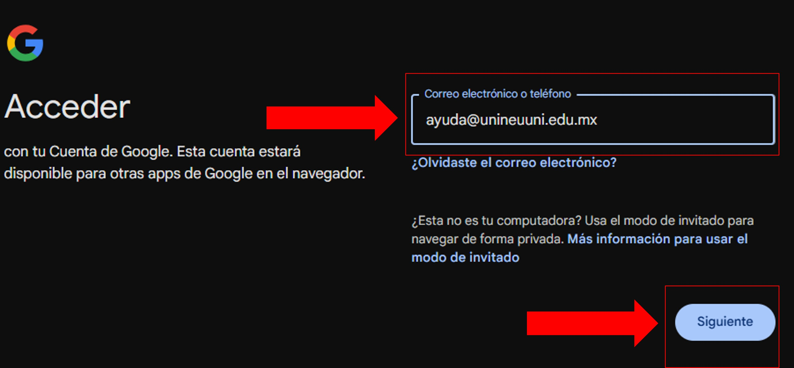

import VideoIntro from '@site/docs/tutorial-basics/insertarvideo.jsx';

# Correo institucional

## Aprende cómo iniciar sesión

Como primer paso, te guiaremos para acceder a tu correo institucional. 
Es tu herramienta clave para estar en contacto y recibir 
información importante de la universidad. ¡Comencemos!

### 1. Agregar cuenta

Inicia en la página principal de Google.

Para ingresar, busca el botón "Acceder" ubicado en la esquina superior derecha y haz clic en él.

Si no ves el botón "Acceder" y en su lugar aparece una cuenta, haz clic en ella.
Al hacerlo, se abrirá una ventana donde podrás seleccionar la opción para agregar otra cuenta.

### 2. Agregar claves de acceso

Al hacer clic en el botón "Acceder" o "Agregar otra cuenta", 
serás redirigido a una nueva pantalla. En esta pantalla, se te 
pedirá que ingreses tu correo electrónico. Introduce tu cuenta 
institucional en el campo correspondiente y luego haz clic en 
el botón "Siguiente" para continuar.

### 3. Verificar el inicio de sesión

Una vez que hayas ingresado la información, el sistema te redirigirá automáticamente al navegador. 
En la parte superior derecha, podrás verificar que la cuenta se ha agregado correctamente.

<VideoIntro title="Acceso al correo institucional" videoUrl="https://www.youtube.com/embed/QtnnNkl3bx0?si=jWpOxq1mDcT1GfNy" />