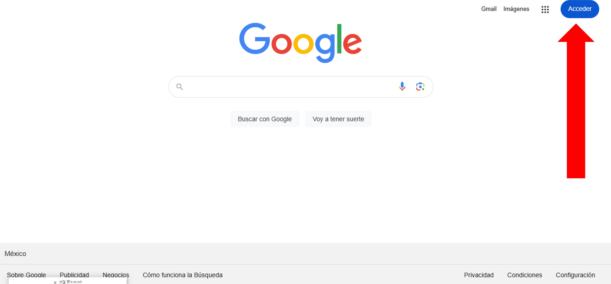
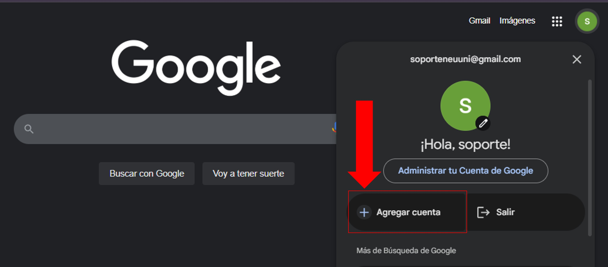
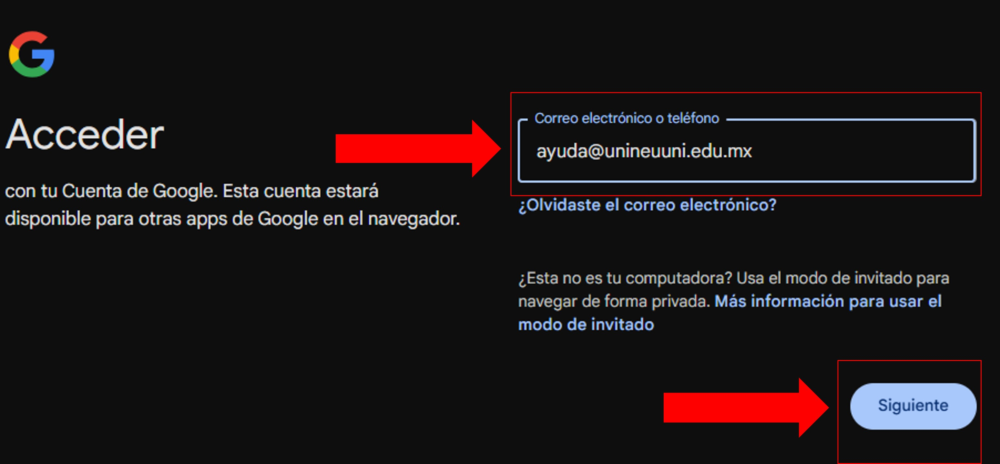
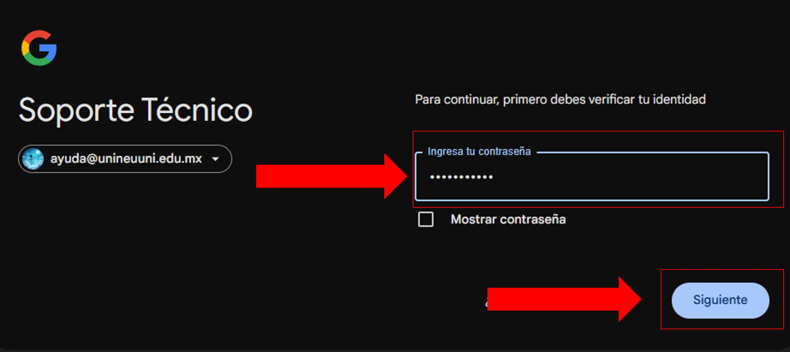
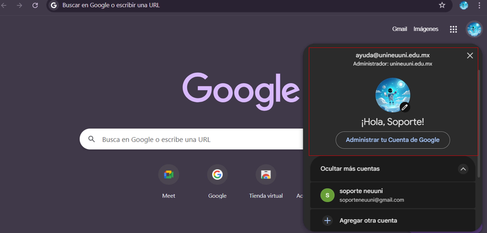

import VideoIntro from '@site/docs/alumnos/tutorial-basics/insertarvideo.jsx';
import IntroBox from '@site/src/components/HomepageFeatures/introbox.jsx'
import Card from '@site/src/components/HomepageFeatures/card.jsx'
import StickyNote from '@site/src/components/HomepageFeatures/stickynotes.jsx'
import CustomLink from '@site/src/components/HomepageFeatures/CustomLink.jsx'

# 📧 Correo institucional

## Guarda tu correo institucional en tu navegador

<IntroBox>
  **¡Bienvenido a esta nueva etapa de tu formación en NEUUNI!** Ahora que ya conoces nuestro modelo educativo y la filosofía
  que nos impulsa, es momento de dar el paso hacia la acción y configurar tu entorno digital de aprendizaje.

  Como primer paso, te guiaremos en el acceso y vinculación de tu correo institucional en tu navegador. Considera esta cuenta
  como tu **llave maestra 🔑**: es la pieza fundamental para autenticar tu identidad en todas nuestras plataformas, ingresar a tus
  clases sincrónicas y gestionar tu tiempo a través del calendario. Mantenerla activa y configurada correctamente te asegurará
  recibir toda la información oficial y académica de manera oportuna, permitiéndote enfocarte plenamente en lo más importante: **tu
  crecimiento profesional**.
</IntroBox>

<StickyNote>
  Este tutorial sirve para configurar tu correo institucional en el navegador por primera vez
</StickyNote>
___

## I. Agregar cuenta

  1. Inicia en la página principal de Google.

  2. Para ingresar, busca el botón **Acceder** ubicado en la esquina superior derecha y haz clic en él.

<Card>
  

  Desde el botón **Acceder** puedes añadir tu cuenta institucional
</Card>

3. Si no ves el botón **Acceder** y en su lugar aparece una imagen de una cuenta, haz clic en ella.
Al hacerlo, se abrirá una ventana donde podrás seleccionar la opción para agregar otra cuenta.

<Card>
  

  *Agrega tu correo institucional*
</Card>

___

## II. Agregar claves de acceso

1. Al hacer clic en **Agregar otra cuenta**, 
serás redirigido a una nueva pantalla, donde deberás ingresar tu correo electrónico y contraseña que se te proporcionaron
anteriormente. Haz clic en **Siguiente** una vez que vayas añadiendo los respectivos campos.

<StickyNote>
  Si perdiste tus claves de acceso, puedes comunicarte al <CustomLink href={'https://wa.me/message/RSY3GACKA2KTN1'}> WhatsApp de Soporte Técnico</CustomLink> para recuperarlas
</StickyNote>

<Card>
  
  

  *Añade correctamente tus claves de acceso para que puedas iniciar sesión correctamente*
</Card>
___

## III. Verificar el inicio de sesión

1. Una vez que hayas ingresado la información correctamente, acepta los Términos y Condiciones. Posteriormente, el sistema te redirigirá
automáticamente a la página principal de Google. **Para verificar que tu correo se ha añadido correctamente**, desde la parte
superior derecha, **haz clic en el ícono de perfil para verificar que la cuenta se ha agregado correctamente**.

<Card>
  

  *Haz clic en el ícono de perfil para verificar tu correo*
</Card>

___

🚀 **¡Todo listo!**
Al integrar tu correo institucional directamente en tu navegador, has dado el paso más importante para optimizar tu tiempo de estudio.
Ahora disfrutarás de:

  - **Sincronización total:** Tus marcadores, historial y contraseñas académicas estarán organizados en un solo perfil.
  - **Acceso sin fricciones:** Olvídate de iniciar sesión manualmente cada vez que entres a tus clases o herramientas de NEUUNI.
  - **Seguridad:** Mantienes tu vida personal y académica en espacios separados, protegiendo tu información.

***¿Qué sigue?*** 🤔

Ahora que tu **llave maestra** está lista, te invitamos a explorar los siguientes tutoriales para acceder a tus plataformas.

___

## 🎥 Videotutorial

<VideoIntro title="Acceso al correo institucional" videoUrl="https://www.youtube.com/embed/QtnnNkl3bx0?si=jWpOxq1mDcT1GfNy" />