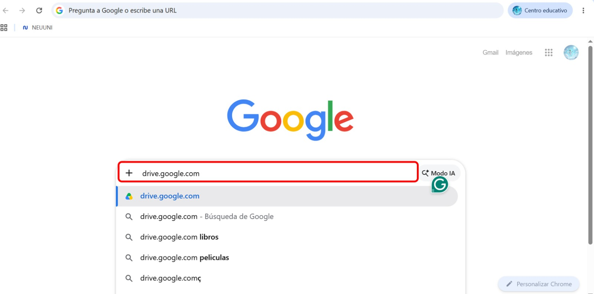
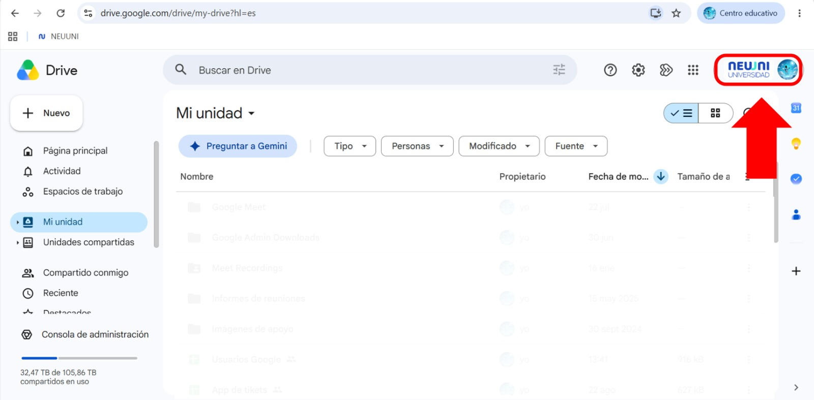
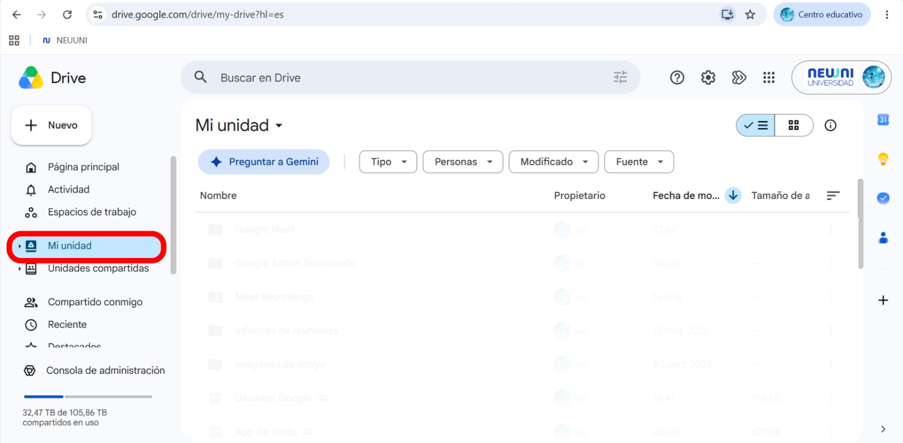

import IntroBox from '@site/src/components/HomepageFeatures/introbox.jsx';
import StickyNote from '@site/src/components/HomepageFeatures/stickynotes.jsx';
import Card from '@site/src/components/HomepageFeatures/card.jsx';

# ☁️ Drive: Tu mochila digital universitaria sin límites

### Almacena, organiza, colabora y accede a tus proyectos escolares desde cualquier lugar 🚀

<IntroBox>
    En tu camino por **NEUUNI Universidad**, las lecturas, tareas, presentaciones y proyectos en equipo se convertirán en tu día a día. Para que nunca te quedes sin espacio ni pierdas tus archivos, tienes a tu disposición **Google Drive**, una potente mochila digital en la nube totalmente integrada con tu cuenta institucional. 🎒✨
</IntroBox>

---

## ¿Qué es Google Drive y por qué es tu mejor aliado?

**Google Drive** es el servicio de almacenamiento y gestión de archivos en la nube de Google. Olvídate de los tiempos en los que tenías que guardar tu tarea en una memoria USB (con el riesgo de perderla) o enviártela por correo para poder abrirla en otra computadora. 🖥️📱

Con Google Drive, toda tu vida universitaria se almacena de forma segura en internet. Esto significa que puedes comenzar un proyecto en tu computadora de escritorio, revisarlo en tu tableta camino al trabajo y darle los toques finales desde tu teléfono celular minutos antes de tu clase en vivo. 🚗💨

<StickyNote>
    Recuerda que para hacer uso de los beneficios de Google Drive, **debes acceder con tu correo institucional**. 
    Puedes acceder a través del link [drive.google.com](https://www.drive.google.com).
</StickyNote>

---

## ✔️ Pasos sencillos para acceder a tu Google Drive

Acceder a tu mochila digital es muy rápido y puedes hacerlo desde cualquier dispositivo con conexión a internet. Sigue estos sencillos pasos para iniciar sesión:

### 1. **Abre tu navegador web** 
Ingresa a la dirección oficial **[drive.google.com](https://drive.google.com)** 🌐.

<Card>
    

    Link para acceder a Google Drive
</Card>

### 2. **Inicia sesión con tu cuenta institucional** 
Haz clic en el botón **"Ir a Drive"** o **"Iniciar sesión"**. Escribe tu correo de alumno (por ejemplo: `tu.usuario@unineuuni.edu.mx`) y tu contraseña 📧.

### 3. **Verifica tu sesión** 
En la esquina superior derecha, haz clic en tu foto de perfil o inicial para confirmar que estás dentro de tu **cuenta institucional de NEUUNI** y no en una cuenta personal 👤.

<Card>
    

    Verifica que esté seleccionado tu correo institucional
</Card>

### 4. **¡Listo! Explora tu espacio** 
Llegarás a la pantalla principal donde verás tu panel de **"Mi unidad"**, listo para comenzar a crear y subir tus archivos 📁✨.

<Card>
    

    Desde **Mi Unidad** podrás comenzar a cargar tus archivos
</Card>

:::tip[ Tip para un acceso rápido]
Guarda el enlace de Google Drive en la **barra de marcadores** de tu navegador (presionando `Ctrl + D` en Windows o `Cmd + D` en Mac) para entrar a tu espacio de estudio con un solo clic. 🚀
:::

---

## 💾 500 Gigabytes de Almacenamiento: Espacio de sobra para toda tu carrera

¡Sí, leíste bien! Como alumno de NEUUNI Universidad, tu cuenta institucional cuenta con un plan de almacenamiento masivo de **500 GB**. 🤩 Esta es una ventaja enorme comparada con las cuentas estándar:

* **Sube lo que quieras, cuando quieras:** Guarda libros digitales completos, antologías, manuales pesados, imágenes en alta resolución, PDFs de investigación y videos educativos sin la menor preocupación de ver el molesto mensaje de "memoria llena". 📚📸
* **Libera espacio en tu computadora:** Mantén el disco duro de tu computadora o la memoria de tu celular completamente limpios. Al organizar tu documentación en las carpetas de Drive, no tienes necesidad de guardar los archivos de forma local; todo se queda seguro en la nube. ☁️💻

---

## 📂 Compatibilidad con Microsoft Office: Trabaja a tu manera y sin complicaciones

¿Estás acostumbrado a realizar tus trabajos en Microsoft Word, tus tablas en Excel o tus diapositivas en PowerPoint? ¡No hay problema! Google Drive es 100% compatible con la paquetería de Office:

* **Sin cambiar de sesión:** No necesitas iniciar sesión en otros lados ni pagar licencias adicionales para ver o editar tus documentos. Sube tus archivos `.docx`, `.xlsx` o `.pptx` directamente a Drive. 📑
* **Edición Directa en la Nube:** Al hacer doble clic sobre un archivo de Word en tu Drive, se abrirá en un editor web súper intuitivo. Podrás editar el texto, agregar imágenes y dar formato de forma directa. Todo se guarda automáticamente en el formato original de Office sin necesidad de realizar molestas conversiones. 🛠️🔄
* **¡Trabaja incluso sin internet!** ✈️ Si vas en el transporte o te quedas sin Wi-Fi en casa, puedes activar el **Acceso sin conexión** en la configuración de Drive. Esto te permitirá ver, comentar y editar tus archivos de Word o Google Docs. En cuanto recuperes la conexión a internet, todos tus cambios se sincronizarán y guardarán en la nube de forma automática. 📴📶

---

## 🤝 Colaboración en Tiempo Real: Trabaja en equipo en perfecta sintonía

El trabajo en equipo es una de las competencias más valoradas en el entorno escolar y profesional. Con Google Drive, dile adiós al caos de enviarse correos con archivos llamados *"Proyecto_Final_v1_corregido_final_este_si.docx"*. 🤯

* **Comparte archivos y carpetas completas:** Crea una carpeta para tu proyecto grupal, compártela mediante el correo de tus compañeros de equipo y denle permisos de edición. Todos podrán subir información y trabajar en el mismo espacio unificado. 📁🔗
* **Conexión instantánea:** Varios alumnos pueden editar el mismo documento al mismo tiempo. Verás los cursores de tus compañeros en tiempo real, lo que facilita enormemente la lluvia de ideas y la redacción colaborativa. 🧑‍💻👩‍💻
* **Comentarios y menciones activas:** Si quieres que un compañero revise una sección específica de un trabajo, solo escribe un comentario en el documento y menciónalo con un `@` seguido de su correo (por ejemplo: `@compañero`). Drive le enviará una notificación inmediata para que se una al archivo. 🔔🏷️
* **Historial de Versiones integrado:** ¿Alguien borró por error un párrafo importante? ¡No te preocupes! Drive guarda un historial con cada cambio realizado. Puedes revisar qué hizo cada integrante del equipo y restaurar el documento a una versión anterior con un solo clic. 🛡️🕒

---

## 📱 Saca provecho a la App Móvil: Digitaliza tus apuntes al instante

La aplicación de Google Drive para teléfonos celulares tiene funciones ocultas espectaculares que todo estudiante virtual debe conocer:

1. **Escáner de Documentos incorporado:** 📝 Si eres de los que prefiere tomar apuntes a mano en libreta o necesitas digitalizar páginas de un libro físico, abre la app de Drive en tu celular, pulsa el botón **"+"** y selecciona **Escanear**. La cámara tomará una foto, corregirá automáticamente la perspectiva, limpiará el fondo y lo guardará como un PDF nítido directamente en tu carpeta de estudios.
2. **Búsqueda Inteligente (OCR):** 🔍 Drive es capaz de "leer" el texto dentro de tus imágenes y archivos PDF escaneados. Si buscas una palabra clave en tu barra de búsqueda (por ejemplo, *"Mercadotecnia"*), Drive te mostrará incluso las fotos de apuntes o capturas de pantalla donde aparezca esa palabra escrita.

---

## ⚙️ Consejos Prácticos para Organizar tu Google Drive

Para que no te pierdas en un mar de archivos a mitad del cuatrimestre, te sugerimos seguir estos sencillos pasos de organización desde tu primer día:

* **Crea carpetas por materias:** Utiliza una estructura clara. Crea una carpeta principal llamada *"NEUUNI Universidad"* y, dentro de ella, crea subcarpetas para cada materia o asignatura (por ejemplo: *"Introducción a la Administración"*, *"Matemáticas Financieras"*). 📂📊
* **Código de Colores:** Al igual que en Google Calendar, puedes dar clic derecho sobre cualquier carpeta en Drive y cambiarle el color. Usa colores llamativos para las materias activas del cuatrimestre y colores grises para las materias que ya aprobaste. 🎨⭐
* **Utiliza la sección de "Destacados":** Si tienes una rúbrica de evaluación o un archivo que consultas todos los días, dale clic derecho y agrégalo a **Destacados** (con el icono de estrella ⭐). Así podrás acceder a él al instante desde el menú lateral izquierdo sin tener que buscarlo entre tus carpetas.

<StickyNote>
    **Dato de Seguridad:** Todos los archivos que subas a tu Drive institucional están protegidos por los más altos estándares de seguridad de Google Cloud. Tus proyectos, documentos personales y tareas están completamente resguardados y solo las personas a las que decidas dar acceso podrán verlos. 🔒🛡️
</StickyNote>

---

## Tu oficina escolar portátil

Contar con **Google Drive** y sus extraordinarios **500 GB de almacenamiento** te proporciona un espacio virtual seguro y versátil para desarrollar tus estudios con total tranquilidad. Esta herramienta fomenta tu autonomía, te enseña a colaborar de forma profesional con tus compañeros y elimina el estrés de perder tus entregas por fallas técnicas en tu equipo. 🚀

Al aprender a estructurar tus carpetas, compartir información de manera responsable y colaborar en la nube, estás desarrollando habilidades de organización digital esenciales para tu futuro laboral. ¡Entra hoy mismo a tu Drive, crea tu primera carpeta y comienza a diseñar tu espacio de éxito! 💪🎓☁️
