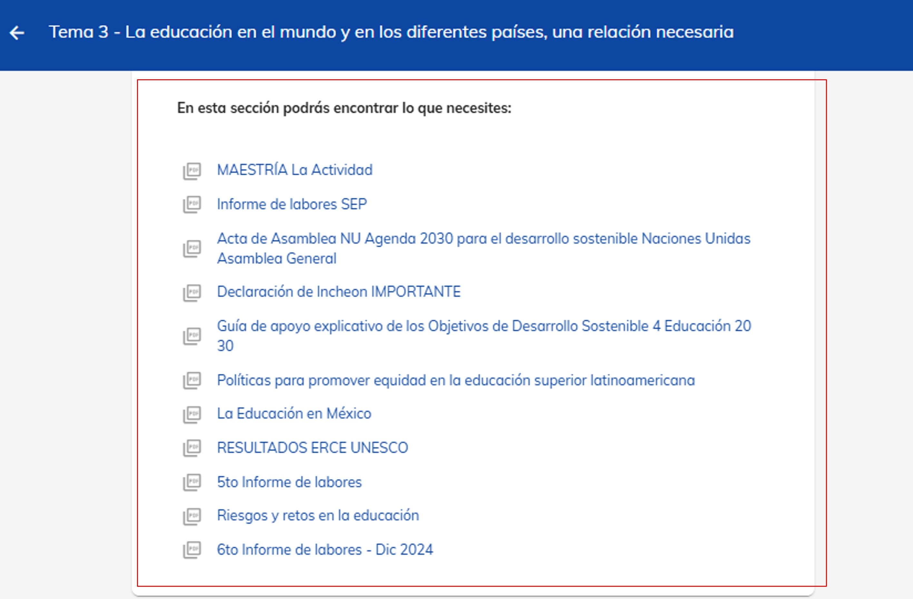

import CustomLink from '@site/docs/alumnos/tutorial-basics/CustomLink.jsx'

# Elementos de un curso

## Descubre el contenido de tus materias

¡Tu aprendizaje comienza aquí! Descubre tu materia a fondo.
Aquí te presentamos los 5 elementos clave de cada materia: Clase Virtual, Clase Sincrónica, Material de Apoyo, 
Foro y Tarea. Explora cada uno y aprovecha al máximo tu aprendizaje.

### 1. Ingreso al curso

Inicia sesión en https://cursos.unineuuni.edu.mx. Si no recuerdas cómo hacerlo, consulta nuestro <CustomLink href="./ingreso-plataforma"> tutorial de ingreso</CustomLink>.

Para acceder a un curso, tienes dos opciones:

- 1. *Desde la página principal*. Elige el curso como señala la flecha derecha (puede que sea necesario que te 
desplaces hacia abajo).
- 2. *Desde el menú lateral izquierdo*. Selecciona **Mis cursos**, aquí estarán todos tus cursos ordenados 
alfabéticamente.

### 2. Navegar por el curso

Al ingresar al curso, en la parte superior, encontrarás una barra de navegación que muestra en qué apartado te 
encuentras. Esta barra incluye:

- **Introducción**: Una breve descripción sobre el contenido del curso.

- **Sección de Temas**: Accede a los temas del curso para consultar los módulos correspondientes al número de clase que 
desees revisar.

- **Estudiantes**: Consulta la lista de tus compañeros en el curso.

En la siguiente imagen, se muestra el apartado de "Introducción", donde encontrarás sus
elementos.

### 3. Contenido de la sección 'Introducción'

En la parte derecha de la pantalla de "Introducción", encontrarás las siguientes secciones:

- **Video de presentación**: Explica los objetivos y estructura del curso (puede no aparecer 
en algún curso, pero nos esforzamos para tenerlo en todos).

- **Mentor**: Conoce el nombre del mentor y su calificación en NEUUNI, asignada por los propios
alumnos, de acuerdo a su desempeño.

- **Avisos**: Contiene los avisos importantes que sube tu mentor en el transcurso de la materia.

- **Avance del curso**: Podrás ver el progreso que llevas en el curso de acuerdo a las actividades
    satisfctorias que vayas obteniendo.

### 4. Módulos del curso

Cuando selecciones el número de tema que deseas revisar, aparecerán los módulos de los temas.
Cada tema del curso está organizado en módulos que te permiten interactuar con el contenido 
y realizar actividades. A continuación se detalla cada uno.

- 1. **Clase virtual**.
        Consulta toda la información relacionada con el tema. Debes estudiar este módulo
        antes de acceder a tu clase sincrónica.

- 2. **Clase sincronica**.
        Accede a las clase grabada y reprodúcela las veces que necesites en cualquier momento
        y en cualquier lugar.

- 3. **Material de apoyo**.
        Refuerza tu conocimiento con materiales adicionales como documentos, enlaces y recursos 
        complementarios.

- 4. **Foro**.
       Comparte tu opinión, imágenes, enlaces o documentos con otros participantes. También 
       puedes leer las aportaciones de los demás.

- 5. **Tarea**.
       Completa las actividades para avanzar en el curso y demostrar tu aprendizaje.

