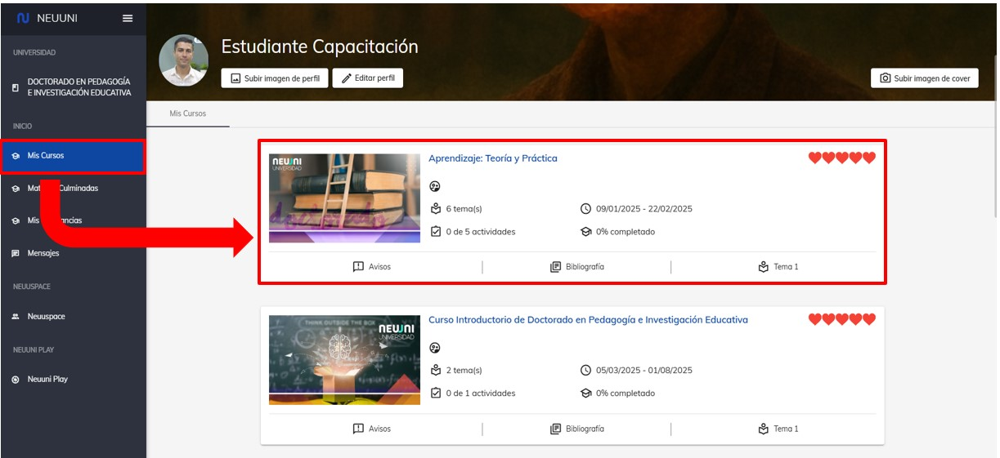
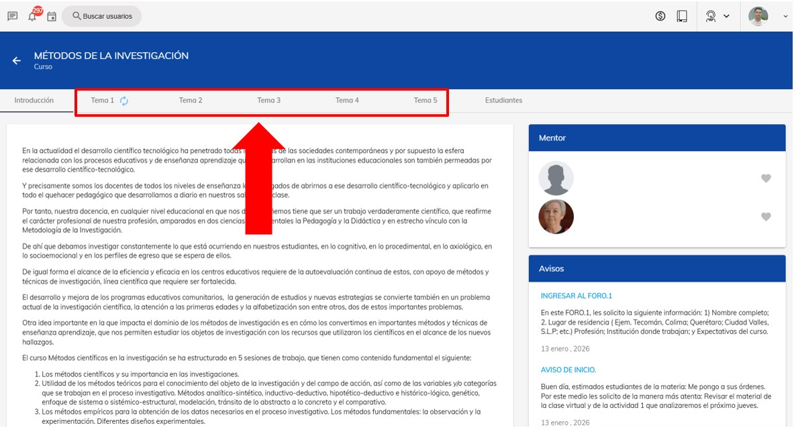
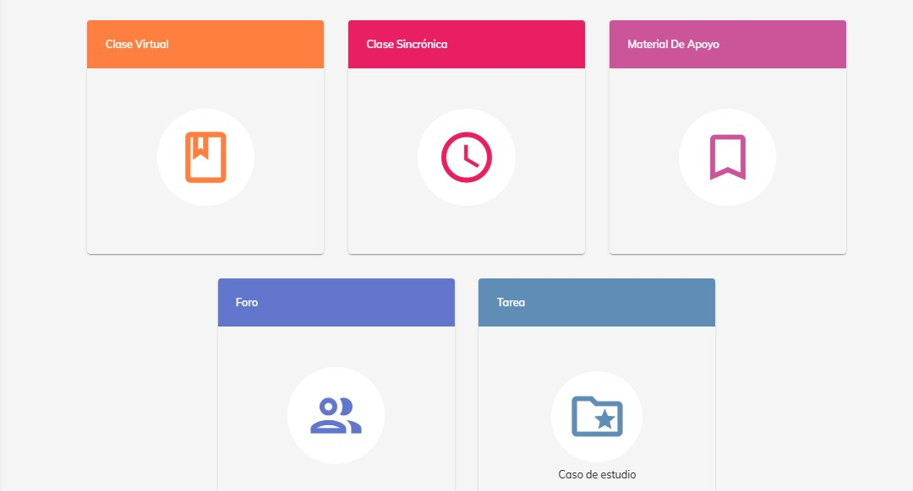
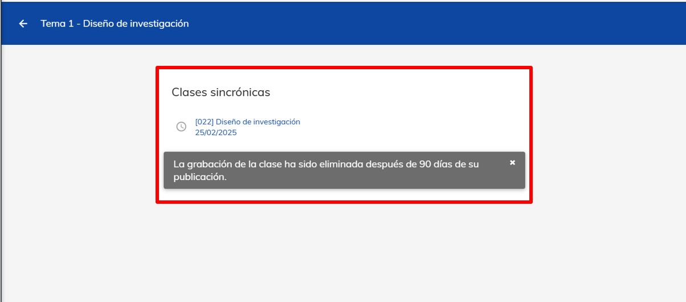
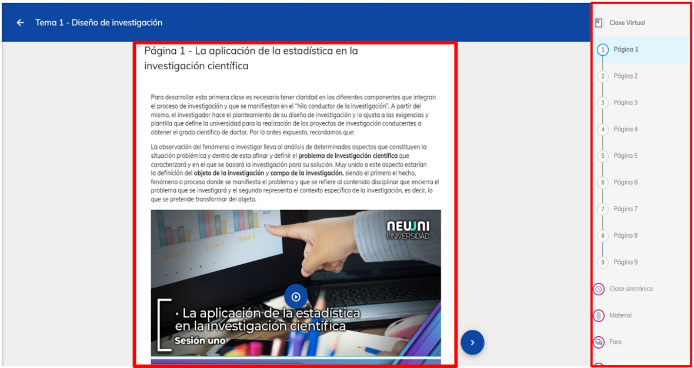
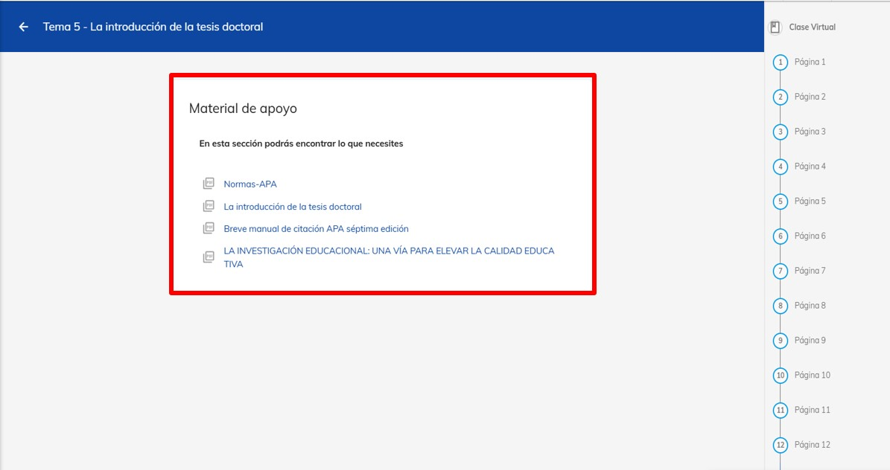
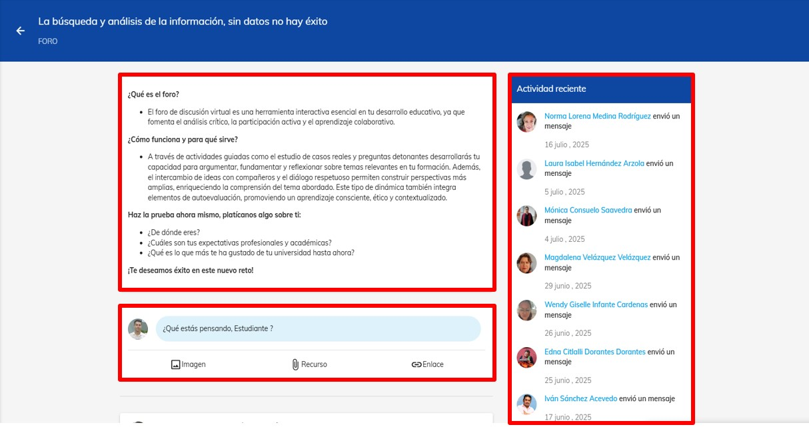
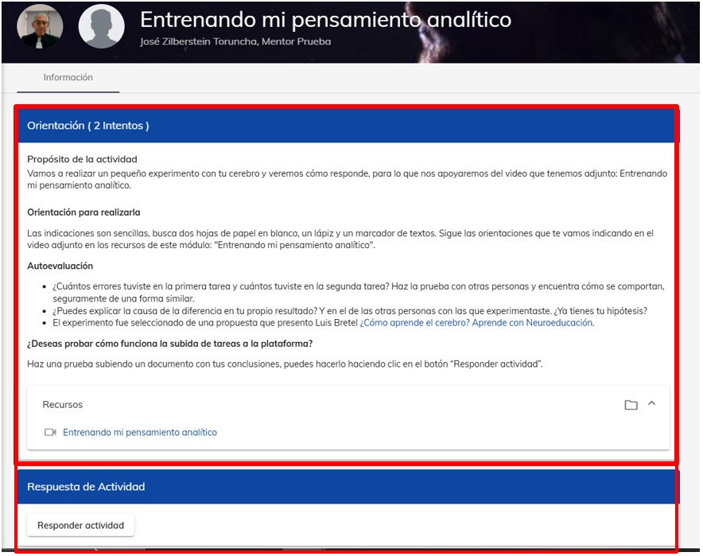

import VideoIntro from '@site/src/components/HomepageFeatures/insertarvideo.jsx';
import IntroBox from '@site/src/components/HomepageFeatures/introbox.jsx'
import Card from '@site/src/components/HomepageFeatures/card.jsx'
import StickyNote from '@site/src/components/HomepageFeatures/stickynotes.jsx'
import CustomLink from '@site/src/components/HomepageFeatures/CustomLink.jsx'

# 🧩 Elementos de un curso

### Descubre el contenido de tus materias

<IntroBox>
        En este tutorial, te presentaremos **los 5 elementos claves de cada materia:**

                - Clase Virtual
                - Clase Sincrónica
                - Material de Apoyo
                - Foro
                - Tarea

        Explora cada uno y aprovecha al máximo tu aprendizaje. 🔝

</IntroBox>

## I. Ingreso al curso

1. Inicia sesión en https://cursos.unineuuni.edu.mx. Si no recuerdas cómo hacerlo,
consulta nuestro <CustomLink href="./ingreso-plataforma">tutorial de ingreso</CustomLink>.

2. El siguiente paso será acceder al curso. Para esto, puedes hacerlo desde dos opciones:

- 1. ***Desde la página principal***. Elige el curso como señala la flecha derecha **desde la página de inicio**.

        <StickyNote>
                Puede que tengas que desplazarte hacia abajo por la página de inicio
                para encontrar el curso
        </StickyNote>

- 2. ***Desde el menú lateral izquierdo***. Selecciona **Mis cursos**, aquí estarán todos tus cursos ordenados 
alfabéticamente.

<Card>
        

        *Las dos maneras de acceder a tus cursos*
</Card>

___

## II. Navegar por el curso

Al ingresar al curso, en la parte superior, **encontrarás una barra de navegación que señala en qué apartado te 
encuentras**. Esta barra incluye:

- **Introducción:** Una breve descripción sobre el contenido del curso.

- **Número de temas:** Accede a los temas del curso para consultar los módulos correspondientes al número de clase que 
desees revisar.

- **Estudiantes:** Consulta la lista de tus compañeros en el curso.

En la siguiente imagen, se muestra el apartado de "Introducción", donde encontrarás sus
elementos.

<Card>
        

        *Número de temas del curso*
</Card>

<StickyNote>
        El número de temas de los cursos es diferente para cada carrera:
        - Los cursos de **licenciatura** tienen **8 temas**
        - Los cursos de **posgrado** tienen **5 temas**
</StickyNote>

___

## III. Contenido de la sección 'Introducción'

En la parte derecha de la pantalla de **Introducción**, encontrarás las siguientes secciones:

- **Video de presentación:** Explica los objetivos y estructura del curso (puede no aparecer 
en algún curso, pero nos esforzamos para tenerlo en todos 👀).

- **Mentor:** Identifica a tu mentor y la calificación en NEUUNI, asignada por los propios
alumnos de acuerdo al desempeño.

- **Avisos:** Conoce la información importante que sube tu mentor en el transcurso de la materia.

- **Avance del curso:** Podrás ver el progreso que llevas en el curso de acuerdo a las tareas
    satisfctorias que vayas obteniendo.

___

## IV. Módulos del curso

Cuando selecciones el número de tema que deseas revisar, **aparecerán los módulos de los temas**.
Cada curso está organizado en módulos que te permiten interactuar con el contenido, participar en el foro
y realizar tareas.

<StickyNote>
        Puedes hacer clic en el nombre del módulo para conocer más detalles
</StickyNote>

<Card>
        

        *Módulos de los temas del curso*
</Card>

 1. <CustomLink href='../Plataforma NEUUNI/clase-virtual'>**Clase Virtual**</CustomLink>:
        Consulta la información relacionada con el tema. Debes estudiar este módulo
        antes de acceder a tu clase sincrónica.

<Card>
        

        *Módulo de Clase Virtual*
</Card>

 2. <CustomLink href='../Plataforma NEUUNI/clase-virtual'>**Clase Sincrónica**</CustomLink>:
        Accede a las clase grabada y reprodúcela las veces que necesites en cualquier momento
        y en cualquier lugar.

<Card>
        

        *En el módulo de Clase Sincrónica puedes revisar la grabación de tu clase*
</Card>

<StickyNote>
        Las clases sincrónicas desaparecen 90 días después de que son subidas en plataforma
</StickyNote>

 3. **Material de apoyo**:
        Refuerza tu conocimiento con materiales adicionales como documentos, enlaces y recursos 
        complementarios.

<Card>
        

        *Archivos para ayudar en el aprendizaje del curso*
</Card>

 4. <CustomLink href='../Plataforma NEUUNI/foro'>**Foro**</CustomLink>:
       Comparte tu opinión, imágenes, enlaces o documentos con otros participantes. También 
       puedes leer las aportaciones de los demás.

<Card>
        
   
        *Participa en el foro correspondiente de cada semana*
</Card>

 5. <CustomLink href='../Plataforma NEUUNI/tarea'>**Tarea**</CustomLink>:
       Completa las tareas para avanzar en el curso y demostrar tu aprendizaje.

<Card>
        

        *Sube tu tarea a través del botón* Responder actividad
</Card>

___

**¡Ya conoces tu aula virtual! 🎓**

Dominar estos 5 módulos es la clave para una experiencia académica exitosa en NEUUNI. Al explorar cada sección, te aseguras de:

        - **Estar preparado:** Al revisar la **Clase Virtual** antes de tus **Clases Sincrónicas**.
        - **Participar activamente:** Enriqueciendo el **Foro** con tus ideas y las de tus compañeros.
        - **Cumplir tus metas:** Entregando tus **Tareas** a tiempo para ver cómo avanza tu porcentaje de éxito.

Ahora que sabes dónde encontrar cada recurso, el siguiente paso es aprender a monitorear tu progreso y asegurar que tus esfuerzos den frutos. 💪📚

Ahora que ya conoces los elementos básicos de la plataforma, **te invitamos a explorar el resto del contenido para que te vayas familiarizando todavía más con
tu plataforma.** 😀 ¡¡Mucha suerte!!