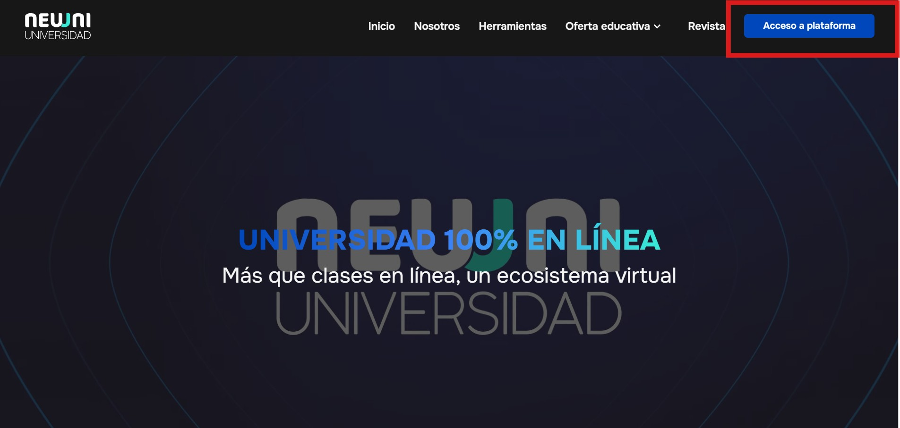
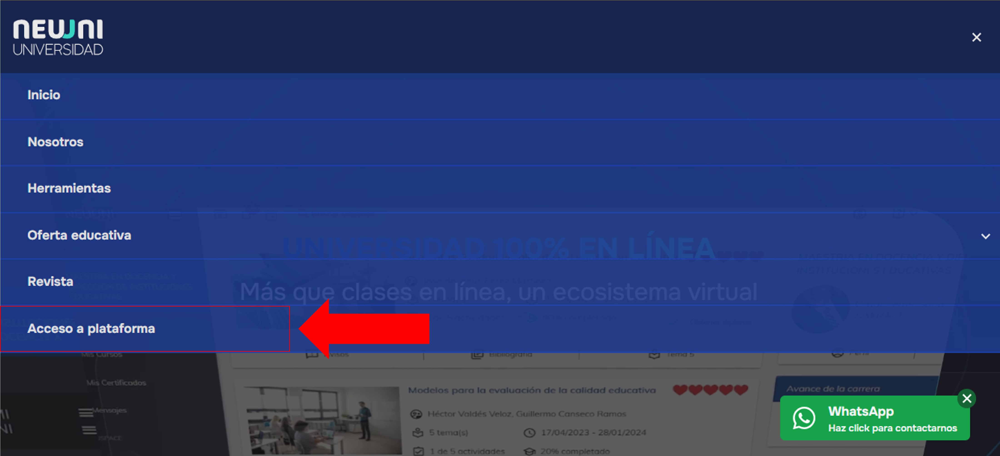
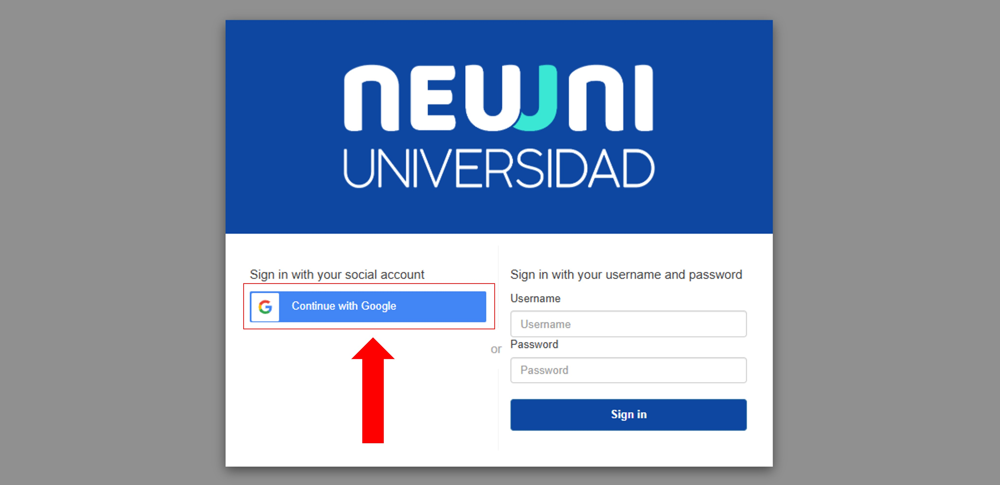
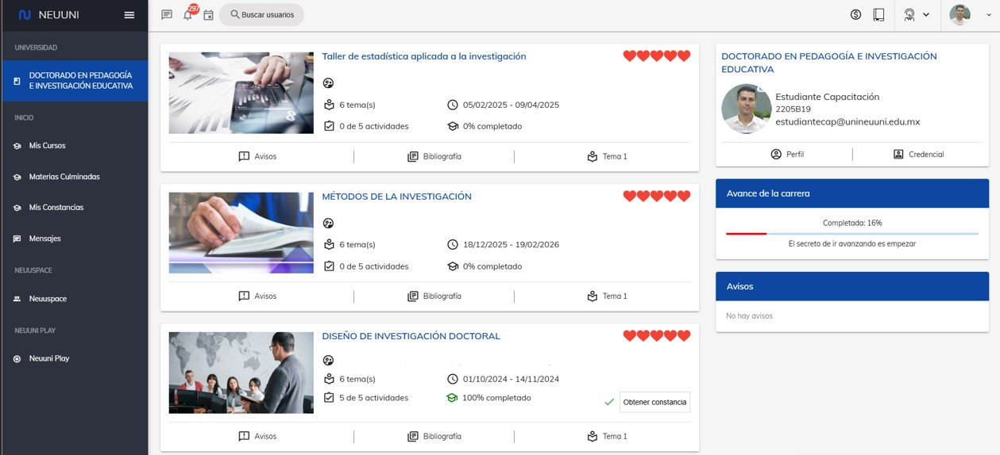

import VideoIntro from '@site/docs/alumnos/tutorial-basics/insertarvideo.jsx';
import CustomLink from '@site/src/components/HomepageFeatures/CustomLink.jsx';
import IntroBox from '@site/src/components/HomepageFeatures/introbox.jsx';
import StickyNote from '@site/src/components/HomepageFeatures/stickynotes.jsx';
import Card from '@site/src/components/HomepageFeatures/card.jsx';

# 🌐 Acceso a NEUUNI

## Accede a la plataforma con tu correo institucional

<IntroBox>
  **¡Buen trabajo!** Ahora que hemos visto cómo agregar nuestro correo institucional al navegador, estamos preparados **para aprender a cómo iniciar sesión en nuestra
  plataforma principal: NEUUNI.**

  En NEUUNI encontrás todos **los recursos para tus cursos: clase virtual, clase sincrónica, material de apoyo, foros y envíos de tarea**. Por ahora, **aprenderemos cómo
  acceder a esta plataforma**, pero más adelante conocerás **los elementos de tus cursos.**
</IntroBox>

___

## I. Ingresa a la plataforma NEUUNI

1. **Accede a la página de inicio de sesión: 🔗 <CustomLink href='https://cursos.unineuuni.edu.mx'>cursos.unineuuni.edu.mx</CustomLink>.**
En la parte superior derecha, haz clic en el botón **Aceso a plataforma**.

<Card>
  
  ___
  *Botón de* **Acceso a plataforma**
</Card>

<StickyNote>
  Si en lugar del botón te aparece un **botón de menú** (un ícono de tres líneas), despliégalo y selecciona la opción que corresponde.
</StickyNote>

<Card>
  
  ___
  *Botón para acceder a plataforma*
</Card>

2. Al ingresar, verás la siguiente pantalla. Haz clic en **Continuar con Google**:

<Card>
  
  ___
  *Acceder en* **Continuar con Google** *es mucho más fácil y sencillo*
</Card>

<StickyNote>
  Como alumno de NEUUNI, **solo podrás acceder a través de Continuar con Google**
</StickyNote>

___

## II. Selecciona tu cuenta institucional

1. Al hacer clic en **Continuar con Google**, se abrirá una nueva pestaña y selecciona tu cuenta institucional de Google.

<StickyNote>
  Si no encuentras tu correo en la lista de cuentas, **haz clic en Usar otra cuenta** e ingresa
  tus claves de acceso
</StickyNote>

<Card>
  
  ___
  *Selecciona la cuenta en la que previamente iniciaste sesión*
</Card>

<Card>
  ***¿Qué hago si me aparece un aviso de acceso bloqueado?***

  *Haz clic en el botón* **Atrás** *de tu navegador y asegúrate de seleccionar tu correo institucional de NEUUNI, con el formato
  ***alumno@unineuuni.edu.mx***.
</Card>

___

## III. Acceso a NEUUNI

1. Una vez que has hecho el ingreso correctamente, podrás configurar tu perfil según se requiera.
2. Al terminar la edición del perfil, podrás confirmar el ingreso a NEUUNI al ver la siguiente pantalla, donde se encuentran 
las secciones de la plataforma, tus cursos e información. .

<Card>
  
  ___
  *Página de inicio de la plataforma*
</Card>

<Card>
  ***¿Qué hago si la pantalla de carga se queda cargando al ingresar?***

  *Debes cargar la página nuevamente y repetir el proceso, debido a que en ocasiones el perfil se valida en el servidor.
  Una opción rápida para cargarla es presionar 
  la tecla 'F5'. Si esto no funciona, comunícate al Whatsapp de Soporte Técnico.*
</Card>

___

**¡Bienvenido a tu campus digital! 🎓**

Has completado con éxito el proceso de autenticación. Ahora que **ya sabes cómo entrar a la plataforma utilizando
tu cuenta institucional**, tienes la puerta abierta a todo tu ecosistema de aprendizaje.

Recuerda que entrar a través de **Continuar con Google** es **la única forma, más rápida y segura** de mantener tus
sesiones activas y protegidas.

Una vez dentro de la plataforma, es momento de que conozcas el corazón de tu formación: **el contenido de tus materias**.
Te invitamos a explorar cómo están organizadas tus clases para que no te pierdas de nada desde el primer día.

___

## 🎥 Videotutorial

<VideoIntro title="Acceso a la plataforma NEUUNI" videoUrl="https://www.youtube.com/embed/s7--pVa-7M8" />