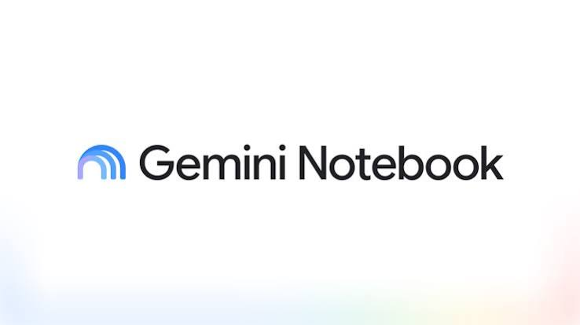
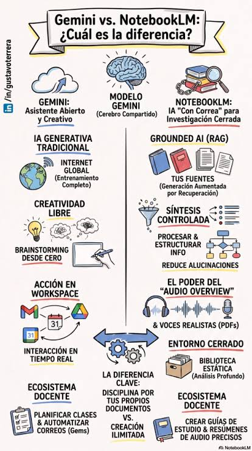
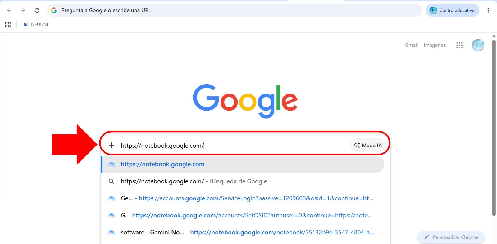
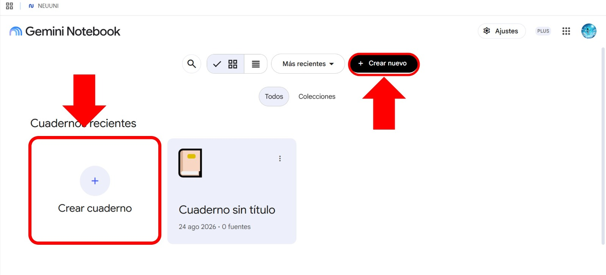
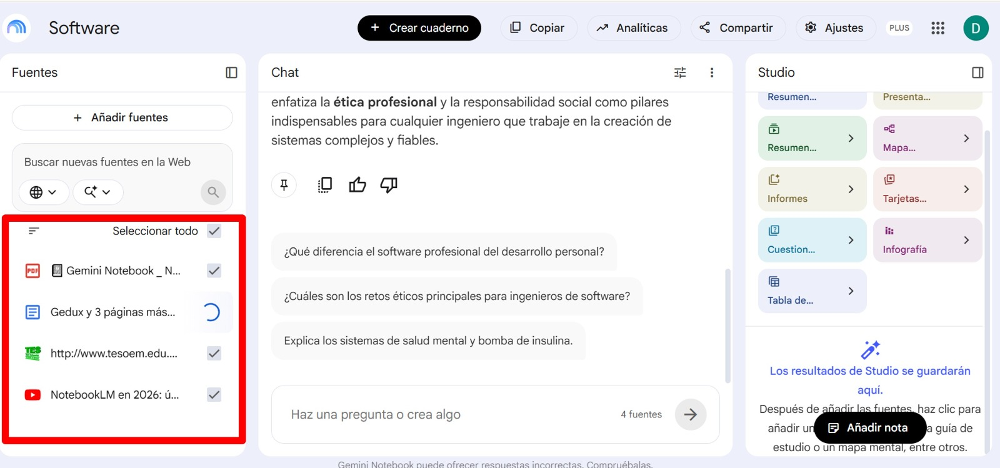
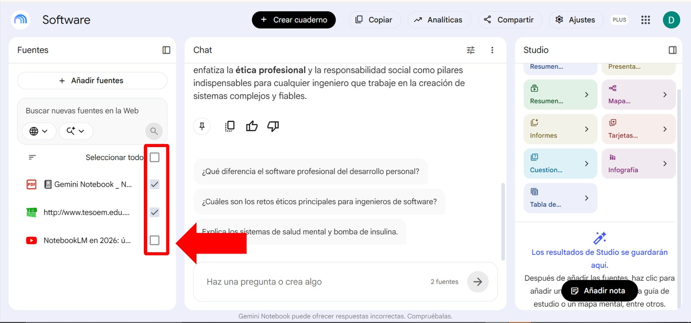
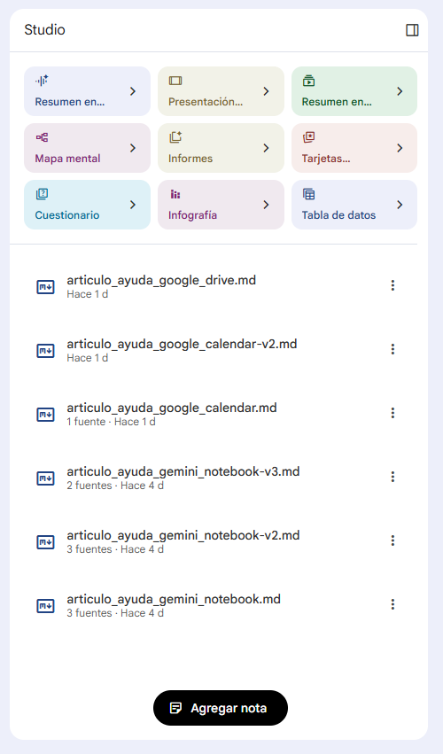
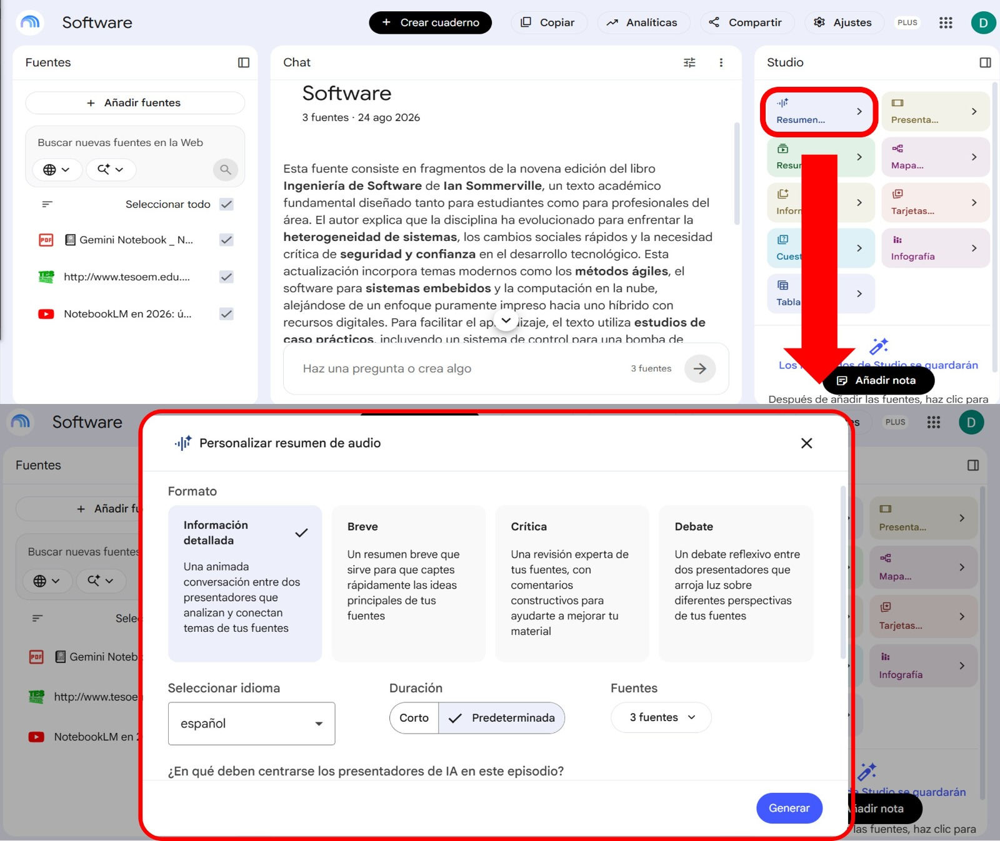

import VideoIntro from '@site/docs/alumnos/tutorial-basics/insertarvideo.jsx';
import CustomLink from '@site/src/components/HomepageFeatures/CustomLink.jsx';
import IntroBox from '@site/src/components/HomepageFeatures/introbox.jsx';
import StickyNote from '@site/src/components/HomepageFeatures/stickynotes.jsx';
import Card from '@site/src/components/HomepageFeatures/card.jsx';

# 📓 Gemini Notebook

### Tu información, tus apuntes y tu propio ritmo de aprendizaje ✨

<IntroBox>
    **Gemini Notebook** es una herramienta gratuita desarrollada por Google diseñada para convertirse en tu libreta de notas inteligente 💡. 
    A diferencia de otras herramientas, esta plataforma trabaja exclusivamente con la información que tú le proporciones, asegurando 
    que cada respuesta sea fidedigna, exacta y directamente relacionada con tus materias 🎯.
</IntroBox>

<Card autoWidth={false}>
    

    Logo Gemini Notebook
</Card>

---

## ¿Qué es y para qué sirve? 🤔

Imagina tener un compañero de estudio incansable 🤝 que se ha leído exactamente los mismos libros, PDFs y artículos que te asignó tu mentor, y que está listo para responder cualquier duda al instante. Eso es **Gemini Notebook** ✨.

Es un entorno inteligente de trabajo donde creas "cuadernos virtuales" por cada materia, proyecto o asignatura 📚. Su uso principal es transformar material de lectura denso en información clara, organizada y fácil de repasar, sirviendo como un excelente asistente de investigación, síntesis de conocimiento y razonamiento impulsado por IA para organizaciones y creadores 🚀.

### Usos más comunes en el ámbito académico:
- 📖 **Sintetizar lecturas largas:** Extraer las ideas principales de capítulos completos, ensayos, manuales técnicos o artículos académicos en segundos.
- 💬 **Resolver dudas específicas:** Hacer preguntas directas sobre el contenido de un documento y obtener respuestas fundamentadas sin tener que releer todo el archivo.
- ✍️ **Generar materiales de repaso:** Crear guías de estudio, listas de conceptos clave, glosarios y cuestionarios de autoevaluación basados en tus propios apuntes.
- 🎧 **Aprender en formatos alternativos:** Convertir textos complejos en dinámicos resúmenes de audio (*Audio Overviews*) o guías estructuradas para repasar de forma auditiva y visual.

---

## Aprende a adaptarlo a tu entorno escolar 🏫

Gemini Notebook se adapta con facilidad a las rutinas diarias de estudio ✏️, independientemente de tu carrera o nivel académico. Aquí te mostramos cómo integrarlo según tus necesidades para que le saques el máximo provecho en tus clases:

| Situación escolar | Cómo te ayuda Gemini Notebook | Beneficio principal |
| :--- | :--- | :--- |
| 📚 **Lecturas extensas o PDFs** | Cargas el documento y pides un resumen de los puntos clave o un mapa conceptual en texto. | Ahorras tiempo y vas directo a lo más importante ⏱️. |
| 📝 **Preparación de exámenes** | Subes tus apuntes y diapositivas de clase para solicitar un cuestionario de práctica. | Repasas con preguntas reales basadas en tu propio temario 🎯. |
| 🎧 **Estudio en movimiento** | Generas un *Resumen de Audio* (un formato tipo podcast con dos voces sintéticas). | Repasas tus temas mientras caminas, viajas en transporte o haces ejercicio 🏃‍♂️. |
| 👥 **Proyectos en equipo** | Creas un cuaderno compartido donde todos suben la bibliografía de la entrega. | Todo el equipo consulta exactamente la misma información 🤝. |
| 🎥 **Videos educativos** | Pegas el enlace de un video de YouTube asignado por tu profesor. | Gemini Notebook analiza la transcripción del video y responde tus dudas 🎬. |

---

## Ventajas clave para tu día a día 🌟

Además de su flexibilidad de estudio 🌈, la plataforma te ofrece herramientas integradas pensadas específicamente para facilitar tu vida académica diaria:

- 📌 **Pistas y citas exactas:** Cada respuesta que te da la plataforma incluye un número de cita [1]. Al hacerle clic, la pantalla te muestra exactamente el párrafo y la página de tu documento de donde salió la información, ideal para citar sin errores y estudiar con absoluta honestidad.
- 🗂️ **Organiza por asignaturas:** Puedes crear un cuaderno independiente para cada materia (ej. *Álgebra*, *Metodología de la Investigación*, *Análisis de Costos*) y mantener todos tus apuntes y lecturas completamente estructurados y bajo control.
- 🔒 **Privacidad garantizada:** Tus trabajos, tareas y documentos cargados son de tu exclusiva propiedad y estrictamente confidenciales. No se comparten con nadie a menos que tú decidas enviar un enlace de colaboración a tus compañeros.

---

## ¿Cómo funciona Gemini Notebook y por qué evita la "alucinación"? 🔍

En el ámbito universitario, la precisión es fundamental 🎓. Una de las grandes preocupaciones al usar Inteligencia Artificial tradicional es la llamada **alucinación** (cuando la IA inventa datos de manera falsa pero creíble). 

Para solucionar esto, Gemini Notebook opera bajo una metodología llamada **RAG (Generación Recuperada-Aumentada / Retrieval-Augmented Generation)** ⚙️.

### Definición Formal del Modelo RAG

El proceso de respuesta mediante RAG y citación formal se fundamenta en la maximización de la probabilidad condicional basada únicamente en el conjunto de contexto cargado 🧠:

- **Fórmula condicional:** `P(y | x, D) = Π P(y_t | y_<t, x, D_recuperado)`
- **x:** Consulta o pregunta ingresada por el estudiante 🙋‍♀️.
- **D:** Conjunto total de documentos cargados en el cuaderno (D = d1, d2, ..., dn) 📄.
- **D_recuperado:** Fragmentos con mayor similitud semántica extraídos mediante incrustaciones (*embeddings*) 🔎.
- **y:** Respuesta generada acompañada de su cita correspondiente relacionada con la fuente 🔗.

### ¿En qué se diferencia de una IA tradicional? ⚖️

- 🤖 **IA Generativa Tradicional:** Herramientas de chat tradicionales responden utilizando conocimiento general que memorizaron de internet durante su entrenamiento (`P(y | x)`). Si les preguntas algo específico de tu clase y no lo saben con certeza, intentarán deducirlo, lo que genera respuestas erróneas o inventadas.
- 🎯 **Gemini Notebook (Modelo RAG):** Funciona bajo el principio de "libro abierto". Cuando realizas una consulta, el sistema analiza el conjunto de tus documentos cargados (`D`), selecciona los fragmentos más importantes (`D_recuperado`) y elabora la respuesta exclusivamente basada en esa información.

De esta manera, el modelo tiene **prohibido inventar afirmaciones** que no provengan directamente de tus archivos ✨. Esto garantiza la **integridad académica**, ya que cada respuesta incluirá una cita directa e interactiva que te permite verificar la fuente con un solo clic.

<Card isHorizontal={false}>
    

    Gemini Notebook vs IA Tradicional (en el contexto de estudio)
</Card>

---

## ¿Dónde ubicar y acceder a Gemini Notebook? 🌐

Acceder a la plataforma es sumamente sencillo y no requiere configuraciones complejas en tus dispositivos 📱💻:

1. 🔗 **Enlace Directo de Acceso:** Puedes ingresar directamente desde tu navegador web a la dirección oficial: **[notebook.google.com](https://notebook.google.com)**.

<Card>
    

    Link para acceder a Gemini Notebook
</Card>

2. 🔑 **Inicio de Sesión:** Inicia sesión con cualquier cuenta de Google (ya sea tu cuenta de Gmail personal o una cuenta institucional de Workspace proporcionada por tu escuela).

3. 🔄 **Integración Nativa en el Ecosistema Gemini:**
   - 📲 **Sincronización Automática:** Todos los cuadernos que crees en la plataforma de Gemini Notebook aparecerán inmediatamente en la navegación de tu aplicación general de Gemini.
   - 💬 **Contexto Compartido:** Cualquier conversación o consulta que mantengas en la aplicación Gemini se integrará como contexto enriquecido dentro del panel de fuentes de tu cuaderno correspondiente.
   - ⚡ **Reflejo en Tiempo Real:** Las actualizaciones en tus fuentes, nombres de cuadernos o instrucciones personalizadas se sincronizan instantáneamente en todas las pantallas.

---

## Instrucciones de Uso Paso a Paso: Diseña tu Entorno de Aprendizaje 🛠️

### Paso 1: Crea tu primer cuaderno de estudio 📓
Al ingresar a la plataforma, verás tu "Estantería" virtual. Haz clic en **Crear nuevo cuaderno** y asígnale el nombre de la asignatura que estás cursando (por ejemplo: *Álgebra*, *Metodología de la Investigación* o *Análisis de Costos*). Esto te permite mantener tus apuntes y materiales perfectamente separados y ordenados por clases.

<Card>
    

    Crea un cuaderno para trabajar
</Card>

### Paso 2: Carga tus fuentes multifactoriales 📂
Gemini Notebook te permite recopilar información a gran escala combinando diversos formatos en un mismo lugar:
- 📄 **Documentos y Presentaciones:** Sube archivos en formatos **PDF, Google Docs, Google Slides, Markdown (.md) y archivos de texto (.txt)**.
- 🌐 **Recursos Web:** Introduce enlaces (URLs) directos de artículos científicos o blogs educativos confiables.
- 🎥 **Videos de YouTube:** Pega el enlace de un video educativo asignado por tu profesor. La plataforma analizará la transcripción del video de manera automática para utilizarla como texto de estudio *(nota: solo se admiten videos con subtítulos/transcripción de audio disponible y que no sean de carácter musical)*.
- 🎙️ **Archivos de Audio:** Sube grabaciones directas de clases, conferencias o reuniones de voz para procesar la información hablada.

> 📊 **Capacidad Masiva de Análisis:** Cada fuente individual puede contener **hasta 500,000 palabras** (o archivos de **hasta 200 MB**), y tu cuaderno de estudio soporta un límite de **hasta 10 millones de palabras** en total (`Σ palabras ≤ 10^7`). ¡Es perfecto para procesar libros de texto completos y manuales densos! 🚀

<Card>
    

    Arrastra o añade los link de las fuentes para que puedas trabajar con ellas
</Card>

### Paso 3: Organiza y depura tus fuentes (Curaduría Activa) 🔍
En el panel lateral izquierdo verás el listado de todos tus archivos cargados. Cada fuente cuenta con una **casilla de verificación**.
- Puedes **"apagar" o "encender"** fuentes específicas utilizando estas casillas laterales.
- Al desmarcar una fuente, la plataforma la aislará del chat y las respuestas se generarán únicamente basándose en los documentos que estén encendidos.

<Card>
    

    Activa las fuentes que deseas utilizar en tu consulta
</Card>

### Paso 4: Cómo hacer preguntas efectivas (Prompting) 💡
Para lograr respuestas impecables, claras y valiosas, te recomendamos estructurar tus preguntas en el chat incluyendo estas **tres variables clave**:
1. 👤 **Rol o Perfil Académico:** Define el enfoque o tono de la respuesta (ej. *"Actúa como un profesor especialista en biología molecular..."*).
2. 🎯 **Restricción de Delimitación:** Señala el origen exacto del contenido (ej. *"Basándote exclusivamente en el capítulo 3 del PDF cargado..."*).
3. 📐 **Formato de Salida Requerido:** Solicita la estructura exacta en la que deseas visualizar la información (ej. *"Genera una tabla comparativa de 3 columnas que sintetice los conceptos clave..."*).

---

## Módulo Studio: Generación de Recursos y Podcasts Académicos 🎙️✨

Una vez que has cargado y validado tus fuentes, el panel **Studio** (ubicado en la esquina superior derecha) te permite transformar tus lecturas en recursos educativos interactivos en segundos.

<Card>
    

    Elige el formato de salida de tu consulta en Notebook
</Card>

### 1. Herramientas Rápidas de Estudio ⏱️
- 📋 **Guía de Estudio (Study Guide):** Genera resúmenes ejecutivos estructurados y esquemas listos para repasar antes de clase.
- ❓ **Preguntas Frecuentes (FAQ):** Extrae automáticamente las preguntas y dudas más lógicas e importantes de los autores en tus textos.
- 📖 **Glosario de Términos:** Identifica conceptos técnicos o complejos dentro de tus lecturas y proporciona definiciones precisas basadas estrictamente en la bibliografía oficial.

### 2. Audio Overviews: Transforma tus lecturas en Podcasts Interactivos 🎧
Con un solo clic, Gemini Notebook genera una conversación dinámica en formato podcast entre dos presentadores de Inteligencia Artificial que debaten sobre tus fuentes:
- 🏃‍♀️ **Estudio en Movimiento:** Repasa tus materias mientras realizas otras actividades, como viajar en el transporte, hacer ejercicio o caminar.
- 🎙️ **Interacción en Vivo:** ¡No eres solo un espectador! Puedes unirte activamente a la transmisión para hacerles preguntas directas a los presentadores de IA y guiar el debate hacia los temas que necesitas estudiar.
- 🌎 **Bilingüismo y Soporte en Español:** Aunque los podcasts se generan inicialmente en inglés, puedes solicitarle al chat de Gemini Notebook que transcriba la conversación y te entregue una traducción estructurada al español.

<Card>
    

    En el contexto de estudio, un podcast es una herramienta muy útil
</Card>

---

## Integridad, Colaboración y Exportación 🤝🚀

### El Reto de la Verificación Interactiva 🔎
Cada vez que el chat te responda, verás pequeños números indexados al final de los enunciados.
- Haz clic en el **número de la cita**.
- Al instante, el panel derecho se desplazará mostrando exactamente la página y el párrafo original de tu documento de donde se extrajo la información.
- **Esto te asegura un estudio honesto e íntegro** 🌱, permitiéndote verificar que la IA realmente extrajo el texto sin alterar el sentido original del autor.

### Colaboración y Trabajo en Equipo 👥
Puedes compartir cuadernos enteros de aprendizaje con tus compañeros de clase a través del botón **Compartir** (mediante correos de Google).
- Crea cuadernos compartidos donde todo el equipo suba la bibliografía oficial de un proyecto o entrega.
- Asegúrate de que todos los integrantes consulten y repasen exactamente bajo la misma base documental unificada 🤝.

### Exportación Directa a un Clic 📝
Cada nota que crees, personalices o estructures dentro de tu cuaderno virtual puede guardarse como una nota interna dentro de la plataforma.
- Para entregar tus tareas o redactar tus trabajos formales, haz clic en el **icono de los tres puntos** en la esquina de la nota correspondiente y selecciona **Exportar a Google Docs** 📄. Todo tu contenido estructurado se enviará inmediatamente a un documento editable en tu cuenta de Google Drive.

---

## Matriz Comparativa de Capacidades: ¿Por qué Gemini Notebook cambia el juego? 🏆

| Característica / Herramienta | Tomar Notas Tradicionales | IA Generativa Tradicional (Chats Abiertos) | Gemini Notebook |
| :--- | :--- | :--- | :--- |
| **Citas directas al texto original** | No | Raras / Inexactas | **Citas precisas con un clic** 🎯 |
| **Resúmenes de Audio (Podcasts)** | No | No | **Generación e interacción en vivo** 🎧 |
| **Privacidad de datos de estudio** | Sí | Variable | **Datos 100% protegidos** 🔒 |
| **Integración con Google Workspace** | No | Limitada | **Sincronización nativa completa** 🔄 |
| **Capacidad de escala por documento** | Limitada al esfuerzo manual | Muy limitada por ventanas de contexto cortas | **Hasta 500,000 palabras por fuente** 🚀 |

---

## Seguridad y Privacidad de Nivel Corporativo 🛡️

Para la tranquilidad de estudiantes, investigadores y docentes, Gemini Notebook está construido sobre la infraestructura de Google Cloud y Google Workspace, cumpliendo con los estándares de seguridad y protección de datos más estrictos a nivel global 🔒:
- 💼 **Propiedad de los Datos:** Todo documento, tarea, PDF o audio que subas a tu cuaderno de estudio es **estrictamente confidencial**. Los datos cargados nunca se utilizan para entrenar los modelos públicos de IA de Google.
- 🔑 **Controles de Acceso Avanzados:** Cuenta con gestión mediante políticas de administración de identidades, soporte de controles de servicio de VPC y aislamiento completo de dominio corporativo.
- 📜 **Certificaciones Internacionales de Cumplimiento:** Cuenta con las certificaciones industriales **SOC 1/2/3** y las normativas internacionales de seguridad de la información **ISO/IEC 27001, 27017 y 27018**.

<StickyNote>

**Recuerda:** La integridad académica se fortalece cuando usamos la tecnología para leer de forma más profunda y crítica, no para dejar de leer 🌱. ¡Aprovecha estas herramientas para potenciar tus calificaciones, organizar mejor tu vida estudiantil y alcanzar todo tu potencial! ✨

</StickyNote>

---

## 📹 Videoconferencia: "El arte de investigar y aprender con Gemini Notebook"

<VideoIntro title="Muestra de Predefensa" videoUrl="https://www.youtube.com/embed/KA4TCt36C54?si=FiO5XXb-5fQxKo1n"/>

---

## 🚀 El futuro de tu aprendizaje está en tus manos

Integrar herramientas como **Gemini Notebook** en tu vida académica no significa buscar el camino corto, sino aprender a **estudiar de forma más inteligente y estratégica** 💡. Al liberarte de la carga pesada de sintetizar cientos de páginas a mano, ganas tiempo valioso para profundizar, analizar críticamente y disfrutar de tu proceso educativo ✨.

Aprovecha cada una de sus funciones, explora los *Audio Overviews* mientras caminas, comparte cuadernos con tu equipo y convierte tus lecturas en un diálogo activo. ¡Estamos seguros de que esta herramienta se convertirá en tu mejor aliada para alcanzar todas tus metas escolares! 🎓🎯🌱

:::note 
  Sí, este artículo fue realizado con ayuda de Gemini Notebook. 😄
:::