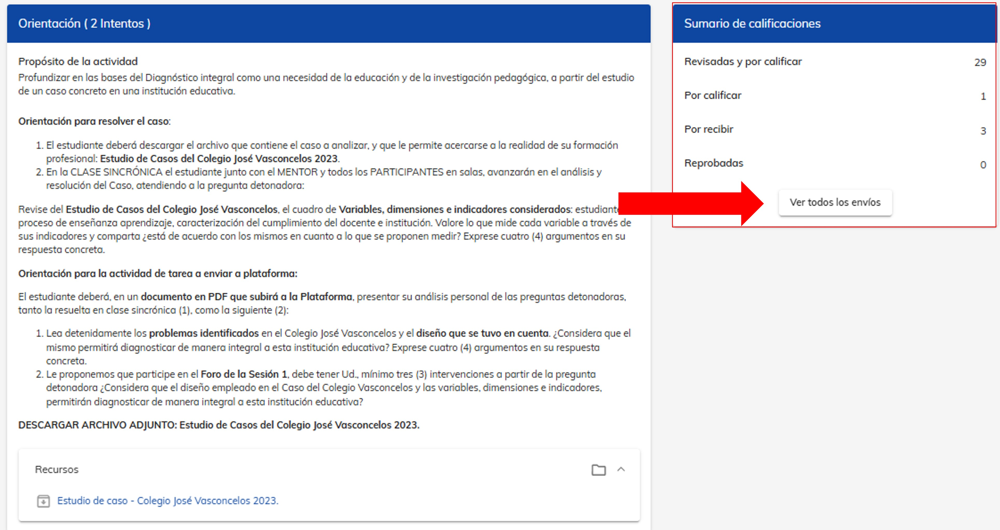

# Evaluación de actividad

## Consejos para retroalimentar al alumno

Uno de los aspectos clave como mentor en NEUUNI es realizar correctamente el proceso de evaluación y retroalimentación a los 
alumnos, es por eso que abrimos este espacio de recomendaciones al realizar este proceso.
Les invitamos a integrar en sus evaluaciones una retroalimentación correcta. Esto 
significa incluir tanto áreas de oportunidad como comentarios positivos. **Señalar las áreas 
de mejora ayuda a los alumnos a identificar qué pueden corregir y a adoptar una 
mentalidad de mejora continua, mientras que reconocer sus aciertos refuerza su 
confianza, reconoce su buen trabajo y los motiva a seguir esforzándose**. ✍⬆

Vamos a repasar el proceso completo de evaluación.

### 1. Ingresa al módulo de tarea. 

Drígete el módulo de **Tarea** de la actividad a evaluar. Si tienes  duda de cómo acceder a este módulo, puedes revisar el 
tutorial [Elementos de un curso](/mentores/tutorial-extras/elementos-curso).
En la sección **Sumario de calificaciones**, selecciona **Ver todos los envíos**. 

### 2. ¿Como calificar?

Utiliza la opción **"Por calificar"** para filtrar los alumnos pendientes de evaluación. 
Selecciona el ícono de **diálogo** (ubicado a la derecha del envío) para acceder al envío de la actividad. 

Dentro del envío de la actividad del alumno, podrás identificar los datos e envío como la fecha y hora y el archivo subido. 
Para descargarlo, haz doble clic sobre el nombre del archivo, que aparece en letras azules. 

Una vez que hayas revisado el archivo y definas tu veredicto, podrás abrir la ventana 
de calificación de la actividad. Para ello, haz clic en el ícono de diálogo ubicado en la 
sección de Evaluación.

En la ventana de **Evaluación**, selecciona la opción Satisfactoria o Insatisfactoria, 
según corresponda. Luego, elige una frase motivacional de las opciones disponibles. 

En la sección de **Retroalimentación**, incluye los comentarios correspondientes a la 
actividad del alumno. Asegúrate de que tus observaciones sean claras, constructivas y 
alineadas con los objetivos de la actividad. 

Una vez que hayas completado todos los campos correctamente, haz clic en **Guardar**. 
Para confirmar que la evaluación se realizó correctamente, verifica que el ícono en la 
sección de Evaluación haya cambiado, mostrando la calificación asignada y la frase 
motivacional que seleccionaste. 

### 3. Importancia de una retroalimentación eficaz

**No olviden que su retroalimentación no solo guía el aprendizaje, sino que también 
inspira a los alumnos a alcanzar su máximo potencial.** 
✨📚Les invitamos a integrar estas prácticas en cada evaluación, recordando el impacto positivo que tienen 
en el camino estudiantil de cada alumno. 

¡Mucho éxito a todos!