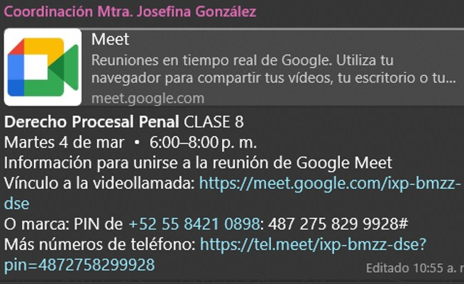
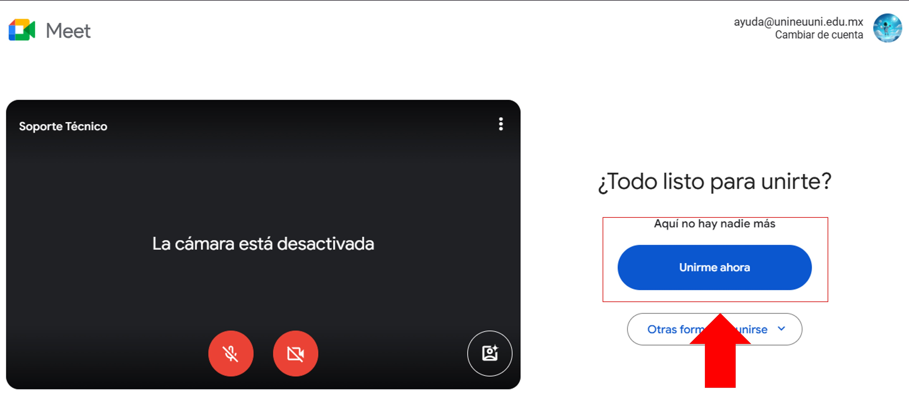

# Accede con tu correo institucional

## Cambia de cuenta para que accedas a tu clase

### Abre tu grupo de trabajo en whatsapp

Durante el transcurso de tu estancia en la Universidad NEUUNI, 
tu coordinador de carrera te enviará el enlace de cada sesión en 
Google Meet, para que puedas acceder a tus clases sincrónicas, 
como se muestra en la imagen.

### Ingresa a la sesión

Al dar clic en el enlace, se abrirá una nueva pestaña en tu navegador,
donde te pedirá que ingreses con tu cuenta institucional de Google,

### Cambia de cuenta

Si no es la cuenta correcta, da clic en "Cambiar de cuenta" y selecciona
tu cuenta institucional de Google, como se muestra en la imagen.

### Accede a la sesión

Una vez seleccionada tu cuenta institucional, da clic en "Unirme ahora" para
acceder a la sesión de Google Meet, como se muestra en la imagen.

