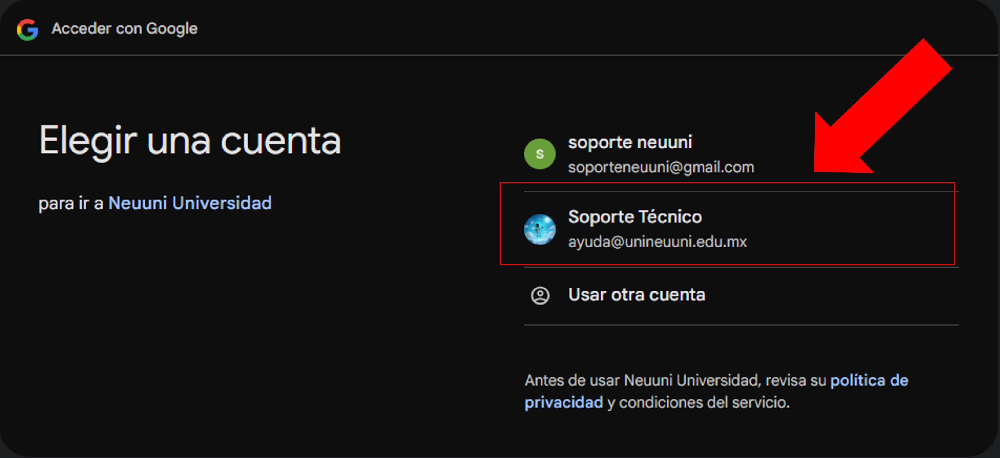

import VideoIntro from '@site/docs/tutorial-basics/insertarvideo.jsx';

# Gedux

## Aprende a ingresar a Gedux

Tranquilidad y facilidad financiera. Realiza tus pagos de colegiatura de manera segura y sencilla a través 
de Gedux. Mantén al día tu trayectoria académica con pagos mensuales fáciles de gestionar.

### 1. Acceso a Gedux desde la plataforma NEUUNI

Dentro de la plataforma NEUUNI, dirígete a la sección superior central.

Ubica el botón con el ícono de **moneda ($)** y haz clic en él para acceder a la plataforma de pagos.

### 2. Ingresa con tu cuenta de Google

Una vez dentro de la plataforma de pagos, selecciona la opción **Continuar con Google**.

Al hacer clic en "Continuar con Google", se abrirá una ventana emergente.
Selecciona tu cuenta institucional de la lista. 

Si no aparece, haz clic en **Usar otra cuenta** e ingresa
tus claves de acceso institucionales.

Una vez que hayas ingresado, se cargará la plataforma Gedux.

Desde aquí, podrás gestionar todo lo relacionado con pagos, como realizarlos mensualmente,
consultar estados de cuenta, ver el historial de pagos y también tendrás acceso a tus
historial académico.

<VideoIntro title="Acceso a Gedux" videoUrl="https://www.youtube.com/embed/laDPECNsgQ8" />