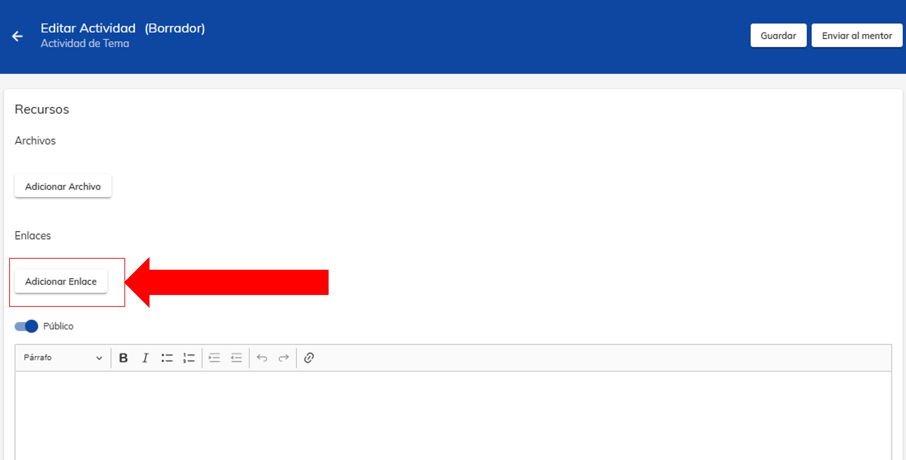

import VideoIntro from '@site/docs/tutorial-basics/insertarvideo.jsx';

# Envío de actividad

##  Sube tu actividad a la plataforma

¿Listo para brillar? Aquí aprenderás a subir tus tareas a la plataforma para que tu mentor pueda evaluarlas. 
Recuerda que tus calificaciones dependen en gran medida de la entrega exitosa de tus actividades.

### 1. Ingreso a la plataforma NEUUNI

Accede a la plataforma de NEUUNI utilizando el siguiente enlace:
https://cursos.unineuuni.edu.mx/ e inicia sesión con tus claves de acceso.

### 2. Localiza dónde subirás tu actividad

Una vez que hayas iniciado sesión, en la página principal, selecciona el curso y número de tema en el que 
deseas subir tu actividad.

### 3. Elige el módulo Tarea.

Al ingresar en el curso, selecciona el módulo **Tarea**.

### 4. Envió de actividad

Al ingresar al apartado de tarea, se podrá observar la siguiente estructura
en la cual podrás realizar el envío de cada actividad correspondiente a cada tema.

### 5. Estructura

Cada actividad se compone de los siguiente aparatados:

- **Proposito de la actividad.** 
Explicar el objetivo de la tarea y su relevancia en el desarrollo de habilidades prácticas.
- **Orientacion para responder el caso.**
Proporcionar instrucciones claras y detalladas sobre cómo abordar la tarea.
- **Orientacion para la actividad a enviar a plataforma.**
Indicar los pasos a seguir para subir la actividad a la plataforma.
- **Recursos a consultar.**
Proporcionar enlaces o referencias a materiales útiles para completar la tarea.

### 6. Cómo enviar tu actividad (archivo o enlace)

Para envío de archivos, nos aparece la siguiente opción con la leyenda 'Adicionar archivo'.
Al hacer clic, se abre una ventana emergente en la cual podremos seleccionar el archivo a enviar..

En la opción de adicionar enlace, se despliega una ventana emergente en la cual podremos ingresar 
el enlace a enviar.

### 7. Enviar... ¿o guardar para corregir?
Una vez que hayas seleccionado el archivo o ingresado el enlace, verás dos opciones: "guardar" y 
"enviar al mentor". Es importante que elijas la opción "enviar al mentor", ya que "guardar" solo 
guarda el archivo en la plataforma.

### 8. Evaluación de actividad

Una vez que envíes tu actividad, tu mentor la evaluará y te proporcionará retroalimentación sobre
tu desempeño. Deberás ingresar a tu actividad enviada, la cual aparecerá como se muestra en la imagen. 
Es importante tener en cuenta el apartado de retroalimentación, ya que la evaluación será "satisfactoria" 
o "insatisfactoria". Si tu actividad se evalúa como insatisfactoria, recibirás retroalimentación para mejorarla.

#### ¡Importante!

Es importante tener en cuenta que plataforma Neuuni, solo nos permite realizar dos intentos de envió de actividad, 
por lo que es importante revisar y asegurarnos de que nuestra actividad cumple con los requerimientos solicitados. 

<VideoIntro title="Envío de actividad" videoUrl="https://www.youtube.com/embed/gWwNqmWR4OQ?si=uJgLGMuJZ-4W7FyZ" />