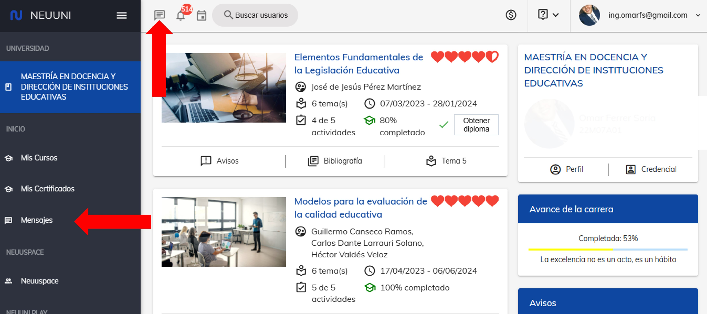

# Chatea con tu mentor

## Contacta a tu mentor en la plataforma

Entendemos que en un entorno virtual puede ser difícil la comunicación entre estudiantes y docentes. Es por eso que, dentro de la plataforma, encontrarás un espacio diseñado para conversar con los estudiantes y mentores con los que compartes cursos.

### Ingresa a la sección de mensajes.

Para ingresar a este apartado, deberás dirigirte al menú principal de la 
plataforma, y una vez dentro, podrás observar un menú en la parte 
lateral izquierda asi como en la parte superior.

Selecciona la opción señalada para poder ingresar.

### Inicia una conversación.

Al ingresar, veras una pantalla como se muestra en la imagen.

### Busca a tu mentor.

Para buscar a tu mentor, deberás dirigirte a la barra de búsqueda 
y escribir el nombre de tu mentor.

### Selecciona al usuario.

Para iniciar conversacióncon deberás dar clic en el nombre del mentor.

### Redacta tu mensaje y envia.
Al seleccionar el contacto, se desplegará la siguiente vista. Si ya tienes una conversación 
iniciada, se visualizará como en la imagen. Si no, deberás redactar tu mensaje y dar clic en
el botón de enviar.

