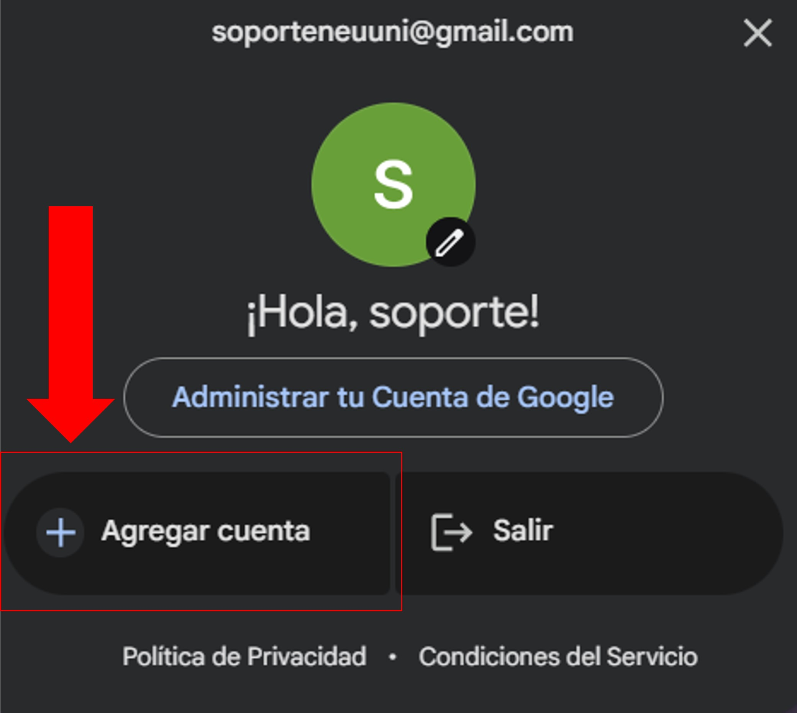
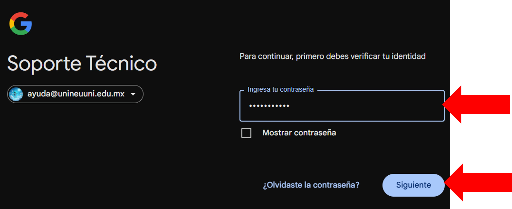

import VideoIntro from '@site/docs/tutorial-basics/insertarvideo.jsx';

# Correo institucional

## Aprende cómo iniciar sesión

Como primer paso, te guiaremos para acceder a tu correo institucional. Es tu herramienta clave para estar en contacto con profesores y recibir información importante de la universidad. ¡Empecemos!

### Abre tu navegador

Al ingresar, nos dirigimos en la parte superior de la derecha, donde se encontrará un botón con el nombre "Acceder"

### Agregar cuenta

Si no te aparece el botón de acceder y en su lugar esta una cuenta, damos clic en la cuenta.

Cuando demos clic, aparecerá una ventana donde podremos agregas otra cuenta.

### Ingresar correo intitucional

Al dar clic en el botón de “Acceder” o “Agregar otra cuenta” nos redirigirá a otra pantalla donde nos 
pedirá ingresar nuestro correo.

Deberemos ingresar nuestra cuenta institucional en el campo y después dar clic en el botón con 
nombre de “siguiente”

### Ingresamos contraseña 
4. Nos pedirá que ingresemos nuestra contraseña.

### Verificamos

Ingresamos nuestra contraseña y damos clic en siguiente

Una vez ingresado, regresara automáticamente al navegador y podrá ver en la parte superior de la 
derecha que la cuenta fue agregada correctamente.

<VideoIntro title="Acceso al correo institucional" videoUrl="https://www.youtube.com/embed/QtnnNkl3bx0?si=jWpOxq1mDcT1GfNy" />