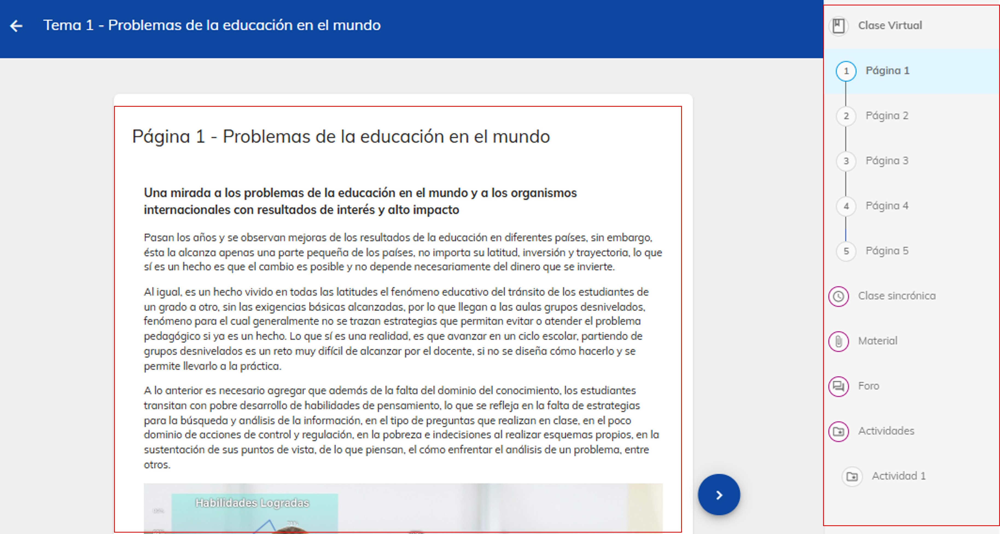

# Elementos de un curso

## Descubre el contenido de tus materias

¡Tu aprendizaje comienza aquí! Descubre tu materia a fondo.
Aquí te presentamos los 5 elementos clave de cada materia: Clase Virtual, Clase Sincrónica, Material de Apoyo, Foro y Tarea. Explora cada uno y aprovecha al máximo tu aprendizaje.

### 1. Ingreso al curso

Para acceder a un curso, tienes dos opciones:

1. Selecciona el curso directamente:
    En la pantalla principal, haz clic en el curso que deseas ingresar, 
    como se indica con la flecha derecha.

2. Usar el menú lateral:
    Dirígete al menú lateral izquierdo y selecciona la opción "Mis cursos", indicado con la
    flecha izquierda. Una vez dentro, verás una lista de todos los cursos en los que estás 
    inscrito. Selecciona el que desees.

### 2. Navegar por el curso

Al ingresar al curso, llegarás a la pantalla inicial. En la parte superior, verás una barra 
que indica en qué apartado te encuentras. Esta barra incluye:

-**Introducción**: Una breve descripción sobre el contenido del curso.
-**Tema**: Accede a los diferentes temas del curso.
-**Estudiantes*: Consulta la lista de compañeros en el curso.

En la siguiente imagen, se muestra el apartado de "Introducción", donde encontrarás los 
elementos clave:

### 3. Contenido de la sección 'Introducción'

En la pantalla de "Introducción", en la parte derecha, encontrarás las siguientes secciones:

-**Video de presentación**: Un video que explica los objetivos y estructura del curso.
    Puede no aparecer en algún curso.

-**Mentor**: Verás el nombre del mentor y debajo su 
    calificación evaluada por los alumnos de acuerdo a su desempeño.

-**Avisos**: Debajo de la información del mentor, se muestran los avisos 
    importantes que ha publicado.

-**Avance del curso**: Podrás ver el progreso que llevas en el curso, según las actividades
    satisfctorias que vayas obteniendo.

### 4. Utilizar las herramientas del curso

Cada tema del curso está organizado en secciones que te permiten interactuar con el contenido 
y realizar actividades. Estas son las principales:

### Clase virtual
        Consulta toda la información relacionada con el tema. Debes estudiar este módulo
        antes de acceder a tu clase sincrónica.

### Clase sincronica
        Accede a las clase grabada y reprodúcela las veces que necesites.

### Material de apoyo
        Refuerza tu conocimiento con materiales adicionales como documentos, enlaces y recursos 
        complementarios.

### Foro
       Comparte tu opinión, imágenes, enlaces o documentos con otros participantes. También 
       puedes leer las aportaciones de los demás.

### Tarea
       Completa las actividades para avanzar en el curso y demostrar tu aprendizaje.
