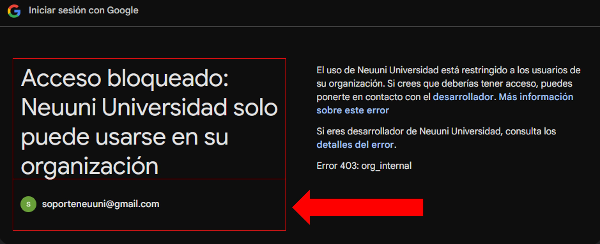

import VideoIntro from '@site/docs/tutorial-basics/insertarvideo.jsx';

# Acceso a NEUUNI

## Accede a la plataforma con tu correo institucional

¡Tu campo virtual te espera!
Encontrarás todos los recursos para tus cursos: clase virtual, clase sincrónica, materiales de apoyo, foros y envíos de tareas. 
Explora y recorre todo lo que NEUUNI tiene para ti.

### 1. Ingresa a la plataforma NEUUNI

Dirígete al enlace de NEUUNI: https://cursos.unineuuni.edu.mx.
En la parte superior derecha, haz clic en el botón **Aceso a plataforma**. 

##### NOTA: *Si en su lugar te aparece un botón de menú, despliégalo y selecciona la opción que corresponde*.

Al ingresar, verás la siguiente pantalla. Haz clic en el botón **Continuar con Google**:

### 2. Selecciona tu cuenta institucional

Al hacer clic en "Continuar con Google", se abrirá una nueva pestaña. En esta, selecciona tu cuenta institucional de Google.

##### *NOTA: Si no la encuentras, haz clic en **Usar otra cuenta** e ingresa tus claves de acceso.*

***¿Qué hago si me aparece un aviso de acceso bloqueado?***

*Haz clic en el botón "Atrás" de tu navegador y asegúrate de seleccionar tu correo institucional de NEUUNI con el formato
alumno@unineuuni.edu.mx*.

### 3. Acceso a NEUUNI

Una vez que hemos hecho el ingreso correctamente, podremos confirmarlo al ver la siguiente pantalla, donde se encuentran 
las secciones de la plataforma, tus cursos e información. .

##### *¿Qué hago si la pantalla de carga se queda cargando al ingresar?*
*Debes cargar la página nuevamente y repetir el proceso, debido a que en ocasiones el perfil se valida en el servidor.
Una opción rápida para cargarla es presionar 
la tecla 'F5'. Si esto no funciona, comunícate al Whatsapp de Soporte Técnico.*

<VideoIntro title="Acceso a la plataforma NEUUNI" videoUrl="https://www.youtube.com/embed/s7--pVa-7M8" />