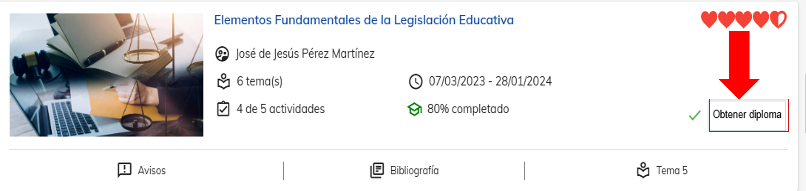

# Generación de certificados

Para poder ser acreedor a un certificado, es importante haber completado el 80% del curso. El 
progreso de los cursos se basa en los distintos temas que hayas completando a lo largo del curso. 

Cada que completes un tema del curso, podrás apreciarlo marcado como completado.

Para culminar una materia se debe tomar el cuenta el porcentaje de avance que se tiene de de avance en la materia, ya sea un 80% o un 100% aparecera la opción de "obtener diploma" en la cual hay que contastar para poder desacargar nuetro certifcado. 

Al realizar dar respuesta a la encuesta si nos habilitara la siguiente opción, el la cual nos permitira realizar la descarga de nuetro certificado. 

Al obtener tu certificado podras observar el porcentaje de avance del tu corso en el cual ira aunmentando al moento de realizar la descarga de cada certificado. 

En el menú lateral, tendrás un apartado con el nombre ”Mis certificados”, aquí encontraras todos los certificados de los cursos que has completado con éxito.

Puedes descargar tus certificados las veces que desees y en cualquier
momento.

