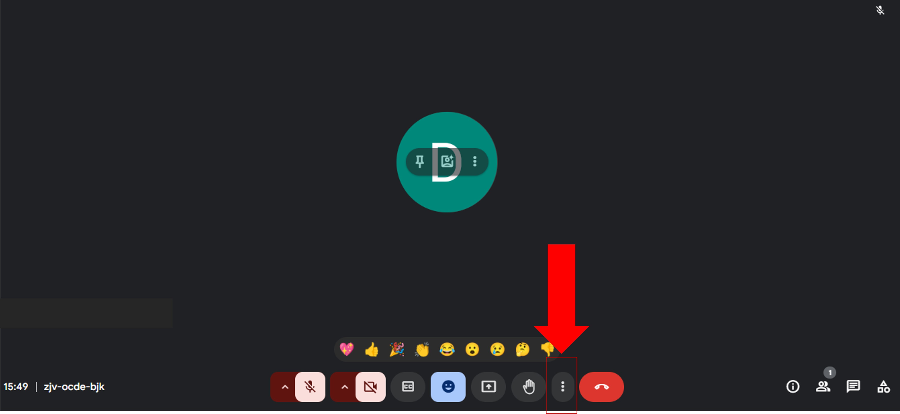

# Imagen en imagen.

## ¿Como abrir imagen en imagen?

"Cada pequeño aprendizaje te acerca a dominar algo nuevo; estás a punto de manejar la multitarea como un experto y aprovechar al máximo 
tus herramientas digitales. ¡Tú puedes lograrlo!" 💪✨

## 1. Accede a tu reunión.

Dentro de la reunión, damos click en el botón de los "tres puntos".

Se abrirá un menú con las opciones que se ven en la imagen, seleccionamos la opción de abrir **"imagen en imagen"** 

Una vez seleccionado, se abrirá una pantalla más pequeña, la cual podremos ocupar para visualizar
el contenido de las clases sin perder de vista a los alumnos.

Al ubicarnos en la pestaña que nos muestra al seleccionar abrir imagen en imagen nos podemos dar cuenta que nos muestra 
las opciones de la llamada en una vista más pequeña como se visualiza en la imagen. Desde esa opción podemos finalizar la 
llamada, silenciar el micrófono, desactivar la cámara, compartir pantalla, así como acceder a la visualización de los 
mensajes, esto para poder visualizar si un alumno comenta alguna duda sobre el contenido de la clase que se está presentando. 

