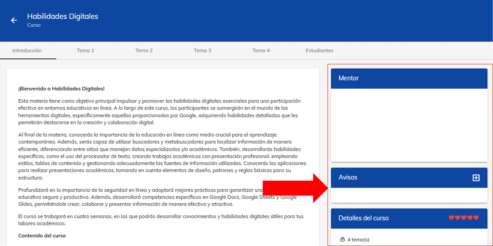
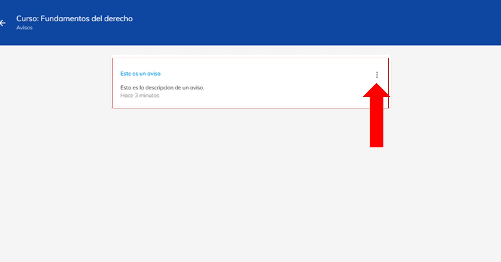

# Crear Avisos

En esta guía, aprenderás a crear, editar y borrar avisos entro de los cursos.

## 1. Ingresa a plataforma Neuuni.

Puedes acceder dando click en el siguiente enlace [Neuuni](https://unineuuni.edu.mx/),
si tienes alguna duda de como ingresar a la plataforma, puedes consultar el siguiente [tutorial](/mentores/tutorial-extras/plataforma).

## 2. Accede a la sección de “mis cursos”.

Selecciona el curso que desees. Dentro del curso podrás visualizar la introducción al curso, en el costado derecho de la página, habrá
distintos apartados en donde podemos encontrar el apartado de avisos.

Para crear un aviso, dirigirte al aparato de avisos y da clic en él 
botón con el siguiente símbolo: “**+**” .Al dar clic en el botón, se abrirá una venta donde nos pedirá poner el título y descripción del aviso.

Después de colocar el titulo y la descripción, tenemos que dar clic en **"guardar"**.
Una vez guardado, podremos visualizar el aviso en los apartaos laterales del curso.

Para ver todos los avisos del curso que hemos creado, solo damos clic en el botón con el nombre: 
”Ver más”

Nos dirigirá a una ventana donde se encontrarán todos nuestros avisos del curso.

Para editar el aviso, le damos selección dando clic en los 3 
puntos que aparecen en la parte superior derecha y damos 
nuevamente clic en la opción de “editar”.

Al dar clic en el botón de **editar**, aparecerá una ventana donde podremos cambiar la información del 
aviso.
Por otro lado, al dar clic en la opción de **eliminar**, aparecerá una ventana donde nos pedirá confirmar
la acción. Al dar clic en confirmar, se eliminará el aviso y aparecerá un mensaje donde se eliminó el aviso 
correctamente.

