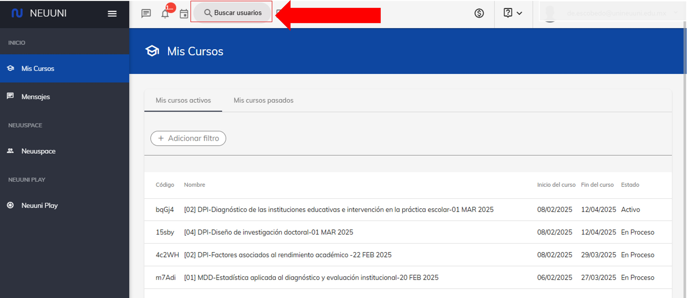
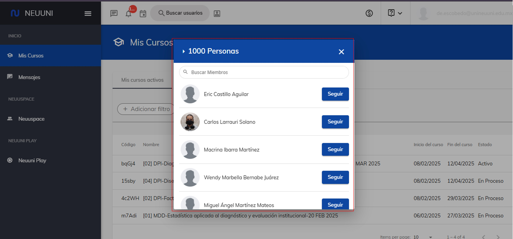

# Buscar Usuarios

Este apartado se maneja a modo de red social, donde podrás seguir a los alumnos y enviarles mensajes si lo deseas.✔

## 1. Ingresa a plataforma Neuuni.

Puedes acceder dando click en el siguiente enlace [Neuuni](https://unineuuni.edu.mx/),
si tienes alguna duda de como ingresar a la plataforma, puedes consultar el siguiente [tutorial](/mentores/tutorial-extras/plataforma).

## 2. Accede a la sección de usuarios.

En la parte superior, podrá encontrar distintos accesos directos, donde podrá acceder directamente a 
sus mensajes, notificaciones y webinars.
Además, al lado derecho de estos accesos directos, se encontrará un apartado donde podrá **buscar 
usuarios** y poder seguir al usuario seleccionado.

Al presionar el botón de buscar usuarios, se mostrará una ventana con una lista de sugerencias y 
una barra de búsqueda donde podrá filtrar la búsqueda.

Al seleccionar al alumno, podrá visualizar el perfil del mismo y desde su perfil podrá enviar mensajes si desea, asi como también
 seguir.

