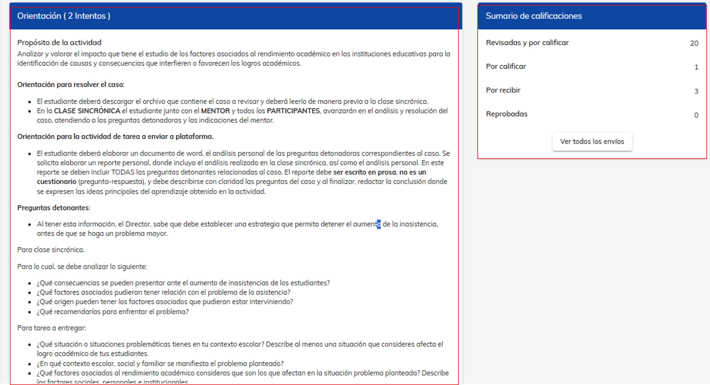
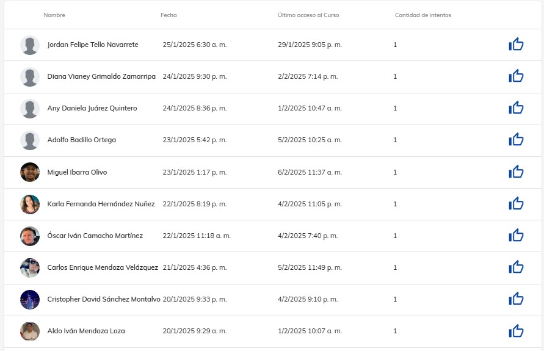
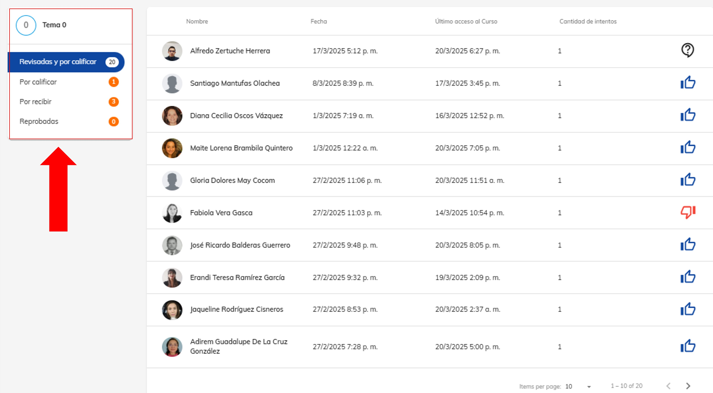

# Calificar tareas

## 1. Ingresa a plataforma Neuuni.

Si tienes alguna duda sobre como ingresar a plataforma puedes consultar el siguiente tutorial, dando clic en el siguiente apartado [Plataforma Neuuni](http://localhost:3003/mentores/tutorial-extras/plataforma).

## 2. Ingresa a la materia consultar.

Para calificar tareas, primero debe ingresar a la materia correspondiente. Desde el apartado de **mis cursos**, seleccione la opción “Materias” y luego elija la materia que desea consultar.

Una vez dentro de la materia nos dirigimos al número de temas a consultar, una vez ubicado el número de temas seleccionamos el módulo de “tarea o actividad”.

Dentro del apartado de tarea, podrá visualizar la descripción de la tarea a realizar, asi como también nos mostrara el aparado de sumario en donde podremos visualizar
la el nuemero de actividades calificadas y por calificar, asi como las actividades reprobadas. 

## 3. Ingresamos a la actividad a calificar.

Dentro del apartado de tarea, podrá visualizar la descripción de la tarea a realizar, así como también nos mostrará el aparado de sumario en donde podremos visualizar
la el número de actividades calificadas y por calificar, así como las actividades reprobadas. 

Seleccionamos la opcionde ver “Ver todos los envíos”, para poder visualizar con mayor detalle 
las actividades enviadaspor los alumnos los alumnos.

##  4. Calificar la tarea.

Dentro de la sección de “Ver todos los envíos”, podrá visualizar a todos los alumnos que han realizado el envío de su actividad y los cuales ya tienes alguna calificación agregada.
También se puede observar en la imagen un menú de navegación en donde nos indica las calificaciones pendientes por realizar, para poder visualizar las actividades que aún no han sido calificadas, dar clic en la opción de “Por calificar”.

Al seleccionar el alumno que se desee calificar, podremos apreciar, el documentó de la tarea del 
alumno para poder descargarlo y visualizarlo y la fecha de entrega.

Debajo contentendra un apartado para calificar la tarea. Al tomar la tarea como excelente, se vera 
reflejado con un pulgar azul hacia arria, de lo contrario se marcará un el pulgar rojo hacia abajo.

Si el alumno tiene mala evaluación en su tarea, tendrá un intento mas para volver a realizar su tarea y 
nuevamente subirla.

En la parte superior encontrará un menú en el cual podrá navegar hacia la retroalimentación, donde 
usted podrá colocarle un comentario sobre la actividad al alumno, es importante que usted como 
mentor, siempre deje una retroalimentación a cada uno de los alumnos.

