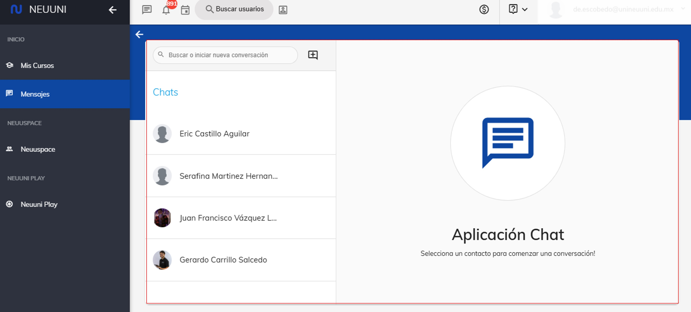

 # Contacta a tu alumno.

Bienvenidos y gracias por formar parte del cambio en la educación actual, en esta guía, aprenderás a
visualizar conversaciones pasadas, buscar alumnos y crear nuevas conversaciones.

## 1. Ubica la selección.

Para acceder a este apartado lo podemos realizar de dos maneras las cuales son las siguiente: 
  
- En la parte superior de la pantalla,encontrarás un ícono de chat o mensajes (generalmente representado con un globo de diálogo). Haz clic 
  en él para abrir el apartado de chat directamente. 

- Si prefieres usar el menú lateral, localiza la opción de **"Mensajes"** en la lista. Haz clic y serás dirigido 
  al área correspondiente.

## 2. Mis conversaciones.

Al ingresar, verás una pantalla similar a la que se muestra en la imagen. En ella, se 
desplegará el historial de conversaciones que hayas tenido al utilizar esta funcionalidad.

## 3. Búsqueda de usuario.

**Para iniciar una nueva conversación** , haz clic en el botón '+' que aparece al lado del buscador,
como se indica en la imagen. Aparecerá una ventana emergente como se muestra en la imagen.

## 4. Inicia una nuena conversación. 

Al seleccionar el contacto, se abrirá la siguiente vista (redacta tu mensaje y haz clic en el botón de enviar).

