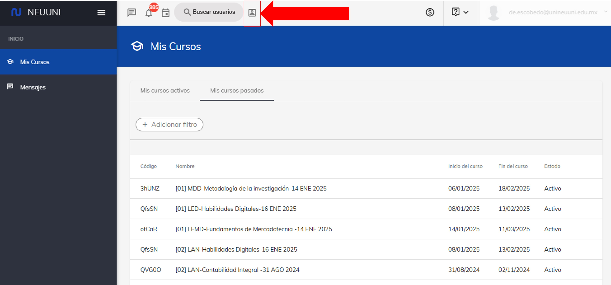
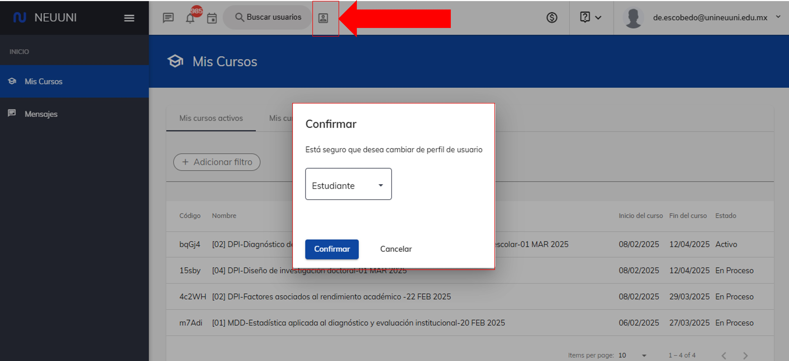
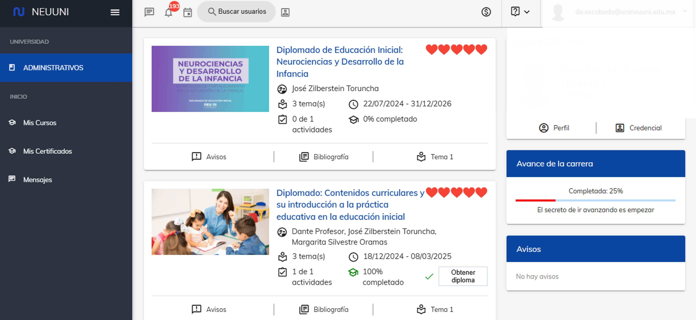

# Accede como alumno. 

## 1. Inicia sección en plataforma.

Puedes accder dando click en el siguiente enlace [Neuuni](https://unineuuni.edu.mx/).

## 2. Ubica la barra superior de plataforma.

En la parte superior, podrá encontrar distintas opciones, donde podrá acceder directamente a 
sus mensajes, notificaciones y webinars. De lado de estos apartados, se encuentra una opción la cual 
nos permitirá cambiar de vista.

Al presionar el botón, nos aparece la siguiente ventana, para esta opcion solo daremos clic en la opcion de confirmar.

Al dar clic en la ventana nos enviara a la vista que tiene un estudiante en plataforma.

.

