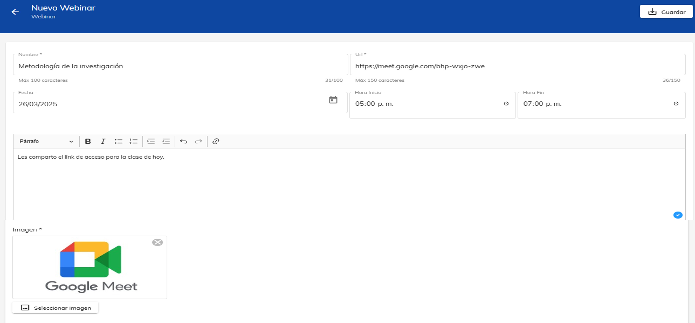

# Webinar

## 1. Ingresa a plataforma Neuuni.

Puedes acceder dando click en el siguiente enlace [Neuuni](https://unineuuni.edu.mx/),
si tienes alguna duda de como ingresar a la plataforma, puedes consultar el siguiente [tutorial](/mentores/tutorial-extras/plataforma).

## 2. Accede a la sección de “mis cursos”.
Selecciona el curso que desees. Dentro del curso podrás visualizar la introducción al curso, en el costado derecho de la página, habrá distintos apartados en donde podemos encontrar el apartado de webinar.
Damos clic en la opción de "**+**".

## 3. Configuracion de un Webinar.

Una vez que hayas ingresado al creador de webinars, se te solicitará completar los siguientes campos:

**Nombre:**
- En este apartado se debera colocar el nombre de la clase que se impartirá.

**URL del evento:**
- Copia y pega el enlace de la llamada correspondiente a tu webinar creado previamente.

- Este enlace debe generarse previamente desde el apartado de Calendario. Para obtenerlo:

- Ve al apartado de Calendario en la plataforma.

- Selecciona tu evento previamente creado.

- Copia la URL que se genera para el enlace de la llamada, como se visualiza en la imagen.

**Fecha y hora:**

- Indica la fecha y el horario exacto en el que se llevará a cabo la sesión.

**Imagen identificativa:**

- Adjunta una imagen que visualmente servirá para identificar visualmente tu webinar. Puedes cargar un archivo desde tu dispositivo. Asegúrate de que sea relevante y atractiva para tu público.

**Nota: Es importante colocar el identificador httpps:// para que aparesca a modo de link.**

Si desea editar o eliminar el webinar, podrá hacerlo en la parte superior de la 
derecha, podrá apreciar 2 botones que corresponden a dichas acciones.

