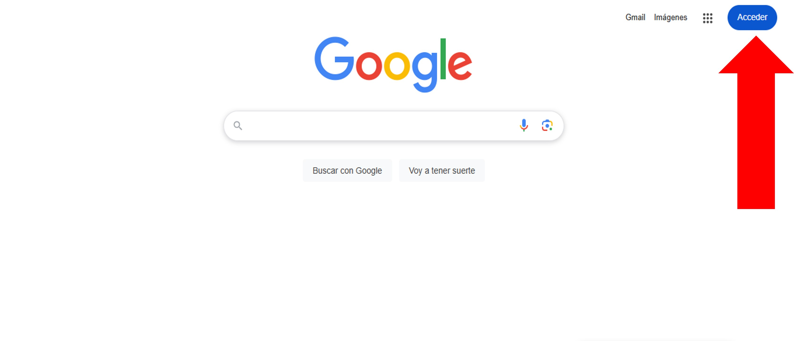

# Ingresar a gmail institucional.

### Paso 1
1. Abre tu navegador

Al ingresar, nos dirigimos en la parte superior de la derecha, donde se encontrará un botón con el nombre “Acceder”

### Paso 2
2. Si no aparece el botón de acceder y en su lugar está una cuenta ya agregada, damos clic en esa opción.

Al seleccionar esa opción nos mostrara una ventana de la siguiente manera con las opciones de agregar cuenta o salir, damos clic en la opción señalada.

### Paso 3
3. Al dar clic en el botón de “acceder” o “agregar otra cuenta”, nos redirigirá a la pantalla de inicio de sesión de Google.
En esta opción debemos colocar nuestros datos de inicio de sesión, en el primer apartado debemos colocar nuestro correo institucional, una vez agregado damos clic en la opción siguiente.

### Paso 4
4. Al dar clic, nos pedirá que ingresemos nuestra contraseña.

### Paso 5
5. Una vez ingresado, regresara automáticamente al navegador y podrá ver en la parte superior de la derecha que la cuenta fue agregada correctamente.

