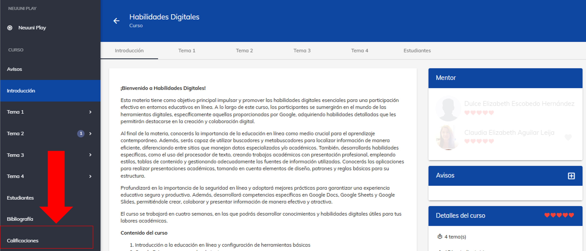
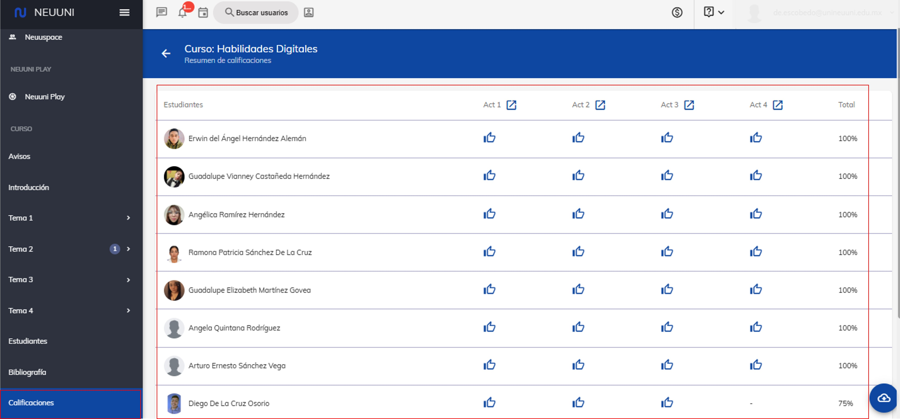

# Descargar calificaciones

En esta guía, aprenderás a descargar las calificaciones.

En este apartado aparecen todas las tareas indicadas y los resultados de los estudiantes, así como el 
acumulado alcanzado. Esta información puedes bajarla a una archivo de Excel, para tener el control 
de la evolución de los estudiantes en cuanto al envio de actividades. 

## 1. Ingresa a plataforma Neuuni.

Puedes acceder dando click en el siguiente enlace [Neuuni](https://unineuuni.edu.mx/),
si tienes alguna duda de como ingresar a la plataforma, puedes consultar el siguiente [tutorial](/mentores/tutorial-extras/plataforma).

## 2. Accede a la sección de “mis cursos”.

Dirígete al curso que administras.

## 3. Descarga de calificaciones.

En el menú de la izquierda desliza la barra de opciones hasta la última opción, 
selecciona la opción de **"calificaciones"**.

En esa sección podrás encontrar todas las actividades que han realizado los alumnos.

Para realizar la **descarga** de la información solo es necesario darle click al botón de la nube. Se descargara 
un archivo en formato de Excel en su ordenador.

