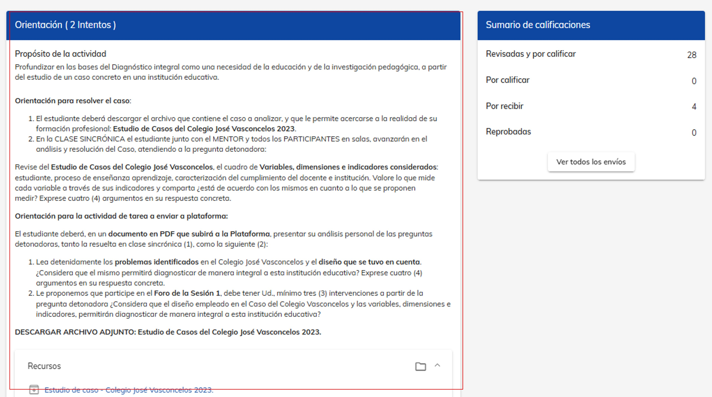

# Elementos de un curso

### 1. Ingreso al curso

Puedes acceder dando click en el siguiente enlace [Neuuni](https://unineuuni.edu.mx/),
si tienes alguna duda de como ingresar a la plataforma, puedes consultar el siguiente [tutorial](/mentores/tutorial-extras/plataforma).

Para acceder a tu materia, puedes realizarlo desde el apartado de "mis cursos", dando clic en el nombre de la materia que se quiera consultar. 

### 2. Navegar por el curso

Al ingresar a tu materia, en la parte superior, encontrarás una barra de navegación que muestra en qué apartado te 
encuentras. Esta barra incluye:

- **Introducción**: Una breve descripción sobre el contenido del curso.

- **Sección de Temas**: Accede a los temas del curso para consultar los módulos correspondientes al número de clase que 
desees revisar.

- **Estudiantes**: Consulta la lista de los alumnos integrados en el curso.

En la siguiente imagen, se muestra el apartado de "Introducción", donde encontrarás sus
elementos.

### 3. Contenido de la sección 'Introducción'

En la parte derecha de la pantalla de "Introducción", encontrarás las siguientes secciones:

- **Video de presentación**: Explica los objetivos y estructura del curso (puede no aparecer 
en algún curso, pero nos esforzamos para tenerlo en todos).

- **Mentor**: Conoce el nombre del mentor y su calificación en NEUUNI, asignada por los propios
alumnos, de acuerdo a su desempeño.

- **Avisos**: Contiene los avisos importantes que sube tu mentor en el transcurso de la materia.

- **Avance del curso**: Podrás ver el progreso que llevas en el curso de acuerdo a las actividades
    satisfctorias que vayas obteniendo.

- **Webinars**; En esta sección podrás colocar la informacion de las clases a impartir semana con semana. 

### 4. Módulos del curso

Cuando selecciones el número de tema que deseas revisar, aparecerán los módulos de los temas.
Cada tema del curso está organizado en módulos que te permiten interactuar con el contenido 
y realizar actividades. A continuación se detalla cada uno.

- 1. **Clase virtual**.
        Consulta toda la información relacionada con el tema. Se debe consultar este módulo
        antes de impartir la clase sincrónica.

- 2. **Clase sincronica**.
        En este apartado se puede el alumno puede acceder  y reprodúcela las veces que necesites en cualquier momento
        y en cualquier lugar.

- 3. **Material de apoyo**.
        En el apartado de material de apoyo se suben materiales a consultar por el alumno, si se tiene material extra para subir se recomienda hacer el envio a coordinación para que pueda
        ser subido a la plataforma.

- 4. **Foro**.
       En el módulo de foro se presentan casos de estudio a debatir entre almnos y mentor, se recomienda que el mentor este al pendiente de las dudas que se presenten en este apartado.

- 5. **Tarea**.
      En el módulo de tarea se presentan las actividades a realizar por el alumno, se recomienda que el mentor este al pendiente de las dudas que se presenten en este apartado, asi como realizar 
      la calificación de las mismas. 
      
